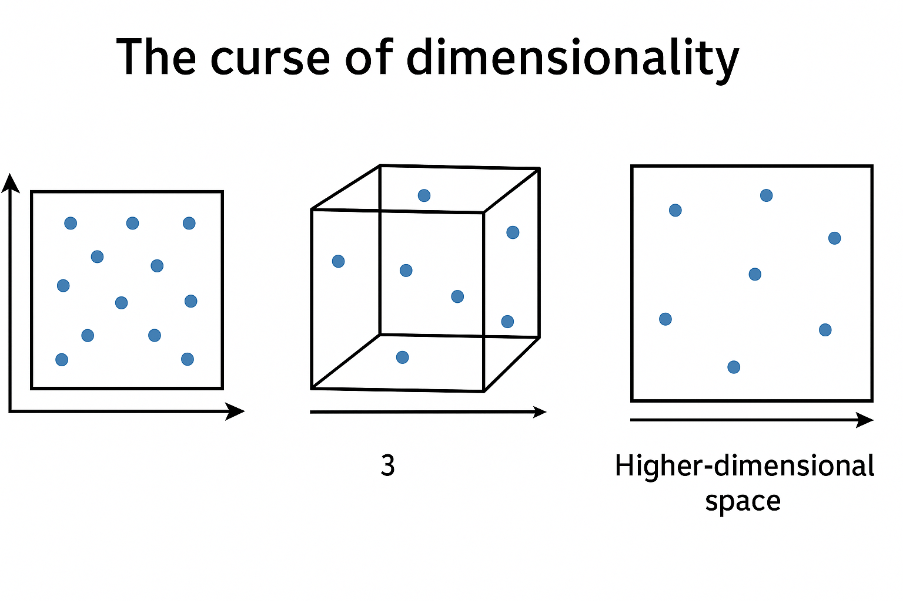
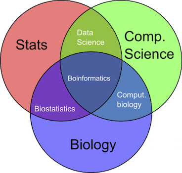
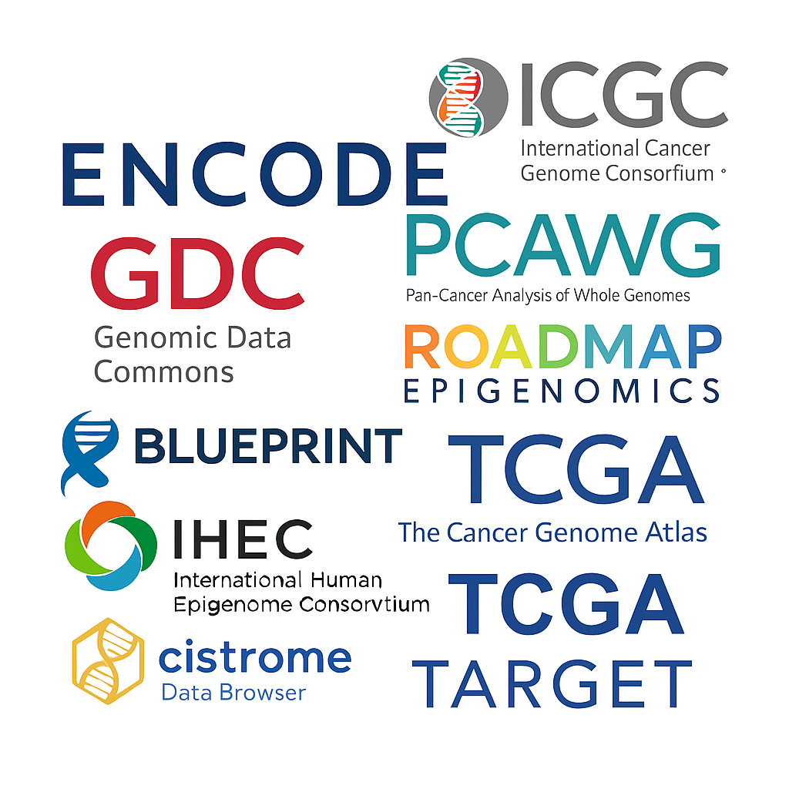
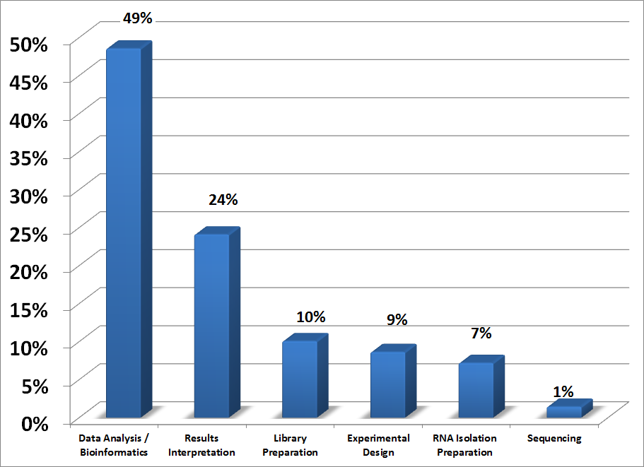

```{r xaringan-themer, include = FALSE}
library(xaringanthemer)
mono_light(
  base_color = "midnightblue",
  header_font_google = google_font("Josefin Sans"),
  text_font_google   = google_font("Montserrat", "500", "500i"),
  code_font_google   = google_font("Droid Mono"),
  link_color = "#8B1A1A", #firebrick4, "deepskyblue1"
  text_font_size = "28px"
)
```

<!-- HTML style block -->
<style>
.large { font-size: 130%; }
.small { font-size: 70%; }
.tiny { font-size: 40%; }
</style>

## Course logistics

**Instructor**: Mikhail G. Dozmorov <mdozmorov@vcu.edu>, Ph.D.  

**Schedule**: Monday, Wednesday 1:00pm – 2:20pm  

**Classroom**: One Capital Square (OCS) 2201  

**Office hours**: By appointment, Mon, Wed 2:30pm – 4:00pm, OCS 709  

**Course documents**:  

<https://bulletin.vcu.edu/azcourses/bios/>  

<https://bios658-2025.netlify.app/>

---
## Course prerequisites

- BIOS 524, Biostatistical Computing, https://bios524-r-2023.netlify.app/
- BIOS 544, Graduate Research Methods II or 
- BIOS 654, Biostatistical Methods II

**Required text**:  
<!-- Sorin Draghici, *Statistics and Data Analysis for Microarrays Using R and Bioconductor*, 2nd Ed., Chapman & Hall/CRC Press, 2012. ISBN-978-1-4398-0975-4 --> 
- Supplemental reading and course materials will be provided in-class. We will be studying primary research papers.
- Lecture notes will contain many footnotes with links. Make a good use of them, explore the references on your own!

**Software**: The R programming environment, High Performance Computing

---
## Grading Policies

|            Assignment           | Percentage Value |
|---------------------------------|------------------|
|      In-class participation     |        20%       |
| Reading and homework assignment |        50%       |
|          Final project          |        30%       |

- Pre-proposal due in the middle of the semester, the final project due at the end

- Deadlines are mandatory

- Discuss homework with your peers, work together, but provide your own solution

---
## Expectations: What you should expect

- Your learning is a priority  

- There are no stupid questions — ask anything and expect answers or a follow-up from me 

- You will have feedback on your homeworks  

- You are professional partners, colleagues in learning

---
## Expectations: What you are expected to do

- You make attending class a priority  

- You submit your best work for homework: your own work, on time  

- You engage in classroom discussion  

- You learn from the class; you learn to teach yourself analytical skills  

- You demonstrate your best professional working ethics (including beyond the class)

---
## Computational Genomics

- Development and application of computational and statistical methods

- Focused on large-scale genomic and biological datasets

- Enables interpretation of DNA, RNA, and epigenomic information

- Supports discovery of patterns, functions, and relationships in the genome

- Bridges biology, computer science, mathematics, and statistics

In summary: generation, organization, analysis, and interpretation of biological (especially genomic) data

---
## Biostatistics

- The application of statistical methods to biological, medical, and public health data

- Designs experiments and studies to collect reliable data

- Analyzes complex, often noisy biological datasets

- Quantifies uncertainty and tests scientific hypotheses

- Supports decision-making in biomedical research and healthcare

- Plays a key role in interpreting high-throughput technologies (e.g., genomics, clinical trials)

In summary: using statistics to make sense of biological data

---
## Meet the curse of dimensionality

The curse of dimensionality refers to the exponential increase in data volume and sparsity as the number of dimensions (features) grows, making it difficult for statistical models to generalize, visualize, or extract meaningful patterns without overfitting.

.center[]

.small[Credit: ChatGPT]

---
## Bioinformatics

* Interdisciplinary field combining biology, computer science, mathematics, and statistics

* Develops algorithms, tools, and databases for managing and analyzing biological data

* Focuses on sequence analysis, genome annotation, structural biology, and systems biology

* Enables integration and interpretation of genomic, transcriptomic, proteomic, and metabolomic data

* Supports hypothesis generation and biological discovery from high-throughput experiments

In summary: using computation to understand biological information

---
## Bioinformatics

.center[]

Data Scientist = statistician + programmer + coach + storyteller + artist  

.small[ https://edvancer.in/8-data-science-skills/ ]

---
## RNA-seq

**RNA-seq** (RNA sequencing) was first introduced in **2008** as a powerful new method for transcriptome profiling using next-generation sequencing (NGS).
  * **Mortazavi et al.** (2008), *Nature Methods*: "Mapping and quantifying mammalian transcriptomes by RNA-Seq"
  * **Nagalakshmi et al.** (2008), *Science*: "The Transcriptional Landscape of the Yeast Genome Defined by RNA Sequencing"

These papers showed that RNA-seq could:

* Quantify gene expression more precisely than microarrays,
* Detect novel transcripts and isoforms,
* Provide base-level resolution.

.small[ https://doi.org/10.1038/nmeth.1226, https://doi.org/10.1126/science.1158441 ]

---
## RNA-seq

Counts of papers per year in PubMed having the word "RNA-seq" in title/abstract

```{r echo=FALSE, cache=TRUE, warning=FALSE, fig.width=12, fig.height=6, fig.align='center'}
# Install if not already installed
# install.packages(c("easyPubMed", "ggplot2"))

library(easyPubMed)
library(ggplot2)

# Set search term
search_term <- "RNA-seq[Title/Abstract]"

# Define years
years <- 2008:2024  # as.numeric(format(Sys.Date(), "%Y"))

# Function to get count of publications for each year
get_pubmed_count <- function(year) {
  query <- paste0(search_term, " AND ", year, "[PDAT]")
  res <- get_pubmed_ids(query)
  return(as.numeric(res$Count))
}

# Get data
counts <- sapply(years, get_pubmed_count)

# Create data frame
df <- data.frame(
  Year = years,
  Count = counts
)

# Plot
ggplot(df, aes(x = Year, y = Count)) +
  geom_line(color = "steelblue", size = 1) +
  geom_point(color = "darkred") +
  scale_x_continuous(breaks = years) +
  labs(title = "Number of PubMed Publications Mentioning 'RNA-seq'",
       x = "Year",
       y = "Number of Publications") +
  theme_minimal() +
  theme(axis.text.x = element_text(angle = 45, hjust = 1))

```

---
## Big genomics data consortia

.center[]

.small[Credit: ChatGPT]

---
## What we will learn: Data analysis

Which step of an RNA-Seq project do you find most intimidating?  

.center[]

.small[ http://www.rna-seqblog.com/rna-seq-blog-poll-results-25/ ]

---
## Generative AI (Large Language Models, LLMs)

- **Allowed and encouraged** — use it to clarify terms, generate examples, organize your code and help to solve errors.

- Remember: you must know **how to ask good questions** and **how to verify answers** — this course focuses on building that skill.

- Examples of LLMs: **ChatGPT**, **Claude**, **Gemini**, **NotebookLM**.  

- VCU also provides access to **Microsoft Copilot**.

.small[https://chatgpt.com  
https://claude.ai  
https://gemini.google.com  
https://notebooklm.google.com  
https://go.vcu.edu/copilot  
https://aiguidebook.vcu.edu/tools/]

---
## Expectations (again) 

- Attend every class  

- Read every assigned reading  

- Complete all homework in time  

- Be active in class. Ask questions  

- Work hard — it will pay off

---
## Course Evaluation

* At the end of the course, you will be asked to **evaluate it**.

* Reflect on and **assess what you have learned** during the course.

* Take notes on **what you liked**, as well as **what could be improved**.

* Your evaluation will be **anonymous**.

