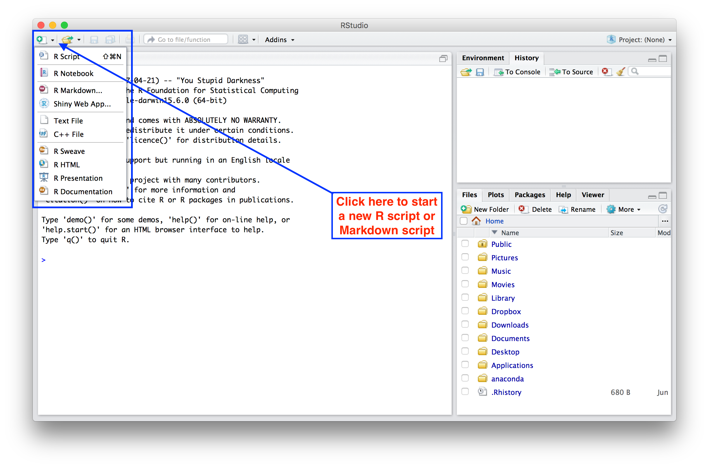

```{r xaringan-themer, include = FALSE}
library(xaringanthemer)
mono_light(
  base_color = "midnightblue",
  header_font_google = google_font("Josefin Sans"),
  text_font_google   = google_font("Montserrat", "500", "500i"),
  code_font_google   = google_font("Droid Mono"),
  link_color = "#8B1A1A", #firebrick4, "deepskyblue1"
  text_font_size = "28px"
)
```

<!-- HTML style block -->
<style>
.large { font-size: 130%; }
.small { font-size: 70%; }
.tiny { font-size: 40%; }
</style>

## RStudio

- RStudio is a program that allows you to run R in a more user-friendly environment  
  
- RStudio offers some GUI (graphical user interface) features for R  

- RStudio can be considered an "R portal"  

- The same R program is running underneath the interface  

- RStudio is open-source software (and therefore is free)  

- After you install R and RStudio, you only need to run RStudio 

.small[ https://cran.r-project.org/bin/windows/base/  
https://posit.co/download/rstudio-desktop ]

---
## RStudio

Open RStudio and this is what you will see:

.center[]

---

## RStudio

Outlined in red is the R Console:

.center[]

---

## RStudio

You can open a new script in the editing window:

.center[]

---

## RStudio

Or you can open an existing script:

.center[]

---

## RStudio

There can be multiple scripts open in the editing window:

.center[]

---

## RStudio

History tab shows command run:

.center[]

---

## RStudio

Environment tab keeps track of the things the user defines:

.center[]

---

## RStudio

Plots appear in the plots tab (as expected):

.center[]


---

## RStudio keyboard shortcuts

- Command (Ctrl) + Enter — Run current line/selection, go to the next line  
- Alt + Enter — Run current line/selection, stay on the current line  
- Ctrl + 1 — Move cursor to source  
- Ctrl + 2 — Move cursor to console  
- Ctrl + L — Clear console  
- Ctrl + Alt + I — Create new code chunk  
- Ctrl + Alt + C — Run current code chunk  
- All the usual — Ctrl + Z, C, X, V, S, O  

Other features: Tab Autocompletion, Code highlightning, Color themes

.small[ https://support.rstudio.com/hc/en-us/articles/200711853-Keyboard-Shortcuts ]

---
## RStudio integration with GitHub Copilot

- Integrates AI-powered assistance directly into the RStudio IDE  

- Offers intelligent code completions based on the current context  

- Provides recommendations for functions, syntax, and best practices  

- Can generate entire code snippets or templates to accelerate coding  

- Helps debug, refactor, and write cleaner, more efficient code  

- Enhances productivity, especially for beginners and exploratory tasks  

.small[ https://docs.posit.co/ide/user/ide/guide/tools/copilot.html ]

---

## RStudio summary

- Project-centric work – scripts and data are organized in one folder (project), easily accessible  

- Single workspace with four (rearrangeable, zoomable) panels  

- Work on multiple projects simultaneously in several instances of RStudio  

- Work on multiple (types of) scripts (rearrangeable tabbed interface)  

- See all variables in R environment, easily visualize them  

- Easy access to help, plots, packages  

- Simple integration with Git version control system


