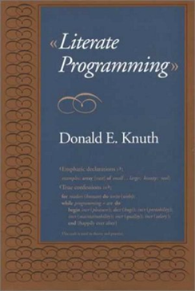
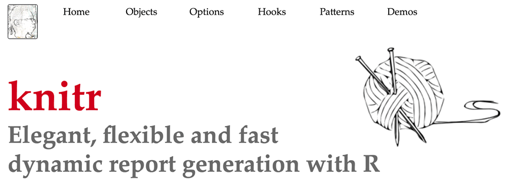
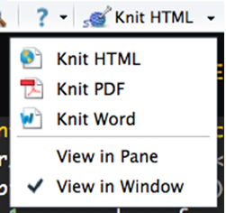

```{r xaringan-themer, include = FALSE}
library(xaringanthemer)
mono_light(
  base_color = "midnightblue",
  header_font_google = google_font("Josefin Sans"),
  text_font_google   = google_font("Montserrat", "500", "500i"),
  code_font_google   = google_font("Droid Mono"),
  link_color = "#8B1A1A", #firebrick4, "deepskyblue1"
  text_font_size = "28px"
)
```

<!-- HTML style block -->
<style>
.large { font-size: 130%; }
.small { font-size: 70%; }
.tiny { font-size: 40%; }
</style>

```{r echo=FALSE}
# literal_text <- function(text) {
#   # Escape special Markdown/HTML characters
#   text <- gsub("&", "&amp;", text)      # Must be first
#   text <- gsub("<", "&lt;", text)
#   text <- gsub(">", "&gt;", text)
#   text <- gsub("\\*", "&#42;", text)
#   text <- gsub("_", "&#95;", text)
#   text <- gsub("\\[", "&#91;", text)
#   text <- gsub("\\]", "&#93;", text)
#   text <- gsub("\\(", "&#40;", text)
#   text <- gsub("\\)", "&#41;", text)
#   text <- gsub("\\{", "&#123;", text)
#   text <- gsub("\\}", "&#125;", text)
#   text <- gsub("\\|", "&#124;", text)
#   text <- gsub("\\\\", "&#92;", text)
#   text <- gsub("`", "&#96;", text)
#   text <- gsub("#", "&#35;", text)
#   text <- gsub("\\^", "&#94;", text)
#   text <- gsub("\\+", "&#43;", text)
#   text <- gsub("~", "&#126;", text)
#   text <- gsub("\\$", "&#36;", text)
#   text <- gsub("%", "&#37;", text)
#   text <- gsub("\"", "&quot;", text)
#   text <- gsub("'", "&#39;", text)
#   
#   # Return as HTML output
#   knitr::asis_output(text)
# }

literal_text <- function(text) {
  htmltools::HTML(htmltools::htmlEscape(text))
}
```

## Literate programming

Let us change our traditional attitude to the construction of programs: Instead of imagining that our main task is to instruct a computer what to do, **let us concentrate rather on explaining to humans what we want the computer to do.** Basic idea - use human- and computer-readable chunks.

--*Donald E. Knuth, Literate Programming, 1984*

```{r, echo=FALSE, out.height="70%", fig.align='center'}

```

---
class: center, middle

# RMarkdown/knitR

---
## Writing reports

- **HTML**: HyperText Markup Language, the standard markup for creating web pages. First version released in 1993.

- **LaTeX**: a high-quality typesetting system for technical/scientific documentation (especially math-heavy). Primarily outputs PDF. First released in 1984 (Leslie Lamport’s LaTeX 2.09), with roots in TeX (1978).

- **Sweave**: integrates R code into LaTeX documents for reproducible PDF reports. Introduced in 2002.

- **Markdown**: a lightweight markup language for plain text formatting. Introduced in 2004. Easily converted to HTML, PDF, Word, and more.

- **Quarto**: a modern, open-source publishing system (successor to R Markdown) for creating documents, presentations, dashboards, and websites from R, Python, Julia, or Observable JavaScript. Supports HTML, PDF, Word, and more.

---
## HTML Example

- HTML files have the `.html` extension.
- Content and formatting are defined by **tags** (usually in opening/closing pairs).
- Tags can be **nested** to combine structure and style.

```{html echo=TRUE, eval=FALSE}
<!DOCTYPE html>
<html>
  <head>
    <title>My First Webpage</title>
  </head>
  <body>
    <h1>Header Level 1</h1>
    <p>This is a <strong>paragraph</strong> with <em>emphasized text</em>.</p>
    <p>Here is a link to <a href="https://www.example.com">Example.com</a>.</p>
    <ul>
      <li>First bullet item</li>
      <li>Second bullet item</li>
    </ul>
  </body>
</html>
```

---
## LaTeX Example

- LaTeX files usually have the `.tex` extension.  
- Commands begin with a backslash (`\`) and define appearance, structure, or formatting.  
- Environments (e.g., `\\begin{...}...\\end{...}`) wrap larger structures like equations, tables, or lists.

```{latex echo=TRUE, eval=FALSE}
\documentclass{article}

\begin{document}

\section{Introduction}
This is a simple \LaTeX{} document.  
We can write text, include \textbf{bold} or \emph{italic} formatting,  
and add mathematical formulas like \( E = mc^2 \).

\subsection{A List}
\begin{itemize}
  \item First bullet point
  \item Second bullet point
\end{itemize}

```
<!--
\subsection{An Equation}
\[
\int_0^\infty e^{-x^2} \, dx = \frac{\sqrt{\pi}}{2}
\]

\end{document}
-->

---
## Sweave example

- Sweave files typically have `.Rnw` extension  
- LaTeX syntax for text, `<<chunk_name, options>>= ... @` outlines code blocks  

```{sweave echo=TRUE, eval=FALSE}
\documentclass{article}
\usepackage{amsmath}

\begin{document}
We start by loading a built-in dataset:

<<load-data, echo=TRUE>>=
data(mtcars)
summary(mtcars$mpg)
@

The average MPG is \Sexpr{round(mean(mtcars$mpg), 1)}.

<<mpg-plot, fig=TRUE, echo=TRUE>>=
hist(mtcars$mpg, main = "Miles per Gallon",
     xlab = "MPG", col = "lightblue")
@

\end{document}
```

---
## Markdown syntax

`*italic*` &nbsp; OR &nbsp; `_italic_` &nbsp;&nbsp;&nbsp; _italics_ 

`**bold**` &nbsp; OR &nbsp;  `__bold__` &nbsp;&nbsp;&nbsp; __bold__

**Headers**

`# Header 1`

`## Header 2`

`### Header 3`

---
## Markdown syntax | Lists

**Unordered List**

`* Item 1`

`* Item 2`

&nbsp;&nbsp;&nbsp; ` [TAB][TAB] * Item 2a`

(To achieve a subpoint, tab twice)

---
## Markdown syntax | Lists

**Ordered List**

`1. Item 1`

`2. Item 2`

`3. Item 3`

&nbsp;&nbsp;&nbsp; ` [TAB][TAB] + Item 3a`

&nbsp;&nbsp;&nbsp; ` [TAB][TAB] + Item 3b`

---
## Markdown syntax

`superscript^2^` &nbsp;&nbsp;&nbsp; x^2^

`~~strikethrough~~` &nbsp;&nbsp;&nbsp; ~~powerpoint~~

**Horizontal Rule / Page Break**

`******`

`------`

**Blockquotes**

A friend once said:

`> It's always better to give`  
`> than to receive.`

---
## Markdown syntax

**Links**

`http://example.com`

`[linked phrase](http://example.com)`

**Images**

``

``

`<center></center>`

`knitr::include_graphics("img/knitr.png")`

---
## Markdown syntax

**Tables**

```
First Header  | Second Header
------------- | -------------
Content Cell  | Content Cell
Content Cell  | Content Cell
```

First Header  | Second Header
------------- | -------------
Content Cell  | Content Cell
Content Cell  | Content Cell

http://www.tablesgenerator.com/markdown_tables

---
## Creating R markdown document

- R Markdown files have .Rmd extension and combine text, code, and output
- In RStudio: File → New File → R Markdown
- Choose document type (HTML, PDF, Word) and fill in title/author
- RStudio provides a template with examples to get you started

```{r, echo=FALSE, out.height="70%", fig.align='center'}

```

---
## Creating R markdown document

```{r, echo=FALSE, out.height="90%", fig.align='center'}
knitr::include_graphics("img/markdown_document.png")
```

---
## Mix and match HTML & LaTeX

R Markdown allows you to combine **Markdown** syntax with **HTML** and **LaTeX** for advanced formatting.

#### Inline HTML:
`<span style="color:blue;">Change text color</span>`  
<span style="color:blue;">Change text color</span>

`<center>Centered text or images</center>`
<center>Centered text or images</center>

#### Inline LaTeX:
`$\alpha + \beta = \gamma$` → renders as α + β = γ

---
## YAML header (think settings)

- YAML: YAML Ain't Markup Language (recursive acronim)
- YAML is a simple text-based format for specifying data, like JSON

```{yml echo=TRUE, eval=FALSE}
---
title: "Untitled"
author: "Your Name"
date: "Current date"
output: html_document
---
```

`output` is the critical part - it defines the output format. Can be `pdf_document` or `word_document`

Comments `#` allowed - create a very detailed YAML header and comment out what's not needed

.small[ http://rmarkdown.rstudio.com/html_document_format.html ]

---
## R Markdown | Code embedding

- Chunks of code are labeled in two ways:  
  - **Non-executable code formatting:** Single backticks around text like `myfunc()` renders in monospace font for display only
  - **Inline executable code:** Single backticks with `r` and a space, then your R code, then closing backtick. The `r` indicates executable R code that runs and shows results in real time.

Examples of inline code:

The estimated correlation is [backtick r cor(x, y) backtick]

Benefits: Instead of hard coding numbers, inline code automatically updates when data changes during knitting.  
*Note: Replace [backtick] with the actual backtick character when typing*

.small[ https://support.rstudio.com/hc/en-us/articles/205368677-R-Markdown-Dynamic-Documents-for-R ]

---
## Large code chunks

- Marked with [three backticks]{r chunk_name, options} followed by R code, then [three backticks] to close

Example structure:  
[three backticks]{r chunk_name, verbatim=TRUE, eval=FALSE}  
x = Inf + .Machine$xmin  
x  
[three backticks]  

- The chunk nameis optional but helpful for organization
- By default, both the R code AND its output are displayed in the report
- Options like eval=FALSE control whether code runs, echo=FALSE hides code but shows output

Note: Replace [three backticks] with actual backtick characters when typing

---
## Chunk options (comma-separated)

- `echo=FALSE` *(default: TRUE)* — hide the code, show only output.  

- `results='hide'` *(default: 'asis')* — hide output. `'hold'` delays output until the end of the chunk.  

- `eval=FALSE` *(default: TRUE)* — display code without running it.  

- `cache=TRUE` *(default: FALSE)* — cache results for slow computations.  

- `fig.width=##`, `fig.height=##`, `fig.align="center"` — control figure size and alignment.  

##### Example

\{r fig.width=5, fig.height=4, fig.align='center', echo=FALSE, cache=TRUE\}

---
## Global chunk options

- Some options you would like to set globally, instead of typing them for each chunk

&nbsp;

```{r global_options, verbatim=TRUE, eval=FALSE}
knitr::opts_chunk$set(fig.width=12, fig.height=8, fig.path='Figs/', 
                      echo=FALSE, warning=FALSE, message=FALSE)
```

- `warning=FALSE` and `message=FALSE` suppress any R warnings or messages from being included in the final document

- `fig.path='Figs/'` the figure files get placed in the Figs subdirectory. (Default: not saved at all)

---
## Tables with `knitr::kable()`

- `knitr` has a built-in function to display a table quickly.  

```{r}
data(mtcars)
knitr::kable(head(mtcars))
```

---
## Tables with pander::pander()

- `pander` package offers more customization for plain-text and markdown tables.

```{r, results='asis'}
library(pander)
panderOptions('table.style', 'rmarkdown') 
panderOptions('table.split.table', Inf)
pander(head(mtcars))
```

---
## Tables with xtable::xtable()

- `xtable` converts R data frames to LaTeX or HTML tables, allowing fine formatting control.

```{r results='asis'}
library(xtable)
print(xtable(head(mtcars)), type = "html")
```

---
## Interactive tables with DT::datatable()

`DT` is an R interface to the DataTables JavaScript library for interactive tables.

```{r}
library(DT)
datatable(mtcars)
```

---
## Creating the final report

- Markdown documents `*.md` can be converted to HTML using

`markdown::markdownToHTML('markdown_example.md', 'markdown_example.html')`

- Another option is to use: 

`rmarkdown::render('markdown_example.md')`

At the backend it uses `pandoc` command line tool, installed with Rstudio [http://pandoc.org/](http://pandoc.org/)

---
## Creating the final report: KnitR

- KnitR: a package for dynamic report generation written in R Markdown. PDF, HTML, DOCX output. Developed in 2012

- Available at: [https://github.com/yihui/knitr](https://github.com/yihui/knitr)

- Available for installation from CRAN, using:
`install.packages('knitr', dependencies = TRUE)`


```{r, out.width = "600px", echo=FALSE}

```

---
## Creating the final report

- Rstudio: one button

- `knit2html()`, `knit2pdf`

```{r, echo=FALSE, out.height="70%", fig.align='center'}

```

- **Note**: KnitR compiles the document in an R environment separate from yours (think Makefile). Do not use **./Rprofile** file.

---
## R Markdown best practices

- At the beginning, include a code chunk named `libraries`, and load all the packages in this chunk. Generally, it is good to load `dplyr` and `pander` packages by default.

- Include a `settings` code chunk, add any cutoff variables or boolean switches that control the behavior of the main code base. 
  - e.g. `pval_adj_cutoff <- 0.1 # Cutoff for FDR-adjusted filtering`
  - ~~An important settings affecting `data.frame` behavior to include is `stringsAsFactors = FALSE`~~
  - `set.seed(12345)`: initialize random number generator 

---
## R Markdown best practices

- At the end of the document, include session information: outputs all packages/versions used

```{r session_info, verbatim=TRUE, results='hide', message=FALSE}
library("dplyr")
library("pander")
diagnostics <- devtools::session_info()
platform <- data.frame(diagnostics$platform %>% unlist, stringsAsFactors = FALSE)
colnames(platform) <- c("description")
pander(platform)
packages <- as.data.frame(diagnostics$packages)
pander(packages[ packages$`*` == "*", ])
```

---
class: center, middle
# Bibliography

---
## BibTex

```
@article{Berkum:2010aa,
	Abstract = {The three-dimensional folding of chromosomes ...},
	Author = {van Berkum, Nynke L and Lieberman-Aiden, Erez and Williams, Louise and Imakaev, Maxim and Gnirke, Andreas and Mirny, Leonid A and Dekker, Job and Lander, Eric S},
	Date-Added = {2016-10-08 14:26:23 +0000},
	Date-Modified = {2016-10-08 14:26:23 +0000},
	Doi = {10.3791/1869},
	Journal = {J Vis Exp},
	Journal-Full = {Journal of visualized experiments : JoVE},
	Mesh = {Chromosome Positioning; Chromosomes; DNA; Genomics; Nucleic Acid Conformation},
	Number = {39},
	Pmc = {PMC3149993},
	Pmid = {20461051},
	Pst = {epublish},
	Title = {Hi-C: a method to study the three-dimensional architecture of genomes},
	Year = {2010},
	Bdsk-Url-1 = {http://dx.doi.org/10.3791/1869}}
```
Save references in `.bib` text file

---
## BibTex managers

- **JabRef** (Windows, macOS, Linux) – http://www.jabref.org/
  - Open-source, cross-platform GUI for managing .bib files; integrates with LaTeX editors.
- **BibDesk** (macOS) – http://bibdesk.sourceforge.net/
  - Classic macOS BibTeX manager with citation search and integration into macOS services.
  - Tweaks for Pandoc: https://github.com/dsanson/bibdesk-pandoc-export-templates
- **Zotero** (Windows, macOS, Linux) – https://www.zotero.org/
  - Popular reference manager that can export .bib files; supports browser capture and plugins.
- **Mendeley Reference Manager** (Windows, macOS, Linux) – https://www.mendeley.com/
  - Cloud-based tool for organizing references and exporting to BibTeX.
  
---
## BibTex and RMarkdown

Add to YAML header

```
bibliography: 3D_refs.bib
```

Insert into RMarkdown as 

```
The 3D structure of the human genome has proven to be highly organized 
[@Dixon:2012aa; @Rao:2014aa]. This organization starts from distinct 
chromosome territories [@Cremer:2010aa], following by topologically associated 
domains (TADs) [@Dixon:2012aa; @Jackson:1998aa; @Ma:1998aa; @Nora:2012aa; @Sexton:2012aa], 
smaller "sub-TADs" [@Phillips-Cremins:2013aa; @Rao:2014aa] and, on the 
most local level, individual regions of interacting chromatin [@Rao:2014aa; @Dowen:2014aa; @Ji:2016aa].
```

---
## Format your BibTex references

To apply a journal-specific citation style in R Markdown, add the following line to your YAML header:

```
csl: genomebiology.csl
```

- **CSL** (Citation Style Language) files define how references are formatted.

- You can download thousands of styles (e.g., APA, Nature, Genome Biology) from the Zotero Style Repository. https://www.zotero.org/styles

- Place the `.csl` file in your project directory so R Markdown can find it.


---
## Format your Word output

- When knitting to Word (.docx), you can customize fonts, headings, margins, and other styles instead of using the defaults.
  1. Create a template Word document with your preferred formatting.
    - Open a blank Word file, adjust styles (e.g., "Normal", "Heading 1") by right-clicking the style name and selecting Modify.
    - Save the file (e.g., `style.docx`).

- Reference the template in your YAML header:

```
output:
  word_document:
    reference_docx: style.docx
```

Your knitted Word file will use the styles from your template.

---
## Putting it all together

A complete YAML header example that combines **Word styling**, **bibliography references**, and **citation formatting** in one place:

```
---
title: "NIH Grant Proposal"
author: "Mikhail Dozmorov"
date: "`r Sys.Date()`"
output:
  word_document:
    reference_docx: styles/NIH_grant_style.docx
bibliography: references.bib
csl: bioinformatics.csl
link-citations: true
---
```

---
## RStudio "Visual" Mode

- Provides a **WYSIWYG** (What You See Is What You Get) editor for Markdown  
- Lets you apply **formatting visually** (bold, italic, headings, lists, tables) without typing syntax  
- Supports **inserting images, links, citations** via menus and dialogs  
- Switch easily between **Visual** and **Source** modes  
- Useful for beginners who want to focus on **content and style** rather than Markdown syntax  
- Still produces **plain-text Markdown** under the hood → fully compatible  
