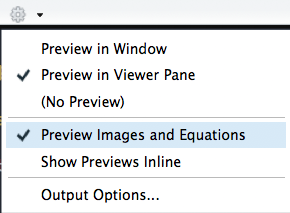

```{r xaringan-themer, include = FALSE}
library(xaringanthemer)
mono_light(
  base_color = "midnightblue",
  header_font_google = google_font("Josefin Sans"),
  text_font_google   = google_font("Montserrat", "500", "500i"),
  code_font_google   = google_font("Droid Mono"),
  link_color = "#8B1A1A", #firebrick4, "deepskyblue1"
  text_font_size = "28px"
)
```

<!-- HTML style block -->
<style>
.large { font-size: 130%; }
.small { font-size: 70%; }
.tiny { font-size: 40%; }
</style>

<!--https://raw.githubusercontent.com/ohsu-knight-cancer-biostatistics/reproducible-research/32bba6a78e347d64745982fb6245915cecb1b7c3/slides-info-reproducible-research/study-group-2016/Chpt%2013%20Web%20Presentations/MathJax_2.Rmd-->

```{r setup, include=FALSE}
knitr::opts_chunk$set(echo = FALSE, cache=FALSE)
```


## What is MathJax?

**MathJax** is a **JavaScript library** that renders LaTeX, MathML, and AsciiMath formula directly in **web browsers**.  

### Key Features:
- Displays **high-quality mathematical notation** on web pages.
- Works with **HTML, Markdown, and blogs**.
- Supports **inline** (wrap in single `$`) and **centered** (wrap in double `$$`) math.
- No compilation needed—browser handles rendering.
- Ensures consistent **cross-platform appearance** of math formulas.

Inline: `$x = \frac{-b \pm \sqrt{b^2 - 4ac}}{2a}$`  
Display:  $x = \frac{-b \pm \sqrt{b^2 - 4ac}}{2a}$

MathJax basic tutorial and quick reference:
.small[http://meta.math.stackexchange.com/questions/5020/mathjax-basic-tutorial-and-quick-reference]
 
---
## Centering you equations

Wrapping into two dollar signs `$$` centers your equations. Other examples, off set and centered - notice double dollar signs:
 
``` 
  $ \sum_{i=0}^n i^2 = \frac{(n^2+n)(2n+1)}{6} $
  
  $$ \sum_{i=0}^n i^2 = \frac{(n^2+n)(2n+1)}{6} $$
```

Inline equation  $\sum_{i=0}^n i^2 = \frac{(n^2+n)(2n+1)}{6}$ on the same line. Or, self-standing equation on a separate line $$\sum_{i=0}^n i^2 = \frac{(n^2+n)(2n+1)}{6}$$
  
  
---
## More Interesting Codes

| **MathJax Syntax** | **Result** |
|--------------------|------------|
| **Greek Letters**  |            |
| `$\alpha \beta \gamma \chi$` | $\alpha\ \beta\ \gamma\ \chi$   |
| `$\Delta \Sigma \Omega$` | $\Delta\ \Sigma\ \Omega$    |
| **Subscripts (_)** |            |
| `$x_i$`            | $x_i$      |
| `$\log_2 x$`       | $\log_2 x$ |
| **Superscripts (^)** |          |
| `$x^2$`            | $x^2$      |
| `$x_i^2$`          | $x_i^2$    |

---
## Grouping with Brackets

Use brackets {...} to delimit a formula containing a superscript or subscript.  Notice the difference the grouping makes:

| MathJax Syntax   | Result |
|------------------|--------|
| `${x^y}^z$`      | ${x^y}^z$ |
| `$x^{y^z}$`      | $x^{y^z}$ |
| `$x_i^2$`        | $x_i^2$ |
| `$x_{i^2}$`      | $x_{i^2}$ |


---
## Scaling:

Add the scaling code `\left(...\right)` to make automatic size adjustments

| Syntax | Rendered |
|--------|----------|
| `$(\frac{\sqrt x}{y^3})$` | $(\frac{\sqrt x}{y^3})$ |
| `$\left(\frac{\sqrt x}{y^3}\right)$` | $\left(\frac{\sqrt x}{y^3}\right)$ |


---
## Sums and Integrals

Subscript (_) designates the lower limit; superscript (^) - upper limit:
 
| Syntax | Rendered |
|--------|----------|
| `$\sum_1^n$` | $\sum_1^n$ |
| `$\sum_{i=0}^\infty i^2$` | $\sum_{i=0}^\infty i^2$ |

Other notable symbols:
 
| Syntax | Rendered |
|--------|----------|
| `$\prod$` | $\prod$ |
| `$\infty$` | $\infty$ |
| `$\bigcup \bigcap$` | $\bigcup\ \bigcap$ |
| `$\int \iint$` | $\int\ \iint$ |


---
## Radical Signs

Use 'sqrt' code to adjust the size of its argument. Note the change in size of the square root function based on the code

| Syntax | Rendered |
|--------|----------|
| `$\sqrt{x^3}$` | $\sqrt{x^3}$ |
| `$\sqrt[3]{\frac xy}$` | $\sqrt[3]{\frac xy}$ |
| `${...}^{1/2}` | ${...}^{1/2}$ |


---
## You can also change fonts!

| Explanation | Rendered |
|-------------|----------|
| `\mathbb` for 'Blackboard bold' | $\mathbb{ABCDEFG}$ |
| `\mathbf` for boldface | $\mathbf{ABCDEFG}$ |
| `\mathtt` for 'typewriter' font | $\mathtt{ABCDEFG}$ |
| `\mathrm` for roman font | $\mathrm{ABCDEFG}$ |
| `\mathsf` for sans-serif | $\mathsf{ABCDEFG}$ |
| `\mathcal` for 'calligraphy' | $\mathcal{ABCDEFG}$ |
| `\mathscr` for script letters | $\mathscr{ABCDEFG}$ |
| `\mathfrak` for "Fraktur" (old German style) | $\mathfrak{ABCDEFG}$ |

---
## You can also change fonts!

In LaTeX/MathJax, certain mathematical functions and operators—like `lim`, `sin`, `cos`, `max`, `ln`—are conventionally typeset in roman font rather than the default italic used for variables. This ensures they are visually distinct from variables.
  - Use `\sin, \lim, \max, \ln`, etc., to render them in roman font.
  - Typing `sin` without the backslash will render it as italic, making it look like a product of variables `s × i × n`.

| Syntax | Rendered |
|--------|----------|
| `$\sin x$` (roman font) | $\sin x$ |
| `$sin x$` (italic, treated as variables) | $sin x$ |


---
## And, add curly brackets

In LaTeX/MathJax, you can create grouped equations using a curly brace. Curly brackets are added using `\begin{cases}` ... `\end{cases}`.

```
$$
\begin{cases}
\widehat{IF_{1D}} = IF_{1D} - f(D)/2 \\
\widehat{IF_{2D}} = IF_{2D} + f(D)/2
\end{cases} \ (1)
$$
```

$$
\begin{cases}
\widehat{IF_{1D}} = IF_{1D} - f(D)/2 \\
\widehat{IF_{2D}} = IF_{2D} + f(D)/2
\end{cases} \ (1)
$$

---
## RStudio bonus

Inline preview of forumlas and images in an RMarkdown document

<center></center>


