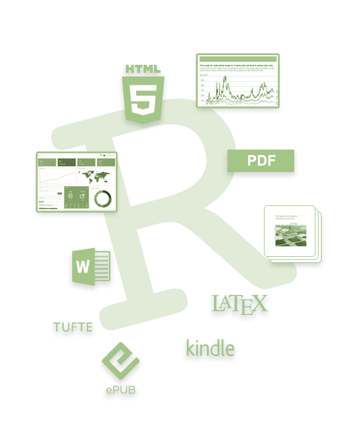
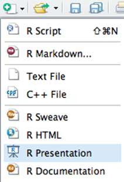
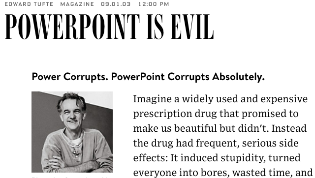
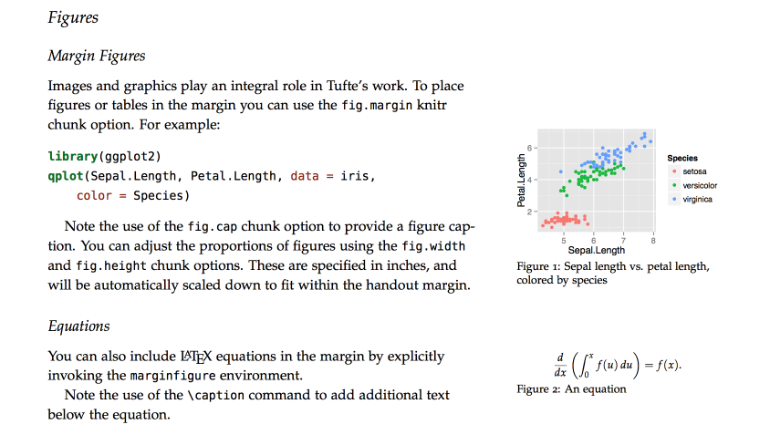
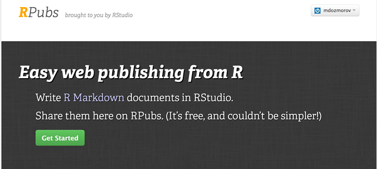

```{r xaringan-themer, include = FALSE}
library(xaringanthemer)
mono_light(
  base_color = "midnightblue",
  header_font_google = google_font("Josefin Sans"),
  text_font_google   = google_font("Montserrat", "500", "500i"),
  code_font_google   = google_font("Droid Mono"),
  link_color = "#8B1A1A", #firebrick4, "deepskyblue1"
  text_font_size = "28px"
)
```

<!-- HTML style block -->
<style>
.large { font-size: 130%; }
.small { font-size: 70%; }
.tiny { font-size: 40%; }
</style>

## The power of RMarkdown

We have seen that RMarkdown is an efficient and flexible tool for technical documentation

```{r, out.width = "300px", echo=FALSE, fig.align='center'}

```

<http://rmarkdown.rstudio.com/>

---
## RMarkdown and RStudio

RStudio houses many tools for creating presentations, reports, web pages, etc.

Some tools require packages and provide templates

---
## R Presentations

- Default presentations in RStudio

- Written in RMarkdown

```{r, out.width = "300px", echo=FALSE, fig.align='center'}

```

<https://support.rstudio.com/hc/en-us/sections/200130218-R-Presentations>


---
## Formatting R Presentations | Beamer

- **Beamer**: LaTeX-based template for creating slides and presentations

- YAML setting: `output: beamer_presentation`

- Customize with YAML: **theme**, **colortheme**, **fonttheme**

- Combine **Markdown** and **LaTeX** content seamlessly

- Presentation format guide: <http://rmarkdown.rstudio.com/beamer_presentation_format.html>

- Tips for better-looking slides: <https://kbroman.wordpress.com/2013/10/07/better-looking-latexbeamer-slides>

---
## Formatting R presentations | ioslides

- Default HTML5 presentation format for R Markdown

- YAML setting: `output: ioslides_presentation`

- Supports Markdown mixed with HTML

- Features: incremental bullets, presenter notes, fullscreen mode

- Customize with options like `widescreen`, `transition`, `incremental`

- Presentation format guide: https://bookdown.org/yihui/rmarkdown/ioslides-presentation.html


---
## Formatting R presentations | others

- **Slidy**: HTML-based slideshow
  - YAML setting: `output: slidy_presentation`
  - Features: Supports incremental slides, table of contents, custom CSS
  - Customization: Adjust slide duration, add footers, custom styles
  - Documentation: R Markdown Slidy Presentation Guide https://bookdown.org/yihui/rmarkdown/slidy-presentation.html

- **reveal.js**: Highly customizable HTML presentation framework
  - YAML setting: `output: revealjs::revealjs_presentation`
  - Features: Fullscreen mode, overview, incremental bullets, LaTeX support
  - Customization: Extensive theming, transitions, and plugin support
  - Documentation: R Markdown reveal.js Guide https://bookdown.org/yihui/rmarkdown/revealjs.html

.small[ https://www.w3.org/Talks/Tools/Slidy2/  
https://revealjs.com/]

<!--
## Slidify

- Customizable presentations in R Markdown. HTML-based. Can render presentations in any format.

- <http://slidify.org/>: 5 min video tutorial 

- Example: Slidify: 'Reproducible HTML Slides from R Markdown', <http://slidify.org/samples/intro/>

- Themes: <https://ramnathv.github.io/slidifyExamples/>
-->

---
## Tufte-style handouts

- Distinctive style of text with sidenotes 



.small[ https://www.wired.com/2003/09/ppt2/ ]

---
## Tufte-style handouts

Tufte Handouts are documents formatted in the style that Edward Tufte uses in his books and handouts. Tufte’s style is known for its extensive use of sidenotes, tight integration of graphics with text, and well-set typography

<center></center>

---
## Tufte-style handouts

- `tufte` package implements rendering `tufte_handouts`, `tufte_book`, `tufte_html`

- Installed as a template in RStudio once the `tufte` package is installed in R

- See the link for examples on accessing and formatting tufte-style reports:

<http://rmarkdown.rstudio.com/tufte_handout_format.html>

---
## Xaringan

- R package for creating HTML5 presentations with R Markdown

- Built on the JavaScript library remark.js, https://remarkjs.com

- YAML setting: `output: xaringan::moon_reader`

- Features:
  - Supports LaTeX math and code highlighting
  - Customizable themes and transitions
  - Presenter notes and incremental slides

- Documentation and examples: https://slides.yihui.name/xaringan

<!--
## Interactive reports

- Shiny - a web application framework for R, <http://shiny.rstudio.com/>

- Presentation format, <http://rmarkdown.rstudio.com/authoring_shiny.html>

- Generally used for exploratory data analysis
-->

---
## Bookdown: Authoring Books with R Markdown

- Bookdown is an R package that extends R Markdown to facilitate writing books, technical documents, and long-form reports. Key Features:
  - Generate output in multiple formats: HTML, PDF, EPUB, and Word.
  - Supports numbering and cross-referencing of figures, tables, equations, and sections.
  - Includes support for citations, bibliographies, and LaTeX-style theorem environments.
  - Allows embedding of interactive content such as HTML widgets and Shiny applications.

Documentation:  
.small[ https://bookdown.org/  
https://bookdown.org/yihui/bookdown/ ] 

.small[R Programming for Data Science https://bookdown.org/rdpeng/rprogdatascience/  
]

---
## Blogdown

- Blogdown is an R package that facilitates building websites using R Markdown and Hugo, a fast static site generator written in Go. Key Features:
  - Dynamic Content: Embed R code, output, and interactive elements within your site.
  - Technical Writing: Supports LaTeX math, citations, and footnotes, making it ideal for academic and technical documentation.
  - Customizable Themes: Utilize themes from Hugo Themes or create your own.
  - Version Control Integration: Seamlessly integrates with Git and GitHub for version control and deployment.

<!-- Getting Started:
  - Install the package: `install.packages("blogdown")`
  - Create a new site: `blogdown::new_site(theme = "hugo-lithium-theme")`
  - Serve the site locally: `blogdown::serve_site()`
-->

Documentation:  
.small[ https://bookdown.org/yihui/blogdown/  
https://github.com/rstudio/blogdown]

---
## Websites | GitHub pages

- A simple way to make a website using Markdown and git, <http://rmarkdown.rstudio.com/rmarkdown_websites.html>

- GitHub pages hosting, <https://pages.github.com/> - quick start on one page

- Example: 'Easy websites with GitHub Pages', <http://kbroman.org/simple_site/>

<!--

## Publishing articles

- LaTeX Journal Article Templates for R Markdown, <https://github.com/rstudio/rticles>


open access peer-reviewed scientific mega journal, <https://peerj.com/>

- Free preprint submission. Judges scientific/methodological rigor. Does not judge the results (may be null), interest or impact


<https://github.com/PeerJ/paper-now> 


## RPubs

- <http://rpubs.com/>: publishing R Markdown reports and presentation on the web
- Everything public
- Example: 'R Cookbook - Chapter 11 - Linear Regression and ANOVA', <http://rpubs.com/escott8908/RC11>

<center>

</center>

## Formulas in presentations

- **MathJax** - formula rendering engine accepting LaTeX, MathML, or AsciiMath syntax.
- Inline formula - decorate with **`$..$`**
    - e.g. `"... when $x < y$ we have ..."` 
    - becomes "... when $x < y$ we have ..."
- Self-standing equation - decorate with **`$$..$$`**
    - e.g. `$$\sum_{i=0}^n i^2 = \frac{(n^2+n)(2n+1)}{6}$$`
    - becomes $$\sum_{i=0}^n i^2 = \frac{(n^2+n)(2n+1)}{6}$$

<https://en.wikibooks.org/wiki/LaTeX/Mathematics>

<http://meta.math.stackexchange.com/questions/5020/mathjax-basic-tutorial-and-quick-reference>
-->
