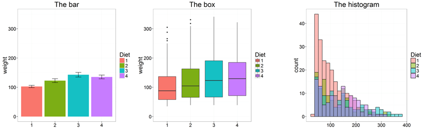
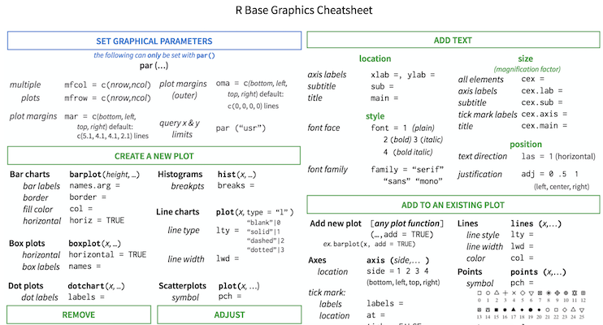

```{r xaringan-themer, include = FALSE}
library(xaringanthemer)
mono_light(
  base_color = "midnightblue",
  header_font_google = google_font("Josefin Sans"),
  text_font_google   = google_font("Montserrat", "500", "500i"),
  code_font_google   = google_font("Droid Mono"),
  link_color = "#8B1A1A", #firebrick4, "deepskyblue1"
  text_font_size = "28px"
)
```

<!-- HTML style block -->
<style>
.large { font-size: 130%; }
.small { font-size: 70%; }
.tiny { font-size: 40%; }
</style>

## Why visualize data?

- Anscombe's quartet comprises four datasets that have nearly identical simple descriptive statistics, yet appear very different when graphed. (See Wikipedia link below)

- 11 observations (x, y) per group

```{r, echo=FALSE, out.height="70%", out.width="70%", fig.align='center'}
knitr::include_graphics("img/figure1.png")
```
.small[ https://en.wikipedia.org/wiki/Anscombe%27s_quartet ]

---
## Why visualize data?

- Anscombe's quartet comprises four datasets that have nearly identical simple descriptive statistics, yet appear very different when graphed. (See Wikipedia link below)
.pull-left[
- 11 observations (x, y) per group

```{r, echo=FALSE, out.height="100%", out.width="100%", fig.align='center'}
knitr::include_graphics("img/figure1.png")
```
]
.pull-right[
```{r, echo=FALSE, out.height="100%", out.width="100%", fig.align='center'}
knitr::include_graphics("img/figure2.png")
```
]
.small[ https://en.wikipedia.org/wiki/Anscombe%27s_quartet ]

<!---
## Why visualized data?

```{r, echo=FALSE, out.height="60%", out.width="60%", fig.align='center'}

```
-->

---
## Why visualized data?

```{r, echo=FALSE, out.height="100%", out.width="100%", fig.align='center'}
knitr::include_graphics("img/DinoSequential.gif")
```
.small[ https://github.com/stephlocke/datasauRus ]

---
## R base graphics

- `plot()` 			versatile function for scatterplots, lines, etc.

- `barplot()` 	bar charts for counts or values

- `boxplot()` 	distribution summaries (median, quartiles, outliers)

- `hist()` 			histogram of frequency distributions

- Other useful functions: `pairs()`, `pie()`, `qqnorm()`, `qqline()`, `qqplot()` <!--`curve()`, `image()/contour()/persp()`-->

```{r, echo=FALSE, out.height="60%", out.width="60%", fig.align='center'}

```

<!-- <http://manuals.bioinformatics.ucr.edu/home/R_BioCondManual#TOC-Some-Great-R-Functions> -->

---
## Use multiple visualization options

```{r, echo=FALSE, out.height="80%", out.width="80%", fig.align='center'}
knitr::include_graphics("img/figure4.png")
```

.small[ Weissgerber TL, Milic NM, Winham SJ, Garovic VD (2015) Beyond Bar and Line Graphs: Time for a New Data Presentation Paradigm. PLOS Biology 13(4): e1002128. https://doi.org/10.1371/journal.pbio.1002128

https://cogtales.wordpress.com/2016/06/06/congratulations-barbarplots/ ]


---
## Heatmaps in R

* `stats::heatmap()` – basic heatmap function in base R

* `pheatmap::pheatmap()` – simple, grid-based, popular for RNA-seq

* `ComplexHeatmap::Heatmap()` – powerful, highly customizable, supports annotations

**Alternatives:**
* `NMF::aheatmap()` – grid-based with clustering and annotation features
* `gplots::heatmap.2()` – adds options (color keys, dendrograms, scaling)
* `heatmap3::heatmap3()` – similar, more flexible extension
* `d3heatmap::d3heatmap()` – interactive heatmap using **d3.js**
* `heatmaply::heatmaply()` – interactive heatmap with improved dendrograms
* `dendextend` – enhanced dendrograms, cluster comparison tools

---
## Alternatives for Visualizing Distributions

- `vioplot()` - Violin plots; show distribution shape + summary statistics

- `pirateplot()` – Combines raw data points, density, boxplot, and mean

- `beeswarm()`: “Bee swarm” plot; spreads out individual points to show distribution while avoiding overlap 

```{r, echo=FALSE, out.height="60%", out.width="60%", fig.align='center'}
knitr::include_graphics("img/figure5.png")
```

.small[https://CRAN.R-project.org/package=vioplot  
https://CRAN.R-project.org/package=yarrr  
https://CRAN.R-project.org/package=beeswarm   
https://bookdown.org/ndphillips/YaRrr/]

---
## Saving Plots

* **Save to PDF (vector graphics):**

```{r eval=FALSE}
pdf("filename.pdf", width = 7, height = 5)
plot(1:10, 1:10)
dev.off()
```

* **Other formats (raster or vector):**
  `bmp()`, `jpeg()`, `pdf()`, `png()`, `tiff()`

* **From RStudio:**
  Use **Export** in the Plots window → save as image or PDF

* **Tip:** Choose **PDF for publication-quality** (scales without loss), **PNG/JPEG** for presentations

* **More info:** `?Devices`

---
## R base graphic cheat-sheet

```{r, echo=FALSE, out.height="80%", out.width="80%", fig.align='center'}

```
.small[ https://github.com/nbrgraphs/mro/blob/master/BaseGraphicsCheatsheet.pdf ]
