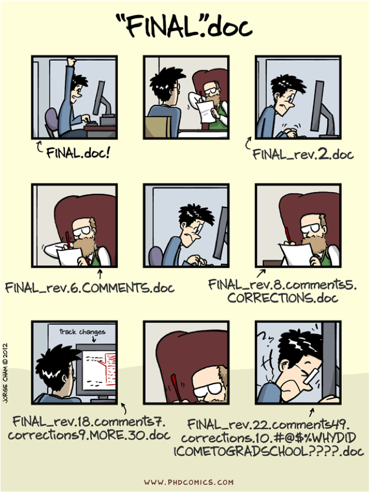
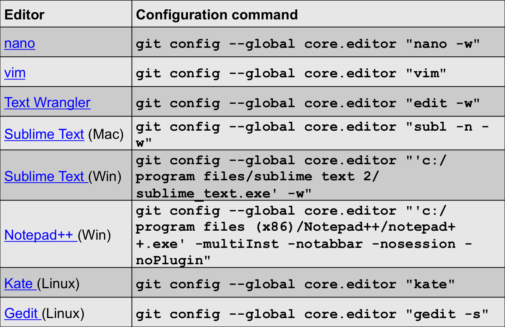
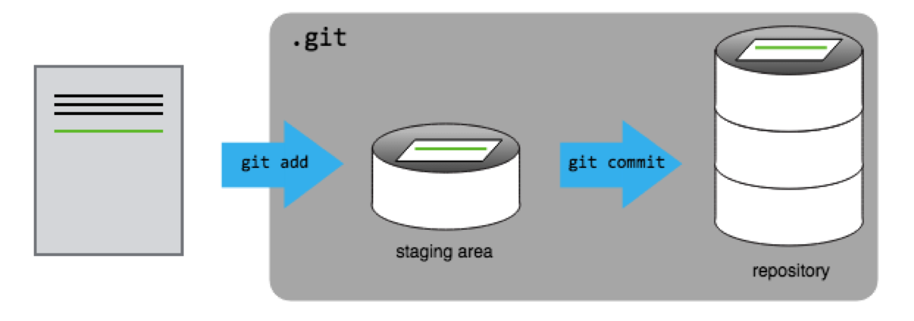
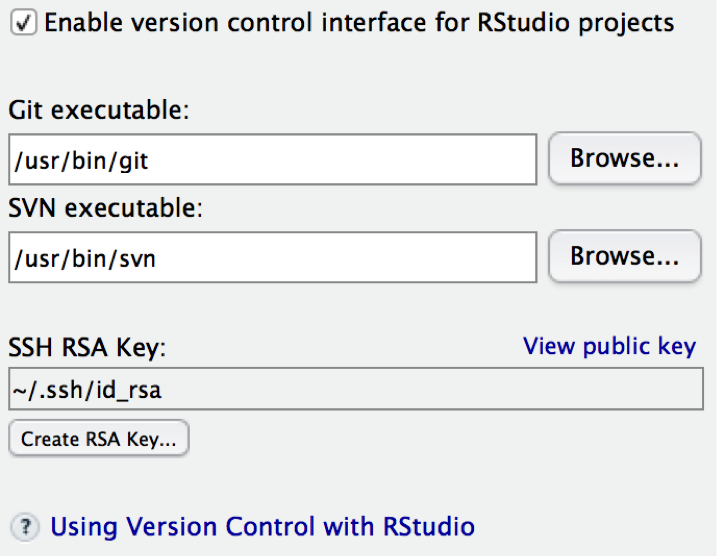
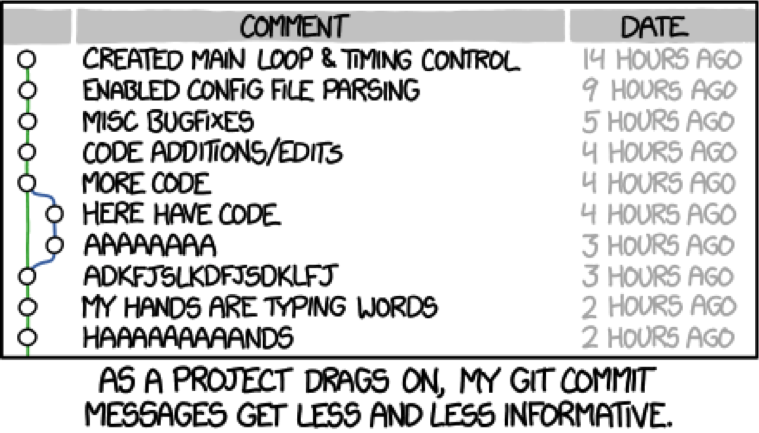
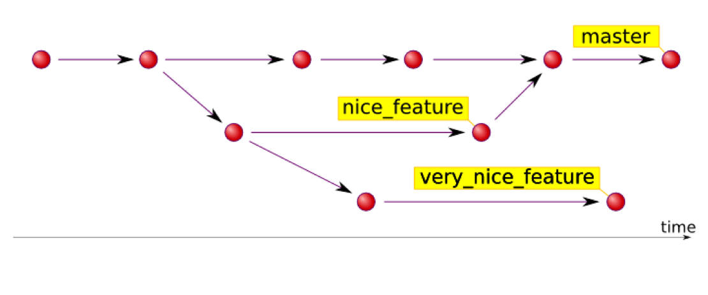
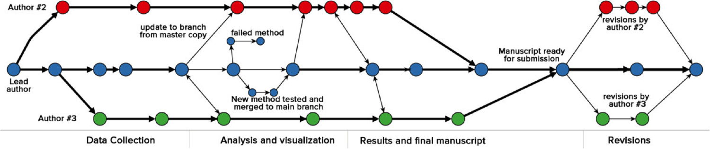

```{r xaringan-themer, include = FALSE}
library(xaringanthemer)
mono_light(
  base_color = "midnightblue",
  header_font_google = google_font("Josefin Sans"),
  text_font_google   = google_font("Montserrat", "500", "500i"),
  code_font_google   = google_font("Droid Mono"),
  link_color = "#8B1A1A", #firebrick4, "deepskyblue1"
  text_font_size = "28px"
)
library(dplyr)
library(ggplot2)
```

<!-- HTML style block -->
<style>
.large { font-size: 130%; }
.small { font-size: 70%; }
.tiny { font-size: 40%; }
</style>

<!--
## Reproducible Research

Good science is built on research that may be reproduced (or copied) by other researchers (and yourself!)

* If another researchers read your report, could they reproduce your work?

* Could you reproduce your own analysis after a year? two?

* Intro to version control: https://rpubs.com/marschmi/ear523_Feb02

## Tips for Reproducible Research

* Document all you do and use your code as the documentation

* Make figures, tables, and statistics the result of scripts

* Keep an entire project in a single directory that is version controlled 

## Keeping History of Changes
<div class="columns-2">
(Jorge Cham, http://www.phdcomics.com)

```{r, out.width = "300px", echo=FALSE}

```

**The Lame Method**

* Multiple dated files with largely the same content

* Periodically zipping files up into numbered/dated archives
</div>
 
## Keeping History of Changes
Version control is the only reasonable way to keep track of changes in code, manuscripts, presentations, and data analysis projects

* Backup of your entire project

* Promotes transparency

* Facilitates reproducibility

* Faster recovery from errors

* Easier collaborations

## Why Version Control?

Version control is not strictly necessary for reproducible research, and it’s admittedly some extra work (to learn and to use) in the short term, but the long term benefits are enormous

People are more resistant to version control than to any other tool, because of the short-term effort and the lack of recognition of the long-term benefits

Imagine that some aspect of your code has stopped working at somepoint. You know it was working in the past, but it’s not working now. How easy is it to figure out where the problem was introduced?
-->

## What is Git?

* Git is an open-source distributed version control system

    * Developed by Linus Torvalds (developer of Linux, @torvalds GitHub name)
    
* Distributed, distinct from centralized (subversion)

    * Authors can work asynchronously without being connected to a central server and synchronize their changes when possible
    
* Complete audit trail of changes, including authorship

* Freedom to explore new ideas without disturbing the main line of work

* Collaborate with elegance – on any file at any time

---
## Advantages of version control:

* It’s easy to set up

* Every copy of a Git repository is a full backup of a project and its history

* A few easy-to-remember commands are all you need for most day-to-day version control tasks

---
## Setting up Git

Download and install Git, https://git-scm.com/downloads. 

Install GitHub Desktop GUI client

* `man <command>. man git` - not always good

* `git --help [<command>]`

---
## Setting up Git

* `git config --global user.name "Your name here”`  
  → Sets your name to appear in commits  

* `git config --global user.email your_email@example.com`  
  → Sets your email to appear in commits  

* `git config --global color.ui "auto"`  
  → Enables colored output in the terminal for better readability  

* `git config core.fileMode false`  
  → Ignores file permission changes (avoids noisy diffs)  

* `git config --list`  
  → Shows all current Git configuration settings


---
## Configuring Text Editor
```{r, out.width = "700px", echo=FALSE}

```

---
## Git Concepts

**Two main concepts**

1. **commit** -  a recorded snapshot of differences you made to your project’s files

2. **repository** - the history of all your project’s commits

* Files can be stored in a project’s working directory (*which users see*) the staging area (*where the next commit is being built up*) and the local repository (*where revisions are permanently recorded*)

```{r, out.width = "550px", fig.align='center', echo=FALSE}

```

---
## Starting a Git Repository

Exercise:

Make a folder. Check with `ls -lah`

`git init` - initializes a repository

`.git` folder contains all Git info - remove it and all will be lost

`git status` - to see the status of your repository.

---
## RStudio and Git

RStudio has built-in facilities for git and GitHub. Set up git in Tools/Global Options

.pull-left[
```{r, out.width = "450px", echo=FALSE}

```
]
.pull-right[
* Your Rstudio project can be your git repository

* Create a project with checkbox “Create a git repository” checked

* Add existing project to version control by selecting git in Tools/Version control/Project setup
]

---
## Status of files in a Git repository

**Untracked → Modified → Staged → Committed**

1. **Untracked** – new files not yet under version control  

2. **Modified** – tracked files that have been changed  

3. **Staged** – changes that are marked to be included in the next commit  

4. **Committed** – changes permanently recorded in the local repository

---
## Tracking Changes

* `git add` - puts files in the staging area

* `git commit` - saves the changes in the files on staging area to the local repository. 

* Always write an informative commit message when committing changes, "-m" flag

* `git status` - shows the status of a repository

```{r, out.width = "550px", echo=FALSE}

```

---
## What to Add

- **New repository from scratch**
  - The first file to create (and `add` and `commit`) is typically a `README.md` file, a Markdown document describing the project

- **A new repo from an existing project**
  - Say you’ve got an existing project that you want to start tracking with git. Go into the directory containing the project

  * Type `git init` – initialize empty repository

  * Type `git add <file> [<file> <file> …]` - start tracking all the relevant files

  * Type `git commit` – saves the snapshot of your current files

---
## What NOT to Add

`git add <file>`, `git add –u` – add all **updated** files

* Don’t include files that are derived from other files in the repository

* Be careful about committing binary files, or really big files.

* Git works best with text files, like code, you can see differences.

* Exercise: commit an image, overwrite it with another, `git diff`

* `git rm <file>` - removes a file from the current and future commits, but it remains in history/repository

* The `.gitignore` file tells Git what files to ignore. `git add -f` forces adding

---
## Ignoring Unnecessary Files

* The various files in your project directory that you may not want to track will show up as such in `git status`

* Unnecessary files should be indicated in a `.gitignore` file

* Each subdirectory can have its own `.gitignore` file

---
## Ignoring Unnecessary Files

Also, you can have a global `gitignore`, such in your home directory, e.g. `~/.gitignore_global`, which contains:

`*~`

`.*~`

`.DS_Store`

`.Rhistory`

`.Rdata`

`.Rproj`

You have to tell git about the global `.gitignore_global` file: `git config --global core.excludesfile ~/.gitignore_global`

---
## When to Commit

* In the same way that it is wise to often save a document that you are working on, so too is it wise to save numerous revisions of your code

* More frequent commits increase the granularity of your “undo” button

* Good commits are atomic: they are the smallest change that remain meaningful

```{r, out.width = "400px", fig.align='center', echo=FALSE}

```

---
## When to Commit

1. One commit = one idea or one change (one feature/task/function to be fixed/added)

2. Make and test the change

3. Add and commit

---
## Best Practices

* A good commit message usually contains a one-line description of the changes since the last commit and indicating their purpose

* Informative commit messages will serve you well someday, so make a habit of adding at least a one-sentence description

- If you want to correct the last commit message, do  
`git commit --amend -m "New commit message"`

```{r, out.width = "400px", echo=FALSE}

```

.small[https://xkcd.com/1296/]

---
## Anatomy of Git Commits

* Each commit is identified by a unique “name” - SHA-1 hashtag (**S**ecure **H**ash **A**lgorithm)

* SHA-1 is an algorithm that takes some data and generates a unique string from it

* SHA-1 hashes are 40 characters long

* Different data will always produce different hashes

* The same data will produce exactly the same hash

---
## Exploring History

`git log` - lists all commits made to a repository in reverse chronological order.

Flags  | Function
------| ------
`-p`  | shows changes between commits
`-3`  | last 3 commits, any number works
`--stat` | shows comparative number of insertions/deletions between commits
`--oneline` | just SHA-1 and commit messages
`--graph` | prettier output
`--pretty` | short/full/fuller/oneline

---
## Exploring History continued

Flags  | Function
------| ------
`--since=X.minutes/hours/days/weeks/months/years` | changes since
or `YY-MM-DD-HH:MM` |
`--until=X.minutes/hours/days/weeks/months/years` | changes before
or `YY-MM-DD-HH:MM` |
`--author=<pattern>` | contributor

---
## Exactly what changes have you made?

* `git diff` – shows all changes that have been made from a previous commit, in all files

* `git diff R/modified.R` - see your changes of a particular file

* To see the differences between commits, use hashtags: `git diff 0da42ba  5m5lpac`

* The differences between commits for a specific file can be checked using `git diff HEAD~2 HEAD -- <file>`

---
## Undoing/Unstaging

* There are a number of ways that you may accidentally stage a file that you don't want to commit

`git add password.txt`

* Check with status to see that it is added but not committed

* You can now unstage that file with:

`git reset password.txt`

* Check with status

---
## Undoing: Discarding Changes

Perhaps you have made a number of changes that you realize are not going anywhere.  Add what you ate for breakfast to `README.md`. Check with status to see that the file is changed and ready to be added

You can now return to previous committed version with:

`git checkout -- README.md`

Check with status and take a look at the file

You can return to a version of the file in a specific commit

`git checkout m5ks3l8 README.md`


---
## Undoing: removing from the repo

Sometimes you may want to remove a file from the repository after it has been committed. Create a file called `READYOU.md`, and add/commit it to the repository

You can now remove the file from the repository with:

`git rm READYOU.md`

List the directory to see that you have no file named `READYOU.md`. Use `git status` to determine if you need any additional steps

What if you delete a file in the shell without git rm? 
`rm README.md`
What does git status say?

Oops! How can you recover this important file?
`git checkout -- README.md`

---
## Undoing: the big "undo"

It is possible that after many commits, you decide that you really want to "rollback" a set of commits and start over. It is easy to revert all your code to a previous version

You can use `git log` and `git diff` to explore your history and determine which version you are interested in. Choose a version and note the hash for that version

`git revert b5l9sa4`

Importantly, this will not erase the intervening commits. This will create a new commit that is changed from the previous commit by a change that will recreate the desired version. This retains a complete provenance of your software, and be compared to the prohibition in removing pages from a lab notebook

---
## Branches

Branches are parallel instances of a repository that can be edited and version controlled in parallel, without disturbing the master branch

They are useful for developing a feature, working on a bug, trying out an idea

If it works out, you can merge it back into the master and if it doesn’t, you can trash it

```{r, out.width = "600px", echo=FALSE}

```
<font size="-3"> https://hades.github.io/2010/01/git-your-friend-not-foe-vol-2-branches/ </font>

---
## Typical Branch Workflow

`git branch` – list current branch(es). An asterisk (*) indicates which branch you’re currently in.

`git branch test_feature` - create a branch called test_feature:

`git checkout test_feature` – switch to the test_feature branch

Make various modifications, and then add and commit.

`git checkout master` - go back to the master branch

`git merge test_feature` – combine changes made in the test_feature branch with the master branch

`git branch –d test_feature` – deletes the test_feature branch

---
## Branches for Collaboration

Multiple authors can work on parallel branches, even on the same document

Conflicts must be resolved manually (using human intelligence)

```{r, out.width = "800px", echo=FALSE}

```
<font size="-3"> 
Ram, Karthik. “Git Can Facilitate Greater Reproducibility and Increased Transparency in Science.” Source Code for Biology and Medicine 8, no. 1 (2013): 7. doi:10.1186/1751-0473-8-7.
</font>

---
## Resolving Conflicts

Conflicts may occur when two or more people change the same content in a file at the same time

`Auto-merging README.md`

`CONFLICT (content): Merge conflict in README.md`

`Automatic merge failed; fix conflicts and then commit the result`

---
## Resolving Conflicts

The version control system does not allow people to blindly overwrite each other’s changes. Instead, it highlights conflicts so that they can be resolved. If you try to push while there are some changes, your push will be rejected, need to pull first. Pull, conflicts, resolve manually.

`<<<<<<< HEAD`

`Your current changes`

`=======`

`Conflicting changes need to be resolved`

`>>>>>>> dabb4c8c450e8475aee9b14b4383acc99f42af1d`

