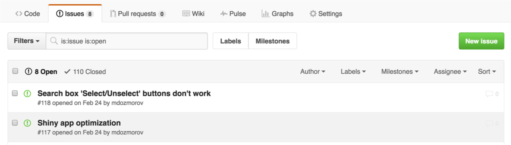
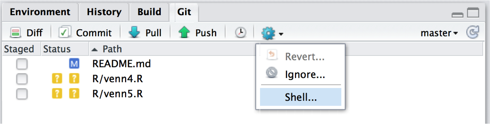

```{r xaringan-themer, include = FALSE}
library(xaringanthemer)
mono_light(
  base_color = "midnightblue",
  header_font_google = google_font("Josefin Sans"),
  text_font_google   = google_font("Montserrat", "500", "500i"),
  code_font_google   = google_font("Droid Mono"),
  link_color = "#8B1A1A", #firebrick4, "deepskyblue1"
  text_font_size = "28px"
)
library(dplyr)
library(ggplot2)
```

<!-- HTML style block -->
<style>
.large { font-size: 130%; }
.small { font-size: 70%; }
.tiny { font-size: 40%; }
</style>


## GitHub

* **GitHub** is an online platform for hosting Git repositories.

* It enables **collaboration**, **version control**, and **code sharing** across teams and the open-source community.

* Think of it as a **social network for code**: you can follow projects, contribute, and review others’ work.

* GitHub offers **free accounts**, including private repositories for students via GitHub Education https://education.github.com/.

* Alternatives include **GitLab**, **Bitbucket**, and **gitea**.


---
## Why use GitHub?

True open source

Graphical user interface for git

Exploring code and its history

Tracking issues

Facilitates:
Learning from others, seeing what people are up to, and contributing to others’ code

Lowers the barrier to collaboration:
"There’s a typo in your documentation." vs. "Here’s a correction for your documentation."

---
## Remotes in GitHub

A local Git repository can be connected to one or more remote repositories
`git remote add origin https://github.com/username/reponame`

Check your work `git remote -v`

Use the `https://` protocol (not `git@github.com`) to connect to remote repositories until you have learned how to set up SSH

`git push origin main` - copies changes from a local repository to a remote repository

`git pull origin main` - copies changes from a remote repository to a local repository

---
## Asynchronous Collaboration

* "FORK" someone’s repository on GitHub – this is now YOUR copy

* `git clone` it on your computer

* Make changes, `git add`, `git commit`

* `git push` changes to your copy

*Create "NEW PULL REQUEST" on GitHub

---
## Keeping in sync with the owner's repo

Add a connection to the original owner’s repository ('upstream' - alias to other repo)  
`git remote add upstream https://github.com/username/reponame`

`git remote –v` - check what you have

`git pull upstream main` – pull changes from the owner’s repo

Make changes, `git add`, `git commit`, `git push`

Question: Where will they go? Can you do git push upstream main?

---
## Create Pull Request

Go to your version of the repository on GitHub

Click the "NEW PULL REQUEST" button at the top

Note that the owner’s repository will be on the left and your repository will be on the right

Click the "CREATE NEW PULL REQUEST" button. Give a succinct and informative title, in the comment field give a short explanation of the changes and click the green button "CREATE PULL REQUEST" again

---
## What others see/do with pull requests

The owner goes to his version of the repository. Clicks on "PULL REQUESTS" at the top. A list of pull requests made to his repo comes up

Click on the particular request. The owner can see other’s comments on the pull request, and can click to see the exact changes

If the owner wants someone to make further changes before merging, he add a comment

If the owner hates the idea, he just click the "Close" button

If the owner loves the idea, he clicks the "Merge pull request"

---
## Track and Resolve Issues

* Issues keep track of tasks, enhancements, and bugs for your projects

* They can be shared and discussed with the rest of your team

* Written in Markdown, can refer to @collaborator, #other_issue

```{r, out.width = "700px", echo=FALSE}

```

* Can use commit messages to fix issues, e.g., `"Add missing tab, fix #100"`. Use any keyword, `"Fixes", "Fixed", "Fix", "Closes", "Closed", or "Close"`


---
## RStudio and GitHub

Basic commands are available:

* See which files are untracked, modified, stage

* What branch you are in

* Add files, commit, push/pull

* See differences, history

* Revert changes, ignore files

* For heavy lifting git, use shell

```{r, out.width = "450px", echo=FALSE}

```


