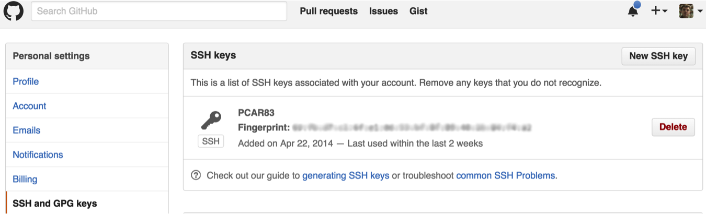

```{r xaringan-themer, include = FALSE}
library(xaringanthemer)
mono_light(
  base_color = "midnightblue",
  header_font_google = google_font("Josefin Sans"),
  text_font_google   = google_font("Montserrat", "500", "500i"),
  code_font_google   = google_font("Droid Mono"),
  link_color = "#8B1A1A", #firebrick4, "deepskyblue1"
  text_font_size = "28px"
)
library(dplyr)
library(ggplot2)
```

<!-- HTML style block -->
<style>
.large { font-size: 130%; }
.small { font-size: 70%; }
.tiny { font-size: 40%; }
</style>

## Why Encryption Matters

- Protects sensitive data from interception

- Ensures confidentiality – only intended recipient can read

- Ensures authenticity – verifies identity of sender

- Ensures integrity – prevents tampering in transit

---
## What is SSH?

- **SSH** = *Secure Shell Protocol*  
- A cryptographic network protocol for secure communication between two computers  
- Provides:  
  - Encrypted login (replaces insecure telnet/rlogin)  
  - Secure file transfer (SCP, SFTP)  
  - Remote command execution  

- Uses **key pairs** (private + public keys) for authentication  
- GitHub uses SSH to let you prove *who you are* without a password  

---
## Encryption allows Passwordless Login for GitHub

- GitHub requires SSH or HTTPS for authentication  

- HTTPS prompts for username and Personal Access Token (PAT) each time  

- SSH with keys allows secure **passwordless login**  

- Keys are safer and more convenient for frequent GitHub use  

.small[https://docs.github.com/en/authentication/keeping-your-account-and-data-secure/managing-your-personal-access-tokens]

---
## Encryption Concepts

* Both public and private keys are generated by one individual – they are yours

* A public key is a “lock” that can be opened with the corresponding private key

* Public key can be placed on any other computer you want to connect to, Private key stays private on any machine you’ll be connecting from

* Only your private key can “open” your public key

```{r, out.width = "200px", echo=FALSE}

```

---
## Getting Public and Private Keys

Generate your public and private keys


First, check if you already have them:

`ls -al ~/.ssh`

If not, generate:

`ssh-keygen -t rsa -b 4096 -C your_email@example.com`

---
## Getting Public and Private Keys

.pull-left[
```{r, out.width = "250px", echo=FALSE}

```

~/.ssh/id_rsa &nbsp;&nbsp; ~/.ssh/id_rsa.pub 

```{r, out.width = "250px", echo=FALSE}

```
~/.ssh/authorized_keys 
]
.pull-right[

- **id_rsa** - Your *private key*
- Stays **only** on your computer
- Must be kept secret


- **id_rsa.pub** - Your *public key*
- Safe to share
- Added to services (e.g., GitHub) to identify you


- **authorized_keys** - A file on the *remote server*
- Lists all public keys that are allowed to connect
- If your `id_rsa.pub` is added, you can log in using your private key
]

---
## Add Public Key to GitHub

Go to your GitHub Account Settings

* Click “SSH and GPG keys” on the left, then “New SSH Key” on the right.

* Add a label (like “My laptop”) and paste your public key into the text box.

* Test it, `ssh -T git@github.com`. You should see something like “Hi username! You've successfully authenticated but Github does not provide shell access.”

```{r, out.width = "450px", echo=FALSE}

```

.small[https://docs.github.com/en/authentication/connecting-to-github-with-ssh]

---
## Add Public Key to any Machine

* Copy your public key `~/.ssh/id_dsa.pub` to a remote machine 

* Add the content of your public key to `~/.ssh/authorized_keys` on the remote machine

* Make sure the `.ssh/authorized_keys` has the right permissions (read+write for user, nothing for group and all)

```{bash eval=FALSE}
cat ~/.ssh/id_dsa.pub | \
   ssh user@remote.machine.com 'mkdir -p .ssh; cat >> .ssh/authorized_keys; chmod 600 authorized_keys'
```

---
## SSH Key Permissions

- **id_rsa (private key)**  
  - Must be **read/write only for you**  
  - Command: `chmod 600 ~/.ssh/id_rsa`  
  - Never share or commit to GitHub  

- **id_rsa.pub (public key)**  
  - Safe to share  
  - Can be world-readable  
  - Example: `chmod 644 ~/.ssh/id_rsa.pub`  

- **authorized_keys (on server)**  
  - Contains trusted public keys  
  - Should be user-readable and writable only  
  - Command: `chmod 600 ~/.ssh/authorized_keys`  

---
## Password-less login

Your private key should be visible to your terminal session

Start SSH agent

Add auto-start function in your `~/.bashrc`

```{r, out.width = "550px", echo=FALSE}

```
.small[ https://gist.github.com/rezlam/850855 ]

---
## Copy files over SSH (without password)

* `scp <file> user@remote.host.com:~/work/`

* `rsync –arvh –progress <file> user@remote.host.com:~/work/`


