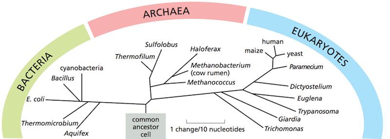
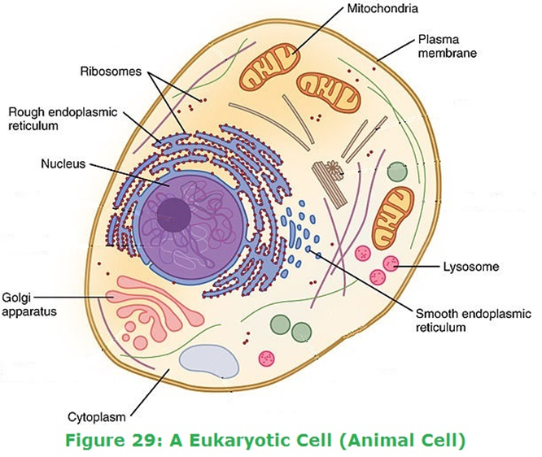
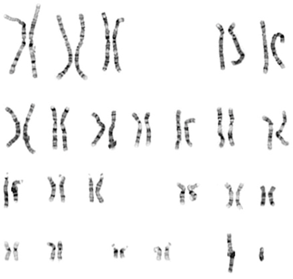

```{r xaringan-themer, include = FALSE}
library(xaringanthemer)
mono_light(
  base_color = "midnightblue",
  header_font_google = google_font("Josefin Sans"),
  text_font_google   = google_font("Montserrat", "500", "500i"),
  code_font_google   = google_font("Droid Mono"),
  link_color = "#8B1A1A", #firebrick4, "deepskyblue1"
  text_font_size = "28px"
)
```

<!-- HTML style block -->
<style>
.large { font-size: 130%; }
.small { font-size: 70%; }
.tiny { font-size: 40%; }
</style>

## Phylogenetic tree (Domains of life)

```{r, echo=FALSE, out.height="40%", fig.align='center'}

```

.small[
- **Bacteria** – a large domain of prokaryotic microorganisms. They lack a membrane-bound nucleus and have diverse shapes, metabolisms, and habitats.
- **Archaea** – a domain of single-celled prokaryotes distinct from bacteria; differ in membrane lipids, cell wall composition, and certain genetic machinery. Often inhabit extreme environments.
- **Eukaryota** – organisms whose cells contain a membrane-bound nucleus enclosed within a nuclear envelope, along with other membrane-bound organelles. ]

---
## Types of organisms, arranged by complexity

Viruses → Bacteria (and other prokaryotes) → Unicellular eukaryotes → Multicellular eukaryotes

- **Viruses** – acellular infectious agents with very small genomes (as little as ∼10,000 bp); require a host cell for replication.  

- **Prokaryotes** – simplest free-living cellular organisms (e.g., bacteria, archaea), typically with genomes of ∼1–5 million bp; lack a membrane-bound nucleus.  

- **Eukaryotes** – organisms whose cells contain membrane-bound organelles, including a nucleus (e.g., yeast, plants, animals).  

- **Multicellular eukaryotes** – composed of specialized cell types requiring differential gene expression and intercellular communication to maintain organismal function.  

---  
## Overview of Cellular Life

- **Cells** are the fundamental units of structure and function in all living organisms.  
- Each cell is a complex system with specialized substructures (organelles in eukaryotes) carrying out essential biological processes.  


---
## Procaryotic cell

.pull-left[.small[
* **Cell wall** – Provides shape, rigidity, and protection; made of peptidoglycan (bacteria) or other polymers (archaea)
* **Plasma membrane** – Selective barrier controlling molecular transport; phospholipid bilayer; site of energy generation
* **Cytoplasm** – Gel-like interior where biochemical reactions occur; contains enzymes, nutrients, ions
* **Nucleoid** – Region containing the circular DNA genome; not membrane-bound
* **Plasmids** – Small, circular, extra-chromosomal DNA; often carry antibiotic resistance or specialized functions
* **Ribosomes** – Sites of protein synthesis; 70S type (smaller than eukaryotic)
* **Flagella** – Locomotion; rotates like a propeller
* **Pili / Fimbriae** – Attachment to surfaces and DNA exchange (conjugation); pili are longer and fewer than fimbriae
* **Capsule / Slime layer** – Protection from immune system and desiccation; composed of polysaccharides ]]
.pull-right[
```{r, echo=FALSE, out.height="70%", fig.align='center'}
knitr::include_graphics("img/Procaryotic.png")
```
]

---
## Eukaryotic cell

.pull-left[ .small[
* **Plasma membrane** – Selective barrier controlling molecular transport; phospholipid bilayer with embedded proteins
* **Cytoplasm** – Fluid-filled interior containing organelles, cytoskeleton, and molecules
* **Nucleus** – Membrane-bound compartment containing linear DNA and nucleolus (site of ribosome assembly)
* **Rough ER** – Studded with ribosomes; synthesizes and modifies proteins
* **Smooth ER** – Lipid synthesis, detoxification, calcium storage
* **Golgi apparatus** – Modifies, sorts, and packages proteins and lipids for transport
* **Mitochondria** – Energy production (ATP) via oxidative phosphorylation; has its own DNA and ribosomes
* **Ribosomes** – Sites of protein synthesis; 80S type (larger than prokaryotic)
* **Cytoskeleton** – Network of microtubules, microfilaments, and intermediate filaments for structure, transport, and movement
* **Lysosomes** – Digestive compartments containing hydrolytic enzymes
* **Peroxisomes** – Break down fatty acids and detoxify reactive oxygen species
* **Centrosome / Centrioles** – Organize microtubules during cell division (in animal cells)
* **Chloroplasts** – Photosynthesis; contains its own DNA and ribosomes (in plants and algae)
* **Cell wall** – Structural support (plants, fungi, algae); made of cellulose (plants) or chitin (fungi)
* **Vacuoles** – Storage of water, nutrients, and waste; large central vacuole in plant cells maintains turgor pressure

]]
.pull-right[
```{r, echo=FALSE, out.height="70%", fig.align='center'}

```
]

---
## Differences between Prokaryotic and Eukaryotic Cells

.small[
| Feature                          | Prokaryotic Cells                                                       | Eukaryotic Cells                                      |
| -------------------------------- | ----------------------------------------------------------------------- | ----------------------------------------------------- |
| **Nucleus**                      | Absent (DNA in nucleoid region)                                         | Present                                |
| **Membrane-bound organelles**    | Absent                                                                  | Present (e.g., nucleus, mitochondria, ER, Golgi)      |
| **Ribosome size**                | 70S                                                                     | 80S                                                   |
| **Cell wall composition**        | Peptidoglycan (bacteria), proteins/polysaccharides (archaea)            | Cellulose (plants), chitin (fungi), absent in animals |
| **Mitotic division**             | Absent (binary fission)                                                 | Present (mitosis/meiosis)                             |
| **DNA associated with histones** | Generally absent (present in archaea)                                   | Present                                               |
| **Number of chromosomes**        | Single, circular                                                        | Multiple, linear                                      |
| **Cell membrane composition**    | Phospholipid bilayer; ester-linked (bacteria) or ether-linked (archaea) | Phospholipid bilayer; ester-linked                    |
| **Number of cells**              | Always unicellular                                                      | Unicellular or multicellular                          |
| **Cell size**                    | Small (0.1–5 µm)                                                        | Larger (10–100 µm)                                    |
]

---
## The Genome: Blueprint of Life

**Genome** – The complete set of genetic material in an organism, including all of its DNA (or RNA in some viruses).

* Contains **genes** (coding sequences) and **noncoding regions** (regulatory elements, repetitive sequences, etc.)

* Organized into **chromosomes** (linear in eukaryotes, usually circular in prokaryotes)

* Encodes the instructions for building and maintaining the organism

* Inherited from parent(s) and passed to offspring

```{r, echo=FALSE, out.width="150px", fig.align='center'}
knitr::include_graphics("img/dna_in_hands.jpg")
```

---
## The Genome: Blueprint of Life

Your genome, together with your environment and life experiences, influences who you are:

* Height
* Hair, eye, and skin color
* Shape and size of facial/body features
* Risk of developing certain diseases
* Response to medications
* Lifespan and cognitive abilities

Many physical traits are strongly determined by genetics.

```{r, echo=FALSE, out.width="150px", fig.align='center'}
knitr::include_graphics("img/dna_in_hands.jpg")
```

---
## Eukaryotic cells and the genome

.pull-left[ 
* Each cell contains a complete copy of an organism’s genome — the blueprint for all cellular structures and functions.

* The genome is organized into chromosomes, composed of tightly packed and coiled DNA.

* Cells come in many types (e.g., blood, skin, nerve), yet all originate from a single fertilized egg.
]
.pull-right[
```{r, echo=FALSE, out.height="70%", fig.align='center'}

```
]

---
## The nucleus

.pull-left[ 
* The nucleus is a specialized compartment found only in eukaryotic cells, housing the organism’s DNA.

* The nuclear membrane separates the nucleus from the cytoplasm, the rest of the cell’s interior.

* The entire cell is enclosed by the plasma membrane containing diverse proteins that function as channels and pumps, regulating movement into and out of the cell.
]
.pull-right[
```{r, echo=FALSE, out.height="70%", fig.align='center'}

```
]

---
## Discovery of chromosomes

.pull-left[ 
* By the mid-1800s, microscopes were powerful enough to reveal unusual structures called **chromosomes**, which appeared to play a key role in cell division.

* Chromosomes could only be seen clearly when appropriate **stains** were applied.

* The term **“chromosome”** comes from Greek words meaning **“colored body.”**
]
.pull-right[
```{r, echo=FALSE, out.width="60%", fig.align='center'}
knitr::include_graphics("img/walter_flemming_mitosis.gif")
```
.small[Drawing of mitosis by Walther Flemming. Flemming, W. Zellsubstanz, Kern und Zelltheilung (F. C. W. Vogel, Leipzig, 1882).]
]

---
## Chromosomes

* Chromosomes are packets of tightly coiled DNA located in the nucleus.

* Each chromosome carries a unique set of **genes**, and the specific location of a gene on a chromosome is called its **genetic locus**.

* Humans have **46 chromosomes**: 44 autosomes and 2 sex chromosomes. Autosomes occur in **pairs** (diploid).

* Because each autosome is present in two copies, there are **two alleles** of a gene at each locus.

* Germ cells (sperm and egg) carry only **one copy** of each chromosome and gene and are **haploid**.

---
## Centromere locations

* The **centromere** divides a chromosome into a short arm (**p**, for *petit*) and a long arm (**q**).

* It is defined by the first band on the short arm (**p10**) and the first band on the long arm (**q10**).

* **Telomeres** are located at the ends of the chromosome arms (**pter** and **qter**).
```{r, echo=FALSE, out.width="35%", fig.align='center'}

```
.small[ https://people.rit.edu/rhrsbi/GeneticsPages/Handouts/ChromosomeNomenclature.pdf ]

---
## Banding Patterns and Nomenclature

.pull-left[ 
* Each chromosome arm is divided into **regions** based on consistent, distinct landmarks.
* Regions are further subdivided into **bands** and **sub-bands**.
* The regions closest to the centromere are numbered **1** (p1 and q1).
* Numbers increase moving away from the centromere toward the chromosome ends.  
  * Example: **Xp22.3** = X chromosome, short arm, region 2, band 2, sub-band 3.
  * It is read as "**X p two-two point three**," not "**X p twenty-two point three**."

]
.pull-right[
```{r, echo=FALSE, out.width="70%", fig.align='center'}

```
]

---
## Karyotype

.pull-left[ 
* **Cytogenetics** is the study of normal and abnormal chromosomes.
* The normal arrangement of chromosomes is called the **euploid** karyotype.
* **Euploidy** means that all autosomes are present in properly paired structures, and the sex chromosomes (X and Y) are present in the expected configuration for the individual’s sex.
* Deviations from the euploid state are called **aneuploidy**, which can include loss of chromosomes, extra copies, or other structural alterations.
]
.pull-right[
```{r, echo=FALSE, out.width="100%", fig.align='center'}

```
]

---
## Cell cycle

```{r, echo=FALSE, out.width="80%", fig.align='center'}
knitr::include_graphics("img/Cell_cycle.png")
```

.small[ https://www.youtube.com/watch?v=NR0mdDJMHIQ ]

