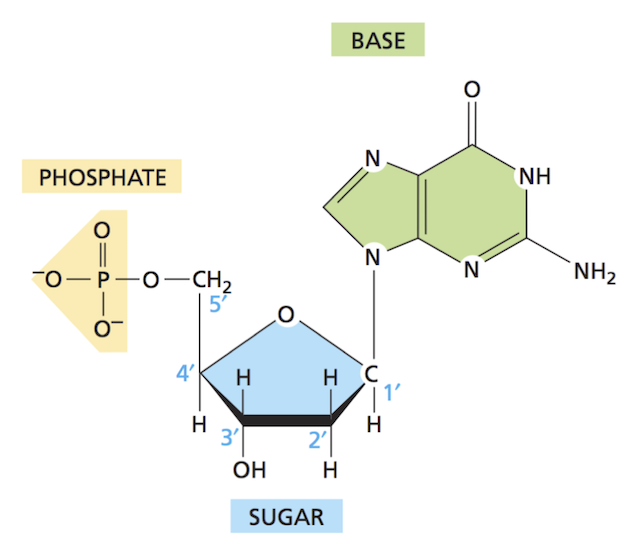
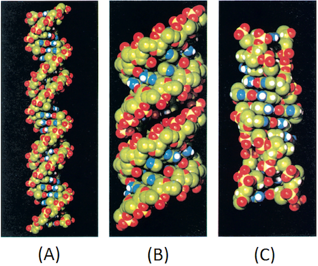

```{r xaringan-themer, include = FALSE}
library(xaringanthemer)
mono_light(
  base_color = "midnightblue",
  header_font_google = google_font("Josefin Sans"),
  text_font_google   = google_font("Montserrat", "500", "500i"),
  code_font_google   = google_font("Droid Mono"),
  link_color = "#8B1A1A", #firebrick4, "deepskyblue1"
  text_font_size = "28px"
)
```

<!-- HTML style block -->
<style>
.large { font-size: 130%; }
.small { font-size: 70%; }
.tiny { font-size: 40%; }
</style>
  
## Genes and genome

* **Genes** are discrete hereditary units located on chromosomes (DNA).

* Each gene provides specific instructions for producing a particular trait or function in the organism.

* The complete set of genes in an organism is called its **genome**.


---
## Building blocks of DNA

* The basic unit, a **nucleotide**, consists of an organic **base** attached to a deoxyribose **sugar**.

* A **phosphate** group is also attached to the sugar.

* The **base** can be one of four types: **cytosine (C), thymine (T), adenine (A), or guanine (G)**.


---
## Nucleotide structure

```{r, echo=FALSE, out.height="550px", out.width="630px", fig.align='center'}

```

---
## Nucleotide structure

.pull-left[
.center[Ribose Sugar]
```{r, echo=FALSE, out.height="40%", fig.align='center'}
knitr::include_graphics("img/Ribose.png")
```
.center[**RNA** - **Ribo**_nucleic_ acid]
]
.pull-right[
.center[ Deoxyribose Sugar ]
```{r, echo=FALSE, out.height="40%", fig.align='center'}

```
.center[**DNA** - **Deoxyribo**_nucleic_ acid]
]

---
## Bases

```{r, echo=FALSE, out.height="40%", fig.align='center'}
knitr::include_graphics("img/Bases.png")
```

---
## Getting to know DNA: Gel electrophoresis

* In the mid-1900s, methods were developed to separate and visualize DNA using an electrically charged gel (originally made from sugar).

* DNA samples are loaded into “lanes” at the top of the gel, and an electric field is applied.

* Smaller DNA fragments migrate faster and move farther down the gel, while larger fragments remain closer to the top.

* This allows detection of DNA and comparison of relative fragment lengths.

* One lane is often reserved for a **DNA ladder**, a set of fragments of known sizes.

---
## Getting to know DNA: Gel electrophoresis


```{r, echo=FALSE, out.width="40%", fig.align='center'}
knitr::include_graphics("img/gel_electrophoresis_dna_bands_yourgenome.png")
```
.small[ https://www.yourgenome.org/theme/what-is-gel-electrophoresis/ ]

---
## Discovery of double helix, 1953

- James Watson and Francis Crick

```{r, echo=FALSE, out.height="45%", out.width="45%",fig.align='center'}
knitr::include_graphics("img/JM_FC.png")
```

---
## Genomic DNA

* DNA is a **double helix**, with bases oriented inward (like rungs of a ladder) and sugar-phosphate backbones forming the outer sides (like the rails of a twisted ladder).

* The two strands are **complementary**, following Watson-Crick base-pairing rules.

* **A** (a purine) pairs with **T** (a pyrimidine), and **C** (a pyrimidine) pairs with **G** (a purine).

* Base pairs are held together by **hydrogen bonds**, and the twisting of the helix results from the geometry of these interactions.

---
## Before the discovery

```{r, echo=FALSE, out.width="95%", fig.align='center'}

```

---
## Genomic DNA
```{r, echo=FALSE, out.height="37%", out.width="37%", fig.align='center'}

```
.small[ WATSON, J., CRICK, F. Molecular Structure of Nucleic Acids: A Structure for Deoxyribose Nucleic Acid. Nature 171, 737–738 (25 April 1953). https://doi.org/10.1038/171737a0 ]

---
## Nucleic acid strand

- Strand synthesis - from 5' to 3' end: (5') TACG (3')
```{r, echo=FALSE, out.height="40%", out.width="40%", fig.align='center'}
knitr::include_graphics("img/strand.png")
```

---
## Double strand: DNA base pairing

- The two strands are held together by hydrogen bonds between bases

```{r, echo=FALSE, out.height="40%", out.width="40%", fig.align='center'}
knitr::include_graphics("img/DNA.png")
```

---
## Rules of base pairing

- Rules of base pairing: A-T(U), C-G (and G-U in RNA)

```{r, echo=FALSE, out.height="38%", out.width="38%", fig.align='center'}
knitr::include_graphics("img/rules_of_pair.png")
```

---
## Base pairing

* Base pairs are held together by weak **hydrogen bonds**.

* While each bond is weak individually, their cumulative effect across the strands provides strong overall stability.

* This makes DNA chemically stable and an effective carrier of genetic information.

<!--
## Helixes conformation

<center>

</center>

- A: B-form: Right-handed, 3.4 nm between bases, 10 bases per turn
- B: A-form: Right-handed, 2.3 nm between bases, 11 bases per turn
- C: Z-form: Left-handed
-->

---
## Helixes conformation

```{r, echo=FALSE, out.height="40%", out.width="40%", fig.align='center'}
knitr::include_graphics("img/Helixes2.png")
```
- A: B-form: Right-handed, 3.4 nm between bases, 10 bases per turn
- B: A-form: Right-handed, 2.3 nm between bases, 11 bases per turn
- C: Z-form: Left-handed

---
## Eukaryotic DNA packaging

```{r, echo=FALSE, out.height="40%", out.width="40%", fig.align='center'}
knitr::include_graphics("img/packaging.png")
```
.small[ https://www.biointeractive.org/classroom-resources/how-dna-packaged ]

---
## The central dogma of molecular biology

.pull-left[
```{r, echo=FALSE, out.height="80%", out.width="80%", fig.align='center'}
knitr::include_graphics("img/Central_Dogma2.png")
```
]
.pull-right[
- Formulated by Francis Crick in 1953

- **DNA makes RNA and RNA makes protein**

- **Transcription** is the making of an RNA molecule off a DNA template. 

- **Translation** is the making of a protein off an RNA template.
]
