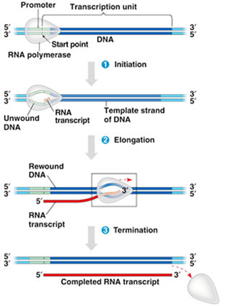
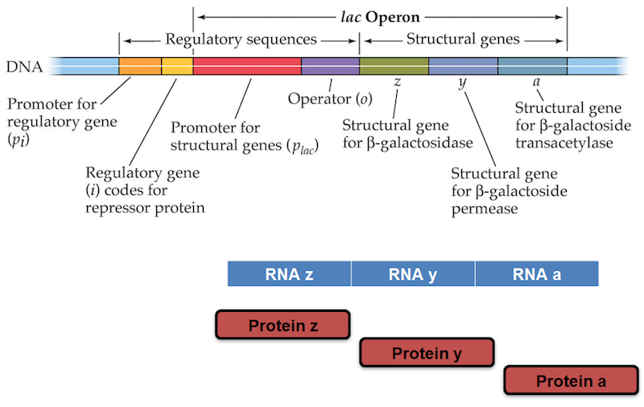

```{r xaringan-themer, include = FALSE}
library(xaringanthemer)
mono_light(
  base_color = "midnightblue",
  header_font_google = google_font("Josefin Sans"),
  text_font_google   = google_font("Montserrat", "500", "500i"),
  code_font_google   = google_font("Droid Mono"),
  link_color = "#8B1A1A", #firebrick4, "deepskyblue1"
  text_font_size = "28px"
)
```

<!-- HTML style block -->
<style>
.large { font-size: 130%; }
.small { font-size: 70%; }
.tiny { font-size: 40%; }
</style>

## Biotechnologies

* Powerful biotechnologies for manipulating DNA serve as building blocks for even more advanced tools.

* **DNA synthesis machines** can produce short DNA molecules of any specified sequence.

* The **polymerase chain reaction (PCR)** allows rapid amplification of a chosen DNA sequence in solution, using only defined starting and ending sequences (primers).


---
## Polymerase Chain Reaction (PCR)

* Developed in 1983 by **Kary Mullis**, PCR enables amplification of DNA fragments flanked by known **primer** sequences.

* Highly sensitive and specific, it can amplify a single DNA molecule into billions of copies with near-perfect fidelity.

* The method relies on **DNA polymerase** enzymes, which copy DNA by adding free nucleotides to a single-stranded template.


<!---
## Polymerase Chain Reaction (PCR)

```{r, echo=FALSE, out.height="100%", out.width="100%", fig.align='center'}
knitr::include_graphics("img/PCR-polymerase_chain_reaction.png")
```
.small[ https://info.abmgood.com/polymerase-chain-reaction-pcr ]
-->

---
## DNA amplification using PCR

```{r, echo=FALSE, out.height="60%", out.width="60%", fig.align='center'}

```
.small[ https://www.animalgenome.org/edu/doe/pcr.html ]

---
## Quantitative Polymerase Chain Reaction (qPCR)

```{r, echo=FALSE, out.height="60%", out.width="60%", fig.align='center'}

```
.small[
* **qPCR** measures initial DNA abundance by tracking **fluorescence** during amplification.
* Fluorescence rises as DNA accumulates:
  * **Dyes** (e.g., SYBR Green) fluoresce when bound to DNA.
  * **Probes** (e.g., TaqMan) emit signal when cleaved by DNA polymerase.
* The **amplification curve** plots fluorescence vs. cycle number.
* The **Ct value** (cycle where fluorescence crosses threshold) reflects starting DNA quantity — lower Ct = more template.
]

---
## RNA vs. DNA: Single vs. double strands

* **RNA – ribonucleic acid**
  1. Usually **single-stranded** (can fold into complex secondary structures).
  2. Contains **ribose sugar** (with a 2′-OH group).
  3. Bases: **A, U, C, G** (uracil replaces thymine).
  4. Less chemically stable than DNA, more transient—functions in **gene expression, catalysis (ribozymes), and regulation**.

* **DNA – deoxyribonucleic acid**
  1. Typically **double-stranded helix** (antiparallel strands).
  2. Contains **deoxyribose sugar** (lacks the 2′-OH group).
  3. Bases: **A, T, C, G**.
  4. Chemically more stable—serves as the **long-term genetic information storage**.

---
## Nucleic acids - RNA

* **Messenger RNA (mRNA)** – **carries genetic information** from DNA to ribosomes; serves as the template for protein synthesis.

* **Transfer RNA (tRNA)** – **delivers specific amino acids** to the ribosome by recognizing codons in mRNA through its anticodon loop.

* **Ribosomal RNA (rRNA)** – **structural and catalytic core** of the ribosome; coordinates mRNA decoding and peptide bond formation.

* **Small RNAs (regulatory RNAs)**
  * **miRNA (microRNA)** – post-transcriptional regulation, represses translation or induces degradation of target mRNAs.
  * **siRNA (small interfering RNA)**, **snRNA (small nuclear RNA)**, **piRNA (PIWI-interacting RNA)**

<!--  * **siRNA (small interfering RNA)** – guides RNA-induced silencing complex (RISC) for sequence-specific mRNA degradation.
  * **snRNA (small nuclear RNA)** – components of the spliceosome, essential for pre-mRNA splicing.
  * **piRNA (PIWI-interacting RNA)** – silences transposable elements, particularly in germline cells.-->

* **Long noncoding RNA (lncRNA)** – chromatin remodeling, transcription, and post-transcriptional regulation.

---
## Eukaryote gene structure

```{r, echo=FALSE, out.height="80%", out.width="80%", fig.align='center'}

```
.small[ https://en.wikipedia.org/wiki/File:Gene_structure_eukaryote_2_annotated.svg ]

---
## Transcription

* **In transcription**, an enzyme complex (primarily **RNA polymerase**) locally unwinds the DNA double helix to expose the bases.

* Of the two DNA strands, only **one strand (the template strand / antisense strand)** is read by RNA polymerase. The other strand (**coding / sense strand**) does not serve as a template.

* **Base-pairing rules** guide RNA synthesis: A–U, T–A, G–C, C–G.
  * The resulting **mRNA sequence matches the coding strand** of DNA (except uracil replaces thymine).
  * RNA uses **ribose sugar** instead of deoxyribose sugar, making it less stable.

* The newly synthesized **mRNA transcript (single-stranded)** undergoes processing in eukaryotes (5′ cap, splicing, poly(A) tail) and then exits the nucleus to the **cytoplasm**, where it directs protein synthesis.


---
## RNA transcribed from 5' to 3' end

```{r, echo=FALSE, out.height="45%", out.width="45%", fig.align='center'}
knitr::include_graphics("img/transcription.png")
```

---
## Three RNA polymerases

**RNA polymerase** – multi-subunit enzyme complex that synthesizes RNA using DNA as a template. In eukaryotes, there are three main nuclear RNA polymerases:

1. **RNA polymerase I** – transcribes most **rRNA genes** (28S, 18S, 5.8S rRNA); **not** the 5S subunit.

2. **RNA polymerase II** – transcribes **mRNA**, as well as many **snRNAs (small nuclear RNAs)** and **miRNAs (microRNAs)**.

3. **RNA polymerase III** – transcribes **tRNAs**, **5S rRNA**, and other **small RNAs** (e.g., U6 snRNA, some repetitive elements).

---
## Three stages of transcription

```{r, echo=FALSE, out.height="38%", out.width="38%", fig.align='center'}

```
http://vcell.ndsu.nodak.edu/animations/transcription/movie-flash.htm 

---
## Gene structure in prokaryotes

```{r, echo=FALSE, out.height="75%", out.width="75%", fig.align='center'}

```

---
## Gene structure in eukaryotes

* Non-coding interruptions within genes are called **introns** (intervening sequences). Although they are transcribed into the initial pre-mRNA, they do not contribute to the final protein sequence.

* The coding regions that remain in the mature transcript are called **exons**. These are the sequences that are ultimately expressed.

* Most, but not all, eukaryotic genes contain introns. During RNA processing, introns are **removed by the spliceosome**, and exons are joined together before translation.

* Through a process known as **alternative splicing**, different combinations of exons can be retained, allowing a single gene to give rise to multiple protein products.

---
## Gene structure in eukaryotes

```{r, echo=FALSE, out.height="100%", out.width="100%", fig.align='center'}
knitr::include_graphics("img/gene_structure2.png")
```
- Exon - EXpressed regiON
- Intron - INTragenic regiON
- mRNA splicing - variants of mRNA assembly

---
## Intron boundaries 

* **Introns** contain conserved nucleotide sequences at their boundaries that signal where splicing should occur.

* At the **5′ end** (splice donor site), the DNA sequence is typically **GT** (**GU** in pre-mRNA).

* At the **3′ end** (splice acceptor site), the sequence is typically **AG**.

* These motifs define the **splice sites** recognized by the spliceosome.
```{r, echo=FALSE, out.height="40%", out.width="40%", fig.align='center'}
knitr::include_graphics("img/splicing.jpg")
```
This **GU–AG splicing rule** applies to the vast majority of eukaryotic introns, though rare variants (e.g., AU–AC introns) also exist.

---
## Alternative splicing

```{r, echo=FALSE, out.height="100%", out.width="100%", fig.align='center'}
knitr::include_graphics("img/alternative_splicing2.png")
```
- Tissue specific alternative splicing patterns of the $\alpha$-tropomyosin pre-mRNA molecule  
- Exons are blue rectangles  
- Introns are black carets

---
## RNA processing 

- After eukaryotes transcribe an RNA, the RNA transcript is extensively modified before export to the cytoplasm. 

- A **cap of 7-methylguanine** (a series of an unusual base) is added to the 5' end of the mRNA. This cap is essential for binding the mRNA to the ribosome. 

- A **string of adenines** (as many as 200 nucleotides known as poly-A) is added to the 3' end of the mRNA after transcription. The function of a poly-A tail is not known, but it can be used to capture mRNAs for study. 
- Introns are cut out of the message and the exons are spliced together before the mRNA leaves the nucleus. 

---
## RNA processing

.pull-left[
```{r, echo=FALSE, out.height="80%", out.width="80%", fig.align='center'}
knitr::include_graphics("img/RNA_processing.png")
```
]
.pull-right[
- 5' cap - 7-methylguanylate (m7G), 5'-5' triphosphate linkage

- 3' tail - poly (A) tail, 100-250 bases of adenylic acid

- m7G, 1st and 2nd riboses are methylated
]

---
## RNA secondary structure

.pull-left[
```{r, echo=FALSE, out.height="80%", out.width="80%", fig.align='center'}

```
]
.pull-right[
Different types of RNA Secondary Structures. [1] First structure represents a stem with five paired bases. [2] Second structure represents Hairpin loop having three paired and six unpaired bases. [3] Third structure is of a HH type of pseudoknot which is one of the most common type in which unpaired base of two hairpins structure get paired with the other one. [4] In the first structure in the bottom row, we have shown a bulge of size one. There can be multiple unpaired bases in structures like this. [5] In fifth structrue we have shown internal loop which usually have double bulge like a structure. [6] In last image in the bottom right we have shown multiloop which joins multiple substructure. 
]

.small[https://arxiv.org/abs/1403.5477]

---
## RNA secondary structure

- Transfer RNA (tRNA) structure

```{r, echo=FALSE, out.height="80%", out.width="80%", fig.align='center'}

```
.small[ https://byjus.com/neet/short-notes-of-biology-for-neet-trna-structure ]

---
## Translation

- In translation, the mRNA serves as a template for protein synthesis. 
- The sequence of bases along the mRNA is thus converted into a string of amino acids. 
- Consecutive non-overlapping triplets of bases (called codons) act as the code to specify the particular amino acids
- There are $4^3=64$ possible codons but only 20 amino acids. 
- There is room for redundancy - this provides a safeguard against small errors that might occur during transcription. 

http://vcell.ndsu.nodak.edu/animations/translation/movie-flash.htm


---
## Translation code
```{r, echo=FALSE, out.height="50%", out.width="50%", fig.align='center'}
knitr::include_graphics("img/translation_code.png")
```

.small[Transcription and translation animated http://sepuplhs.org/high/sgi/teachers/genetics_act16_sim.html]

---
## RNA editing (A-to-I events)

**A-to-I RNA editing**  
- A post-transcriptional modification where **adenosine (A)** in RNA is enzymatically converted to **inosine (I)**.  
- Carried out by **ADAR enzymes** (adenosine deaminases acting on RNA).  
- Inosine is read as **guanine (G)** during translation and by most sequencing methods.  
- Functions:  
  - Expands transcriptome and proteome diversity  
  - Regulates RNA stability, splicing, and localization  
  - Occurs most frequently in **Alu repetitive elements** within non-coding regions  
- Dysregulation has been linked to cancer, neurological disease, and immune disorders.  

---
## Gene expression

- Each cell contains a complete copy of the organism's genome. A gene that is transcribed is said to be expressed
- Not all cells express the same genes which is why different cells perform different functions
- Even within the same cell different genes will be expressed at different times and perhaps at different levels

---
## Housekeeping genes

- **Housekeeping genes** are genes that are required for the maintenance of basal cellular functions that are essential for the existence of a cell, regardless of its specific role in the tissue or organism. 
- They are expected to be expressed in all cells of an organism under normal conditions, irrespective of tissue type, developmental stage, cell cycle state, or external signal.
- Can be used as internal controls in gene expression studies

---
## Housekeeping genes

- Typical examples: 
  - glyceraldehyde- 3-phosphate dehydrogenase (GAPDH)
  - tubulins (beta-tubulin TUBB)
  - cyclophilin (cyclophilin A CYPA)
  - albumin (ALB)
  - actins (beta-actin ACTB)
  - 18S rRNA or 28S rRNA.

---
## Housekeeping genes

- Should they be expressed at constant level? 
- How to account for alternative splicing? 

3,804 housekeeping genes (and exons) defined from Human BodyMap project gene expression data http://www.tau.ac.il/~elieis/HKG/

.small[ Eisenberg, Eli, and Erez Y. Levanon. “Human Housekeeping Genes, Revisited.” Trends in Genetics: TIG 29, no. 10 (October 2013): 569–74. https://doi.org/10.1016/j.tig.2013.05.010 ]

---
## Transcription factors

- Transcription factors (TFs) are proteins that bind to specific DNA sequences in the control region of each gene and determine whether or not the gene will be transcribed. 
- The specific stretch of nucleotide sequence to which the TFs bind, often called a sequence motif, is usually quite short, typically 5-10 nucleotides long. 

```{r, echo=FALSE, out.height="40%", out.width="40%", fig.align='center'}
knitr::include_graphics("img/transcription_factor.png")
```

---
## Transcription factors

- Some TFs provide the RNA polymerase enzyme with access to the gene while other TFs block such access to ensure the gene is transcriptionally repressed
- Histone modifications may also affect transcription by RNA polymerases of specific regions of chromosomal DNA. Methylation of CpG sites and microRNAs also affect gene expression. 

```{r, echo=FALSE, out.height="40%", out.width="40%", fig.align='center'}
knitr::include_graphics("img/transcription_factor2.png")
```

---
## Human Genome Project

- Computational biology attempts to use genome sequence to ascertain function of genes. 
- Although genomes vary slightly from person to person, it seemed reasonable to try to establish a consensus human genome sequence. 
- Robert Sinsheimer, chancellor of UC Santa Cruz, proposed to sequence the human genome in 1984. 
- After much debate, the human genome project started in October 1990. 

---
## Genome sizes compared

```{r, echo=FALSE, out.height="40%", out.width="40%", fig.align='center'}

```

http://www.hhmi.org/biointeractive/coding-sequences-dna 
