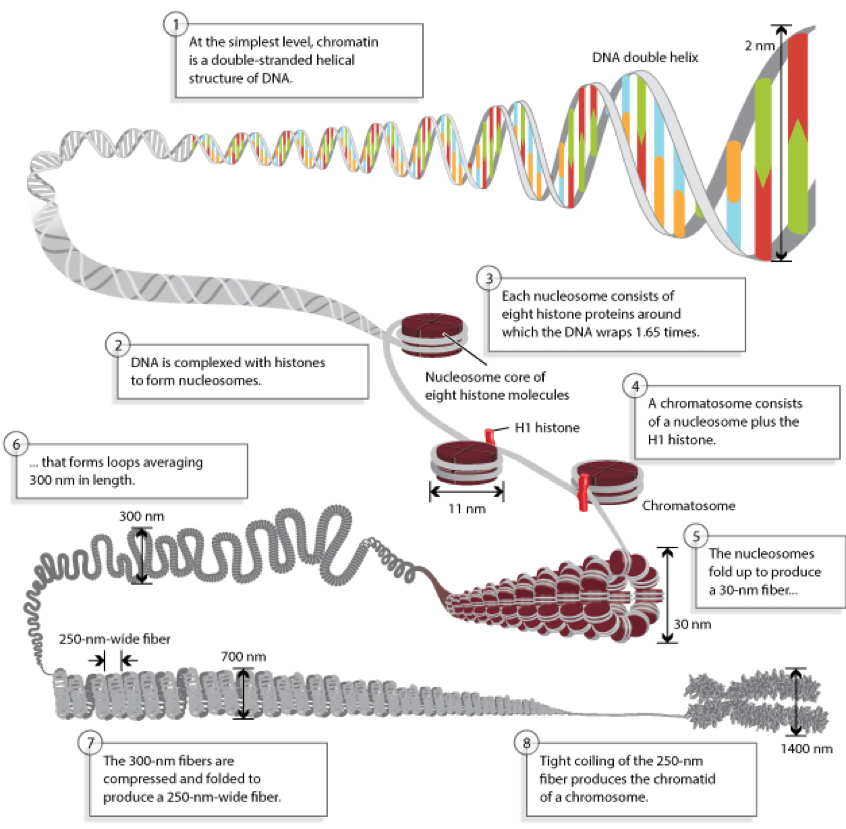
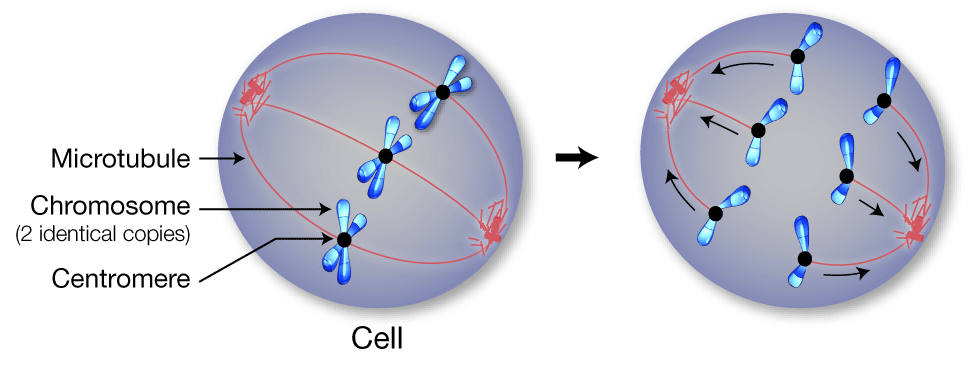
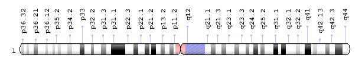
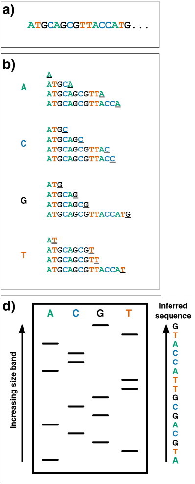
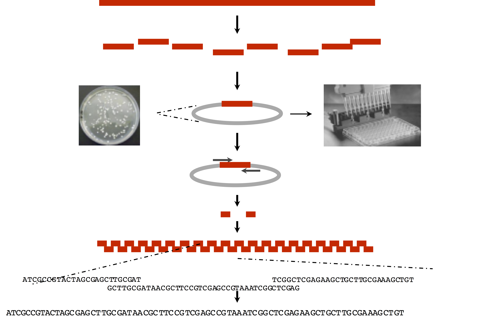
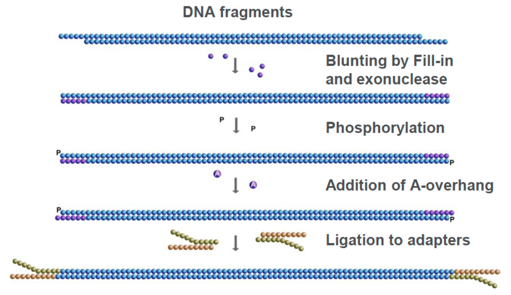

```{r xaringan-themer, include = FALSE}
library(xaringanthemer)
mono_light(
  base_color = "midnightblue",
  header_font_google = google_font("Josefin Sans"),
  text_font_google   = google_font("Montserrat", "500", "500i"),
  code_font_google   = google_font("Droid Mono"),
  link_color = "#8B1A1A", #firebrick4, "deepskyblue1"
  text_font_size = "28px"
)
library(dplyr)
library(ggplot2)
```

<!-- HTML style block -->
<style>
.large { font-size: 130%; }
.small { font-size: 70%; }
.tiny { font-size: 40%; }
</style>

## Age of OMICS

```{r, out.width = "800px", fig.align='center', echo=FALSE}

```

.small[ https://www.intechopen.com/chapters/67272 ]

---
## Genome arithmetics

- A haploid (one copy) human genome contains 23 chromosomes: 22 autosomes (chromosomes 1–22) and one sex chromosome (X or Y).  

- The human genome is _diploid_, consisting of a maternal and a paternal haplotype. Together, they form the 46-chromosome genotype.

```{r, out.width = "750px", fig.align='center', echo=FALSE}

```

---
## Genome arithmetics

- Each cell contains one genome in the nucleus (except red blood cells, which lack chromosomes).  

- Mitochondria (“cell powerhouses”) carry their own genomes; liver cells may contain 1,000–2,000 mitochondria.  

- A typical human has ~40 trillion cells (not counting trillions of gut bacteria).  

- Stretched out, one haploid genome is ~2 meters of DNA; a diploid cell has ~4 meters (1 m ≈ 3.28 ft).  
  - Across 40 trillion cells, that equals ~160 trillion meters of DNA.  
  - 160 trillion meters ≈ 99.8 billion miles.  
  - That’s about 1,073 trips from Earth to the Sun.

---
## Genome arithmetics

- Haploid genome: ~3.05–3.1 billion base pairs  (estimates from the Telomere-to-Telomere (T2T) Consortium)

- Protein-coding genes: ~19,000–20,000  

- Protein-coding transcripts (distinct isoforms): ~85,000  

```{r, out.width = "650px", fig.align='center', echo=FALSE}

```

.small[ https://www.ensembl.org/Homo_sapiens/Location/Genome ]

---
## The human genome from a micro to macro scale 

```{r, out.width = "550px", fig.align='center', echo=FALSE}

```

---
##  The basic structure of a chromosome

.pull-left[
```{r, out.width = "450px", fig.align='center', echo=FALSE}
knitr::include_graphics("img/chromosome_structure.png")
```
]
.pull-right[
- **Size** — the simplest way to distinguish chromosomes.  

- **Banding pattern** — unique arrangement of Giemsa bands identifies each chromosome.  

- **Centromere position** — the centromere appears as a narrow constriction where the two chromosome arms meet; it is crucial for proper segregation during mitosis and meiosis.  

.small[ http://learn.genetics.utah.edu/content/basics/readchromosomes/ ]
]

---
##  The role of the centromere

- Centromeres are essential for proper chromosome separation during cell division.  
- They serve as attachment sites for microtubules—protein fibers that pull duplicated chromosomes to opposite poles of the cell.  
- This process ensures each daughter cell receives a complete set of chromosomes. 
- Every chromosome contains exactly one centromere.  

```{r, out.width = "550px", fig.align='center', echo=FALSE}

```

.small[ http://learn.genetics.utah.edu/content/basics/readchromosomes/ ]

---
## Centromere positions

The position of the centromere relative to chromosome ends helps distinguish chromosomes. Types include:  

- **Metacentric** — centromere near the middle, arms of roughly equal length.  
- **Submetacentric** — centromere off-center, producing a short arm (“p” for petite) and a long arm (“q,” the next letter after p).  
- **Acrocentric** — centromere very close to one end, creating a very short “p” arm.  
```{r, out.width = "450px", fig.align='center', echo=FALSE}
knitr::include_graphics("img/chromosome_centromere.png")
```

.small[ http://learn.genetics.utah.edu/content/basics/readchromosomes/ ]

---
##  Chromosome Giemsa banding (G-banding)

- **Heterochromatic regions** — AT-rich, gene-poor DNA that stains darkly with Giemsa, forming dark G-bands.  
- **Euchromatic regions** — less condensed, GC-rich, and transcriptionally active; stain lightly, producing light G-bands.  
- **Cytogenetic banding** — bands are labeled p1, p2, p3… and q1, q2, q3…, numbered outward from the centromere to the telomeres.  

```{r, out.width = "550px", fig.align='center', echo=FALSE}

```

- At higher resolution, sub-bands appear within bands. For example, the CFTR gene locus is **7q31.2**: chromosome 7, q arm, band 3, sub-band 1, sub-sub-band 2 (read as “7 q 3, 1 point 2”).

.small[ https://ghr.nlm.nih.gov/chromosome/1#ideogram  ]


# Genome sequencing

---
## Why sequence a reference genome?

- **Determine the complete sequence** of the human haploid genome.  

- **Identify and annotate all protein-coding genes**, along with their genomic locations.  

- **Establish a reference map** to track the location and frequency of genetic variation in the human population.  
- **Unravel the genetic architecture of disease**, including both inherited and somatic mutations.  

- **Advance our understanding of evolution**, from genome dynamics within humans to species divergence.  


---
## Early DNA Sequencing Methods: Maxam–Gilbert Sequencing (chemical degradation)
.pull-left[
- DNA is radioactively labeled at one end.  

- DNA is subjected to base-specific chemical cleavage reactions.  

- Fragments are separated on a high-resolution polyacrylamide gel.  

- Labor-intensive, uses hazardous chemicals → largely abandoned.  
]
.pull-right[
```{r, out.width = "300px", fig.align='center', echo=FALSE}

```
]
.small[ https://en.wikipedia.org/wiki/Maxam%E2%80%93Gilbert_sequencing ]

---
## Early DNA Sequencing Methods: Sanger Sequencing (chain termination / sequencing by synthesis)
.pull-left[
1. Single-stranded DNA template with a primer (radioactively or fluorescently labeled).  
2. DNA polymerase extends the primer in the presence of **normal dNTPs** plus a small fraction of **ddNTPs** (chain-terminating nucleotides, stops synthesis, generating fragments of varying length.
3. Products are separated by electrophoresis.
4. The sequence is read from the order of terminated fragments (short → long).  
]
.pull-right[
```{r, out.width = "180px", fig.align='center', echo=FALSE}

```
]
.small[ https://en.wikipedia.org/wiki/Sanger_sequencing  
https://www.youtube.com/watch?v=bEFLBf5WEtc ]

<!--(originally 4 lanes per base, now capillary electrophoresis with fluorescent ddNTPs).  

Sanger's ‘chain-termination’ sequencing. Radio- or fluorescently-labelled ddNTP nucleotides of a given type - which once incorporated, prevent further extension - are included in DNA polymerisation reactions at low concentrations (primed off a 5′ sequence, not shown). Therefore in each of the four reactions, sequence fragments are generated with 3′ truncations as a ddNTP is randomly incorporated at a particular instance of that base (underlined 3′ terminal characters).
Dideoxynucleotides (ddNTPs) lack the 3′ hydroxyl group that is required for extension of DNA chains, and therefore cannot form a bond with the 5′ phosphate of the next dNTP
-->

---
## Sequencing in a nutshell

- Break long DNA molecules into smaller fragments (hundreds to thousands of bases).

- Sequence each fragment starting from one end, determining bases step by step.
- Sequencing reactions typically stop after a certain length due to signal decay/noise.

- The output is many sequence fragments of varying lengths:  
  - Sanger: thousands of bases  
  - NGS: typically 100–300 bases  

- These fragments are called **reads** (especially in NGS).

---
## Shotgun genome sequencing (late 1970s)

- Fragment genome (or large cloned inserts)  
- Clone 2–10 kb fragments into plasmids/phage vectors  
- Sequence into genomic DNA using vector primers  
- Assemble genome from overlapping reads  

```{r, out.width = "550px", fig.align='center', echo=FALSE}

```

---
### Lee Hood’s Automation (sequencing in mid-1980)

- Break genome into many small fragments  
- Clone fragments into vectors (BACs, cosmids)  
- Sequence ends of fragments in parallel  
- Use automated DNA sequencers (Hood’s capillary systems)  
- Assemble overlapping reads into contiguous sequence  

```{r, out.width = "550px", fig.align='center', echo=FALSE}

```

---
## Shotgun Genome Sequencing Milestones

- **1977** — Bacteriophage φX174 (5.4 kb) — *first DNA genome sequenced (Sanger’s group)*  
 
 - **1995** — *Haemophilus influenzae* (1.83 Mb) — *first free-living organism sequenced (Venter & Smith)*  

- **1996** — *Saccharomyces cerevisiae* (12 Mb) — *first eukaryotic genome*  

- **2000** — *Drosophila melanogaster* (165 Mb) — *first multicellular animal genome (Celera + public consortium)*  

- **2001–2003** — Human genome draft (~3 Gb) — *public Human Genome Project + Celera draft in 2001; completed reference in 2003*  

.small[ https://en.wikipedia.org/wiki/Phi_X_174 ]

---
## Massively Parallel DNA Sequencing Instruments

- All platforms require a DNA library, generated by amplification or adapter ligation  

- Each library fragment is amplified on a solid surface (beads or flat Si-based flow cells) with covalently attached adapters  

- Sequencing is performed by stepwise detection of nucleotide incorporation for each amplified fragment  

- Hundreds of thousands to millions of reactions are tracked simultaneously = "massively parallel sequencing"  

- Produces **digital reads**, enabling direct quantitative comparisons  

- Read lengths are shorter than those from capillary (Sanger) sequencing  


---
## Library Construction for MPS

```{r, out.width = "550px", fig.align='center', echo=FALSE}

```

- Shear high molecular weight DNA with sonication
- Enzymatic treatments to blunt ends
- Ligate synthetic DNA adapters (each with a DNA barcode), PCR amplify 
- Quantitate library
- Proceed to WGS, or do exome or specific gene hybrid capture

---
## PCR-Related Problems in MPS

- PCR is essential for DNA amplification, but it introduces artifacts  

- During library construction, certain fragments may be preferentially amplified ("jackpotting")  

- Leads to duplicate reads with identical start/stop positions  

- Requires post-alignment **de-duplication**, keeping only one representative read pair  

- Low-input DNA increases jackpotting risk due to reduced fragment diversity  

---
## PCR-Related Problems in MPS

- PCR can introduce false-positive artifacts due to polymerase substitution errors  

- Early-cycle substitutions can appear as true variants  

- Late-cycle substitutions are usually diluted by correctly copied fragments  

- Cluster formation (bridge amplification) is a form of PCR that can bias amplification of high- or low-GC fragments  

- This bias can lead to reduced coverage at affected loci  

---
## Exome/Target Enrichment (Hybrid Capture)

- Hybrid capture selects fragments from a whole-genome library by using probes corresponding to most (but not all) human exons or gene targets  

- Probes are biotinylated, allowing enrichment via streptavidin-coated magnetic beads  

- An **exome** is defined as all annotated exons in the reference genome  

- Custom capture reagents can target specific loci of clinical or research interest  


