```{r xaringan-themer, include = FALSE}
library(xaringanthemer)
mono_light(
  base_color = "midnightblue",
  header_font_google = google_font("Josefin Sans"),
  text_font_google   = google_font("Montserrat", "500", "500i"),
  code_font_google   = google_font("Droid Mono"),
  link_color = "#8B1A1A", #firebrick4, "deepskyblue1"
  text_font_size = "28px"
)
library(dplyr)
library(ggplot2)
```

<!-- HTML style block -->
<style>
.large { font-size: 130%; }
.small { font-size: 70%; }
.tiny { font-size: 40%; }
</style>

## Early days of human genome sequencing

```{r, out.width = "750px", fig.align='center', echo=FALSE}
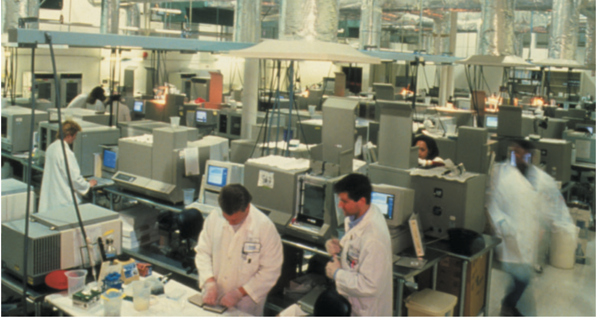
```

.small[ Green, Eric D., James D. Watson, and Francis S. Collins. "Human Genome Project: Twenty-Five Years of Big Biology." Nature 526, no. 7571 (October 1, 2015): 29–31. doi:10.1038/526029a. ]

---
## Two shotgun-sequencing strategies

```{r, out.width = "750px", fig.align='center', echo=FALSE}

```
```{r, out.width = "650px", fig.align='center', echo=FALSE, eval=FALSE}
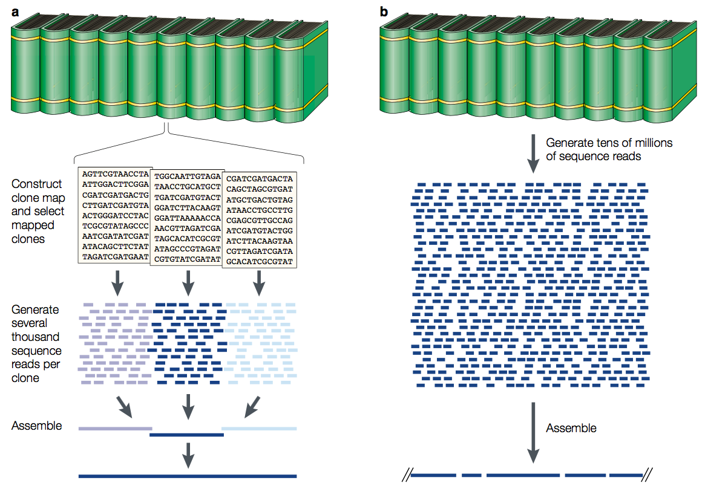
```

.small[ Green, E. Strategies for the systematic sequencing of complex genomes. Nat Rev Genet 2, 573–583 (2001). https://doi.org/10.1038/35084503 ]

<!--a | Schematic overview of clone-by-clone shotgun sequencing. A representation of a genome is made by analogy to an encyclopaedia set, with each volume corresponding to an individual chromosome. The construction of clone-based physical maps produces overlapping series of clones (that is, contigs), each of which spans a large, contiguous region of the source genome. Each clone (for example, a bacterial artificial chromosome (BAC)) can be thought of as containing the DNA represented by one page of a volume. For shotgun sequencing, individual mapped clones are subcloned into smaller-insert libraries, from which sequence reads are randomly derived. In the case of BACs, this typically requires the generation of several thousand sequence reads per clone. The resulting sequence data set is then used to assemble the complete sequence of that clone (see Figs 3,4). b | Schematic overview of whole-genome shotgun sequencing. In this case, the mapping phase is skipped and shotgun sequencing proceeds using subclone libraries prepared from the entire genome. Typically, tens of millions of sequence reads are generated and these in turn are subjected to computer-based assembly to generate contiguous sequences of various sizes.-->

---
## A first map of the human genome

```{r, out.width = "750px", fig.align='center', echo=FALSE}

```

.small[ International Human Genome Sequencing Consortium. Initial sequencing and analysis of the human genome. Nature 409, 860–921 (2001). https://doi.org/10.1038/35057062 ]

---
## Human genome is sequenced!

```{r, out.width = "850px", fig.align='center', echo=FALSE}
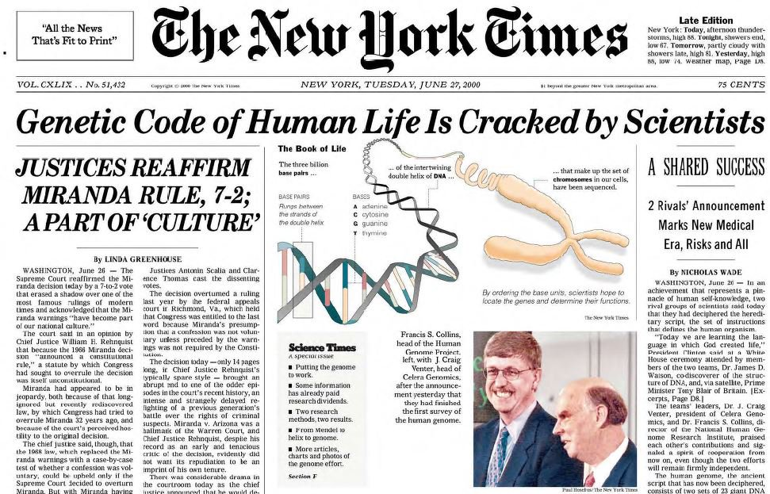
```

---
## The Human Genome roadmap

```{r, out.width = "1200px", fig.align='center', echo=FALSE}
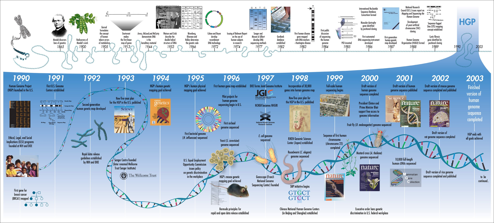
```


<!--
## Sanger sequencing: technological advances

- 1977: Fred Sanger
    - 1 hardworking technician = 700 bases per day = 118,000 years to sequence the human genome
- 1985: ABI 370 (first automated sequencer)
    - 5000 bases per day= 16,000 years
- 1995: ABI 377 (Bigger gels, better chemistry & optics, more sensitive dyes, faster computers)
    - 19,000 bases per day = 4,400 years
- 1999: ABI 3700 (96 capillaries, 96 well plates, fluid handling robots)
    - 400,000 bases per day = 205 years
-->

---
## Evolution of Sequencing Technologies

- **First-generation sequencing**: Sanger sequencing  

- **Second-generation / Next-generation sequencing (NGS)**: massively parallel, high-throughput sequencing platforms (e.g., Illumina, 454, SOLiD)  

- **Ultra high-throughput sequencing**: later NGS instruments with extremely high read output  

- Note: "Massively parallel" and "high-throughput" describe features rather than separate generations


---
## Evolution of Sequencing Technologies

- **2005** — 454 Pyrosequencing (Roche)  

- **2006** — Solexa/Illumina Genome Analyzer  

- **2007** — ABI SOLiD (Life Technologies)  

- **2010** — Complete Genomics (population-scale short-read sequencing)  

- **2010** — Ion Torrent (Life Technologies)  

- **2011** — Pacific Biosciences (single-molecule real-time, long reads)  

- **2015** — Oxford Nanopore Technologies (portable long-read sequencers)

<!--
## 454 Pyrosequencing
```{r, out.width = "550px", fig.align='center', echo=FALSE}
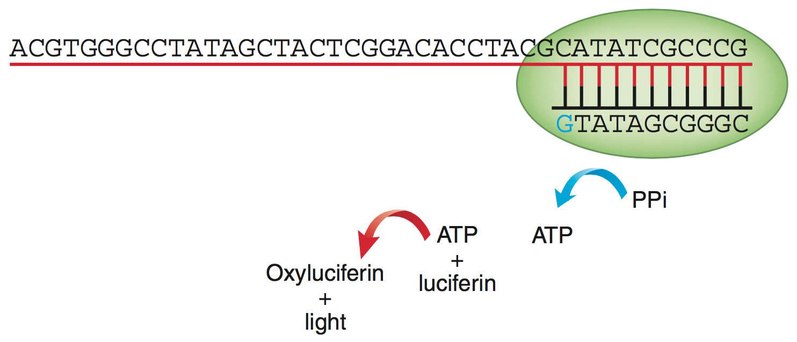
```
- Hybridize sequencing primer to DNA fragment  
- Add DNA polymerase, ATP sulfurylase, luciferase, apyrase, and substrates (APS and luciferin)  
- Nucleotide incorporation triggers a chain reaction that produces light  
- Flow nucleotides sequentially: Add A → capture light signal :: Wash :: Add T → capture light signal :: Wash :: Add G → capture light signal :: Wash :: Add C → capture light signal :: Wash :: Repeat ~500 cycles  
.small[ Rothberg, J., Leamon, J. The development and impact of 454 sequencing. Nat Biotechnol 26, 1117–1124 (2008). https://doi.org/10.1038/nbt1485 ]


## 454 pyrosequencing

.pull-left[
1) Fragment DNA

2) Bind to beads, emulsion PCR amplification

3) Remove emultion, place beads in wells

4) Solid phase pyrophosphate sequencing reaction

5) Scanning electron micrograph
]
.pull-right[
```{r, out.width = "550px", fig.align='center', echo=FALSE}

```
]
.small[ https://www.nature.com/nbt/journal/v26/n10/full/nbt1485.html ]

## 454 sequencing: summary

- First post-Sanger technology (2005)
- Used to sequence many microorganisms & Jim Watson’s genome (for $2M in 2007)
- Longer reads than Illumina, but much lower yield (~500bp)
- Rapidly outpaced by other technologies - now essentially obsolete
--->

---
## Solexa / Illumina Sequencing (2006)

- PCR-amplify DNA fragments to generate a sequencing library  

- Immobilize fragments on a solid surface and perform **bridge amplification**  

- Sequence by **reversible terminator chemistry** using four color-labeled nucleotides  

.small[ Video of Illumina sequencing, http://www.youtube.com/watch?v=77r5p8IBwJk (1.5m), https://www.youtube.com/watch?v=fCd6B5HRaZ8 (5m) ]

---
## Solexa (Illumina) sequencing (2006)
```{r, out.width = "550px", fig.align='center', echo=FALSE}
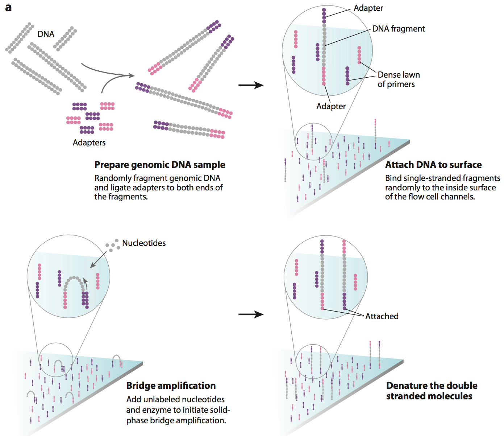
```
.small[ Mardis, Elaine R. "Next-generation DNA sequencing methods." Annu. Rev. Genomics Hum. Genet. 9.1 (2008): 387-402. https://doi.org/10.1146/annurev.genom.9.081307.164359 ]

---
##  Cluster amplification by "bridge" PCR

```{r, out.width = "800px", fig.align='center', echo=FALSE}
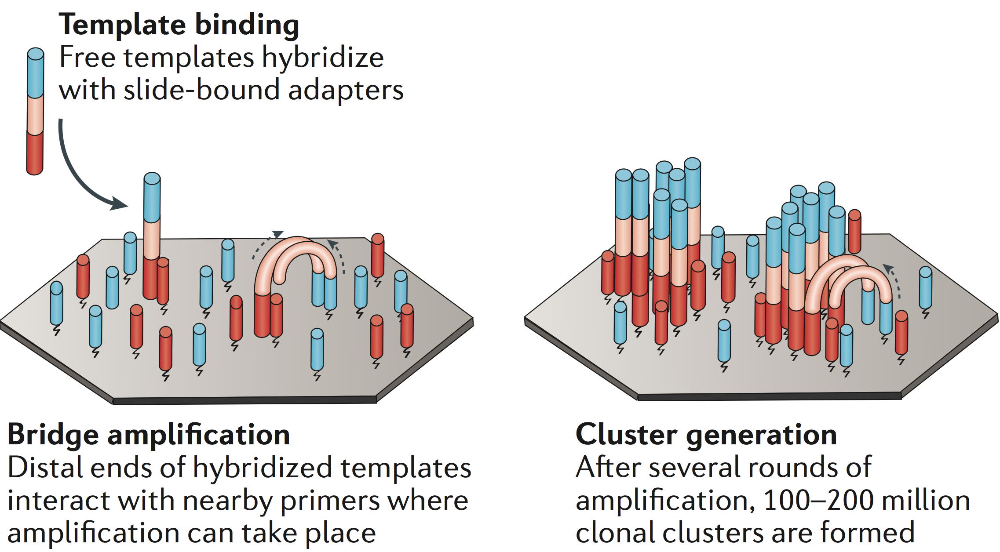
```

<!-- .small[ https://binf.snipcademy.com/lessons/ngs-techniques/bridge-pcr ] -->

---
## Clonal amplification

```{r, out.width = "500px", fig.align='center', echo=FALSE}
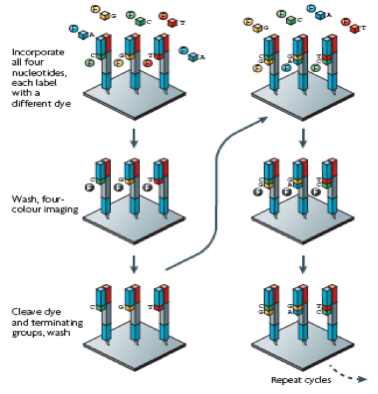
```

---
## Base calling

- 6 cycles with base-calling

```{r, out.width = "650px", fig.align='center', echo=FALSE}
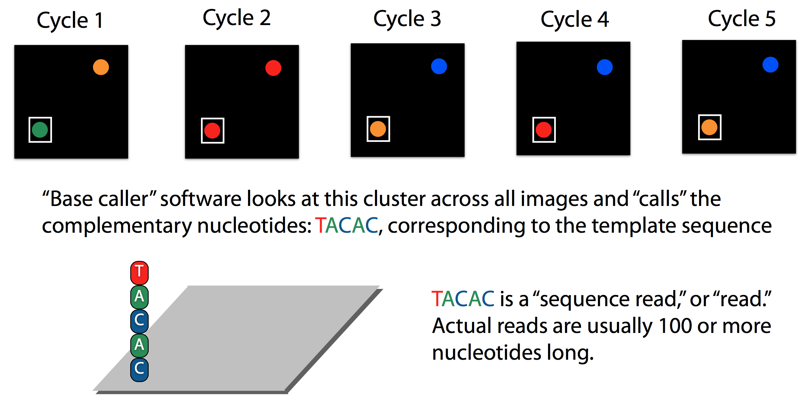
```

.small[ https://www.youtube.com/watch?v=IzXQVwWYFv4

https://www.youtube.com/watch?v=tuD-ST5B3QA ]

---
## Illumina sequencers

```{r, out.width = "550px", fig.align='center', echo=FALSE}

```

- **HiSeq 4000**: ~3 billion paired 100 bp reads (~600 Gb/run); ~8 days per run; ~$10,000 per human genome  
- **HiSeq X Ten**: ~6 billion paired 150 bp reads (~1.8 Tb/run); <3 days per run; ~$1,000 per human genome  
  - Comprised of 10 instruments for population-scale sequencing  
- **NextSeq 1000/2000**: Up to 3.6 billion paired-end reads; 12–30 hours per run; Benchtop system for smaller-scale sequencing projects  
  
<!--
## Illumina sequencers

```{r, out.width = "550px", fig.align='center', echo=FALSE}

```

- Massive improvement of the cluster density - higher output
- Less expensive than the previous sequencers
- Faster runs

.small[ https://blog.genohub.com/2017/01/10/illumina-unveils-novaseq-5000-and-6000/
http://www.mrdnalab.com/illumina-novaseq.html ]
-->
<!-- http://www.opiniomics.org/hiseq-move-over-here-comes-nova-a-first-look-at-illumina-novaseq/ -->

---
## Solexa / Illumina Sequencing: Summary

**Advantages**  
- High throughput, accuracy, and read length for second-generation sequencers  
- Fast and robust library preparation  

**Disadvantages**  
- Limited read length (typically up to 150 bp)  
- Some runs may exhibit sequencing errors  

.small[ Video of Illumina sequencing https://www.youtube.com/watch?v=womKfikWlxM (5m) ]

<!--
## ION Torrent-pH Sensing of Base Incorporation

```{r, out.width = "550px", fig.align='center', echo=FALSE}

```

## Platforms: Ion Torrent

```{r, out.width = "550px", fig.align='center', echo=FALSE}

```

- Low substitution error rate, in/dels problematic, no paired end reads
- Inexpensive and fast turn-around for data production
- Improved computational workflows for analysis
-->

---
##  Pacific Biosciences

```{r, out.width = "550px", fig.align='center', echo=FALSE}
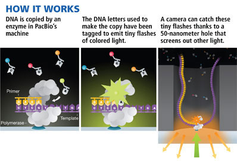
```
- Long reads
    - Structural variant discovery
    - _De novo_ genome assembly

.small[ https://www.forbes.com/forbes/2009/1005/revolutionaries-science-genomics-gene-machine.html ]

---
## Pacific Biosciences (PacBio) Sequencing: Summary

**Key Points**  
- Single DNA molecule sequenced by one polymerase in each **zero-mode waveguide (ZMW)**  
- Four-color fluorescent detection captures base incorporation in real time  
- Detects base modifications (e.g., methylated cytosine)  
- No theoretical limit to DNA fragment length  

**Caveats**  
- Higher raw error rate (~1–2%), but errors are random and correctable with coverage  
- Lower throughput (~5 Gb per run compared to short-read platforms)  

<!--
## Nanopore sequencing

- Nanopore sequencing with ONT is accurate and relatively reliable
- Current yield per run ("R9.4" chemistry): ~5 Gbp, 97% identity (i.e., 3% error rate)

```{r, out.width = "550px", fig.align='center', echo=FALSE}
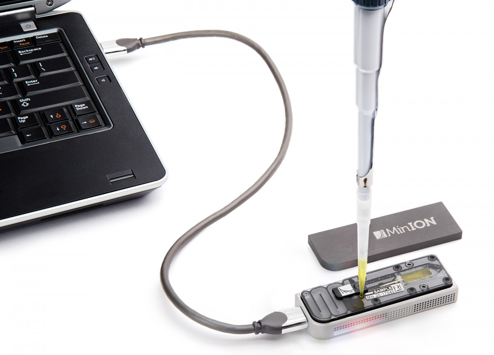
```

.small[ https://www.technologyreview.com/s/600887/with-patent-suit-illumina-looks-to-tame-emerging-british-rival-oxford-nanopore/

Video of Ion Torrent chemistry, http://www.youtube.com/watch?v=yVf2295JqUg (2.5m) ]

## Nanopore sequencing

- Key advantage - portability

```{r, out.width = "550px", fig.align='center', echo=FALSE}
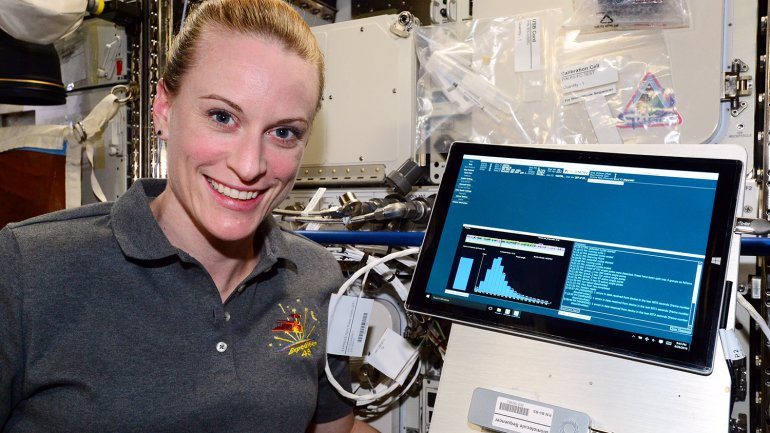
```

```{r, out.width = "550px", fig.align='center', echo=FALSE}

```

.small[ Video of Nanopore DNA sequencint technology https://www.youtube.com/watch?v=CE4dW64x3Ts (4.5m)

https://phys.org/news/2016-08-nasa-dna-sequencing-space-success.html ]

## Nanopore for human genome sequencing

```{r, out.width = "550px", fig.align='center', echo=FALSE}

```

- Closes 12 gaps
- Phased the entire major histocompatibility complex (MHC) region, one of the most gene-dense and highly variable regions of the genome

.small[ Jain, Miten, Sergey Koren, Karen H Miga, Josh Quick, Arthur C Rand, Thomas A Sasani, John R Tyson, et al. “Nanopore Sequencing and Assembly of a Human Genome with Ultra-Long Reads.” Nature Biotechnology, January 29, 2018. https://doi.org/10.1038/nbt.4060.

https://www.genengnews.com/gen-exclusives/first-nanopore-sequencing-of-human-genome/77901044 ]

## Nanopore technology

- Nanopore sequencing yields raw signals reflecting modulation of the ionic current at each pore by a DNA molecule.
- The resulting time-series of nanopore translocation, ‘events’, are base-called by proprietary software running as a cloud service.

```{r, out.width = "550px", fig.align='center', echo=FALSE}

```

.small[ Loman, Nicholas J., and Aaron R. Quinlan. "Poretools: a toolkit for analyzing nanopore sequence data." Bioinformatics 30.23 (2014): 3399-3401. https://doi.org/10.1093/bioinformatics/btu555 ]

## Nanopore base callers

- Proper base calling is a paramount, as it defines whether the technology is good or bad.
- `Nanonet`, `Albacore`, `Scrappie`
- Most modern basecallers use neural networks.

```{r, out.width = "550px", fig.align='center', echo=FALSE}

```

.small[ https://github.com/rrwick/Basecalling-comparison ]

## Nanopore analysis

- The resulting files for each sequenced read are stored in ‘FAST5’ format, an application of the HDF5 format.
- `poretools` - a toolkit for analyzing nanopore sequence data.

```{r, out.width = "550px", fig.align='center', echo=FALSE}

```

.small[ https://github.com/arq5x/poretools

https://academic.oup.com/bioinformatics/article-lookup/doi/10.1093/bioinformatics/btu555 ]
-->

---
## Oxford Nanopore Sequencing: Overview

- Technology ~30 years old  
- Key advantage: portability (MinION, PromethION)  
- Current yield (R9.4.1 chemistry): ~5 Gbp per run  
- Accuracy: ~97% raw read identity  
- Latest chemistry (R10.4.1) can achieve >99% raw read accuracy  
```{r, out.width = "350px", fig.align='center', echo=FALSE}
knitr::include_graphics("img/nanopore_x616[1].jpg")
```

---
## Nanopore Sequencing Technology

- DNA passes through a nanopore, modulating ionic current  
- Raw signals are base-called by proprietary software  
- Sequenced reads stored in FAST5 format  
- Base callers include `Nanonet`, `Albacore`, `Scrappie` 
- Tools like `poretools` are used for data analysis  

```{r, out.width = "550px", fig.align='center', echo=FALSE}

```
.small[ Loman, Nicholas J., and Aaron R. Quinlan. "Poretools: a toolkit for analyzing nanopore sequence data." Bioinformatics 30.23 (2014): 3399-3401. https://doi.org/10.1093/bioinformatics/btu555 ]

---
## Nanopore Sequencing for Human Genome

- Closed 12 gaps in the human genome  
- Phased the entire major histocompatibility complex (MHC) region  
- Enables high-quality assemblies with long reads  

```{r, out.width = "550px", fig.align='center', echo=FALSE}

```

.small[ Jain, Miten, Sergey Koren, Karen H Miga, Josh Quick, Arthur C Rand, Thomas A Sasani, John R Tyson, et al. “Nanopore Sequencing and Assembly of a Human Genome with Ultra-Long Reads.” Nature Biotechnology, January 29, 2018. https://doi.org/10.1038/nbt.4060.

https://www.genengnews.com/gen-exclusives/first-nanopore-sequencing-of-human-genome/77901044 ]


---
## PacBio vs. Oxford Nanopore sequencing

```{r, out.width = "550px", fig.align='center', echo=FALSE}

```

.small[ https://blog.genohub.com/2017/06/16/pacbio-vs-oxford-nanopore-sequencing/ ]

---
## Single-End vs. Paired-End Sequencing

- **Single-end sequencing**: sequence only one end of each DNA fragment  

- **Paired-end sequencing**: sequence both ends of each DNA fragment  
  - Reads are "paired" and separated by a known fragment length (usually a few hundred bp)  
  - Can be used as single-end reads, but provide extra information useful for:  
    - Detecting structural variants  
    - Improving alignment in repetitive regions  
  - Requires more complex modeling during analysis  

---
## Paired-end sequencing - a workaround to sequence longer fragments

- Read one end of the molecule, flip, and read the other end

- Generate pair of reads separated by up to 500bp with inward orientation

```{r, out.width = "650px", fig.align='center', echo=FALSE}
knitr::include_graphics("img/illumina_paired_end.png")
```

---
## Templates and segments

- Template – DNA/RNA molecule which was subjected to sequencing
    – "Insert size" - template length
    - "Segment" – part of the template which was "read" by a sequencing machine (represented by a "sequencing read")

```{r, out.width = "550px", fig.align='center', echo=FALSE}

```

- Alignment of the read pair to the reference genome gives coordinates describing where in the genome the read pair came from

```{r, out.width = "550px", fig.align='center', echo=FALSE, eval=FALSE}
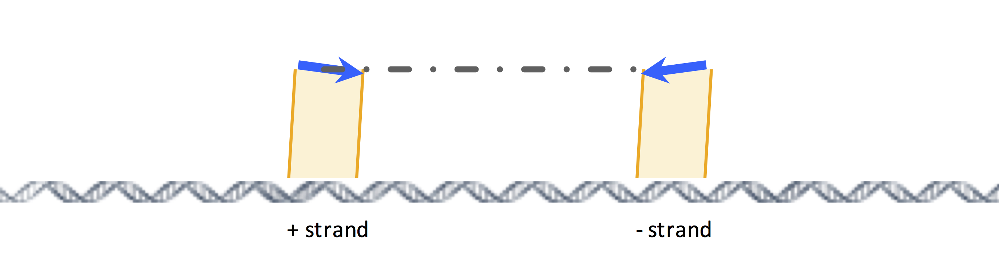
```

---
## Next-Generation Sequencing (NGS)  

- **2005** — *454 Pyrosequencing* — *first commercially available next-gen sequencing platform (Roche)*  

- **2006** — *Illumina Genome Analyzer* — *short-read sequencing becomes the dominant platform*  

- **2008** — *1000 Genomes Project* launched — *cataloging human genetic variation across populations*  

- **2011** — *Complete Genomics* and *BGI* enable population-scale human genomes  

- **2014** — *Oxford Nanopore MinION* — *portable, long-read sequencing device*  

---
## Applications of NGS

NGS has a wide range of applications:  

- **WGS, exome**: sequence genomic DNA  

- **RNA-seq**: sequence transcriptomes  

- **ChIP-seq**: identify protein-DNA interaction sites  

- **Bisulfite sequencing (BS-seq)**: measure DNA methylation  

- **ATAC-seq**: profile open chromatin regions (chromatin accessibility)  

- Many others (e.g., Hi-C, single-cell sequencing, CUT&RUN)  

---
## DNA-seq (Whole-Genome Sequencing)

- Sequence genomic DNA without prior treatment  
  - DNA is extracted from cells, fragmented into small pieces, and sequenced  

- **Goals:**  
  - Compare with a reference genome to identify genetic variants:  
    - Single nucleotide polymorphisms (SNPs)  
    - Insertions and deletions (indels)  
    - Copy number variations (CNVs)  
    - Other structural variations (e.g., gene fusions)  
  - Perform _de novo_ assembly of new genomes  

---
## Variations of DNA-seq

- **Targeted sequencing (e.g., exome sequencing)**  
  - Sequence specific genomic regions instead of the whole genome  
  - Cheaper than whole-genome sequencing, allowing larger sample sizes  
  - Target regions are enriched or "captured" using methods like hybridization arrays or probes  

- **Metagenomic sequencing**  
  - Sequence DNA from a mixture of species, usually microbes, to study microbial communities  
  - Goals: determine species composition, genome content, and relative abundances  
  - _De novo_ assembly is required, but unknown species numbers and proportions make assembly challenging  

---
## RNA-seq

- Sequence the **transcriptome**: the complete set of RNA molecules in a sample  

- **Goals:**  
  - Catalog RNA products  
  - Determine transcriptional structures (e.g., alternative splicing, gene fusions)  
  - Quantify gene expression levels—NGS-based replacement for expression microarrays  

<!--
## Sequencing vs. microarray

- Very good agreement
- More information

```{r, out.width = "550px", fig.align='center', echo=FALSE}
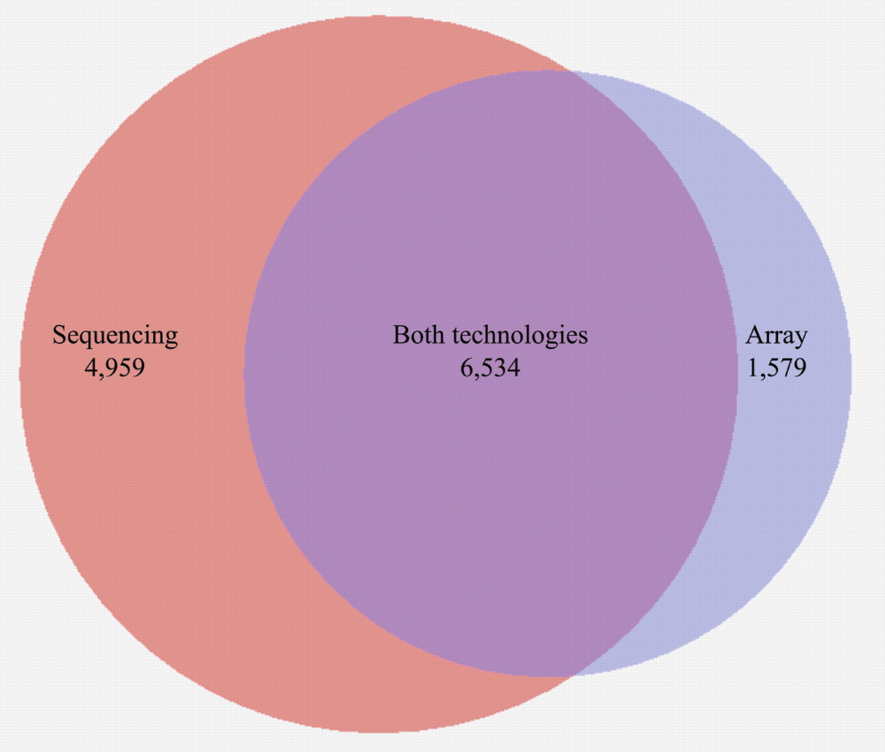
```

.small[ https://www.ncbi.nlm.nih.gov/pubmed/18550803 ]
-->

---
## ChIP-seq

- **Chromatin Immunoprecipitation followed by sequencing** (ChIP-seq)  
  - Sequencing-based version of ChIP-chip  

- **Purpose:**  
  - Identify genomic locations of specific events, such as:  
    - Transcription factor binding  
    - DNA methylation or histone modifications  

- **Method:**  
  - ChIP step enriches ("captures") genomic regions of interest before sequencing  

---
## Single-Cell Sequencing Approaches

- **scRNA-seq (single-cell RNA-seq)**
  - Profiles transcriptomes at single-cell resolution
  - Platforms: droplet-based (10x Genomics), microwell (Drop-seq, Seq-Well), plate-based (SMART-seq)

- **scATAC-seq**
  - Maps chromatin accessibility (open vs. closed regions)
  - Infers regulatory elements & TF binding sites at single-cell resolution

- **Multi-omics**
  - Joint profiling of modalities in the same cell:
    - scRNA + scATAC (multiome)
    - Transcriptome + protein (CITE-seq)
    - DNA methylation + transcriptome (scM&T-seq)

---
## Single-Cell Sequencing Approaches

- **Spatially resolved single-cell sequencing**
  - Preserves tissue architecture
  - Combines sequencing with imaging or barcoding (e.g., Slide-seq, 10x Visium)

- **Single-cell genome sequencing**
  - Detects mutations, copy number variation (CNV), clonal evolution

### Key Applications
- Cell type identification & heterogeneity
- Developmental trajectories & lineage tracing
- Tumor microenvironment & immune profiling
- Precision medicine & drug response

---
## What matters is what you feed into the sequencing machine

```{r, out.width = "1200px", fig.align='center', echo=FALSE}
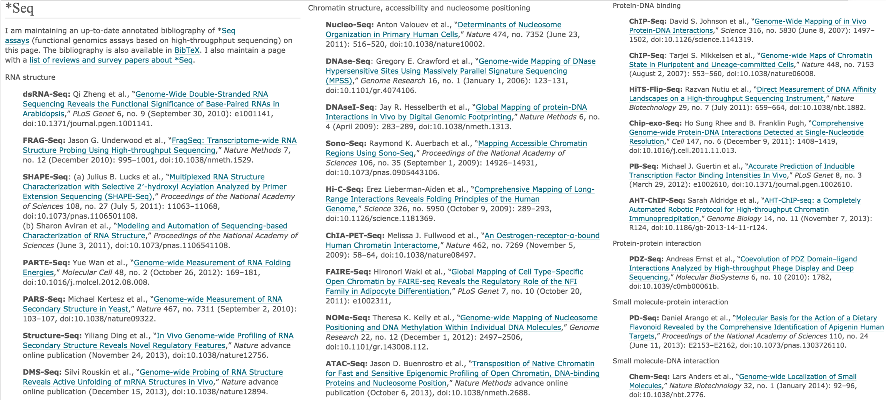
```

.small[ https://liorpachter.wordpress.com/seq/ ]

<!---
## Evolution of sequencing technologies

```{r, out.width = "550px", fig.align='center', echo=FALSE}

```
-->

---
## Developments in next generation sequencing: instruments, read lengths, throughput.

```{r, out.width = "650px", fig.align='center', echo=FALSE}
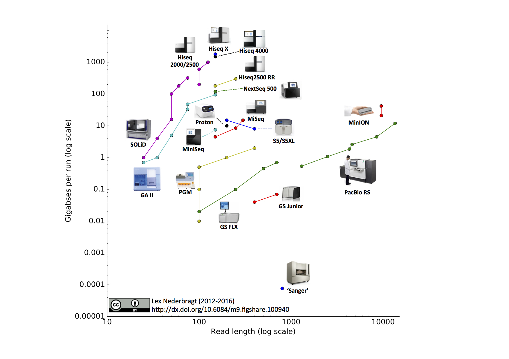
```

.small[ https://github.com/lexnederbragt/developments-in-next-generation-sequencing ]

---
## Toward Complete Genomes  

- **2015–2019** — *Hi-C, PacBio HiFi, and Nanopore ultra-long reads* enable chromosome-scale assemblies  

- **2021** — *Vertebrate Genomes Project* reports high-quality reference assemblies for many species  

- **2022** — *Telomere-to-Telomere (T2T) Consortium* publishes first truly complete human genome (3.055 Gb, CHM13 cell line)  

- **2023** — *pangenome reference consortium* releases first draft human pangenome, capturing diversity beyond a single reference  

