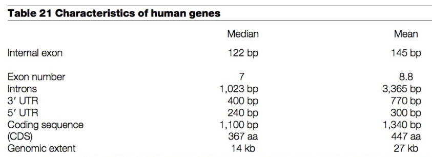
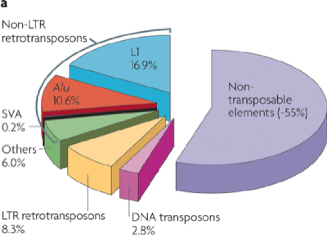

```{r xaringan-themer, include = FALSE}
library(xaringanthemer)
mono_light(
  base_color = "midnightblue",
  header_font_google = google_font("Josefin Sans"),
  text_font_google   = google_font("Montserrat", "500", "500i"),
  code_font_google   = google_font("Droid Mono"),
  link_color = "#8B1A1A", #firebrick4, "deepskyblue1"
  text_font_size = "28px"
)
library(dplyr)
library(ggplot2)
```

<!-- HTML style block -->
<style>
.large { font-size: 130%; }
.small { font-size: 70%; }
.tiny { font-size: 40%; }
</style>

## Binary vs "Plain Text" Files

### Plain Text ("Flat") Files
- Structured into **lines and columns**, easy to parse
- **Human-readable** and processable with simple command-line tools (`cat`, `grep`, `awk`, etc.)
- Space savings possible via **archiving** (e.g., `.zip`) 

### Binary Files
- **Not human-readable**; require specialized software for processing
- Plain text tools (e.g., `wc`, `grep`) **will not work properly**
- **Efficient storage**, often significantly smaller than equivalent text files (e.g., 70–80% size reduction)

---
## Common Genomic File Formats

- **FASTA** – DNA/protein sequences with identifiers (plain text)  
- **FASTQ** – Extension of FASTA, includes per-base quality scores; standard for raw sequencing reads (plain text)  
- **SAM / BAM** – Sequencing read alignments to a reference genome (SAM = text, BAM = binary, compressed)  
- **BED** – Genomic intervals (e.g., genes, peaks, regions); widely used for annotation and visualization (plain text)  
- **GFF / GTF** – Genome annotation formats describing genes, transcripts, and features (plain text)  
- **WIG / BigWig** – Continuous signal tracks (e.g., coverage, expression); WIG = text, BigWig = indexed binary for efficient queries  
- **VCF** – Variant Call Format; stores SNPs, indels, and structural variants with genotype information (plain text)  

---
## FASTA Format

- Originated in the 1980s with the FASTP/FASTA software for sequence similarity searching  

- Simple, widely used format for storing and transferring biological sequences  

- Supports both nucleotide and protein sequences (FASTA = "Fast-All")  

- Standard output format of sequence databases (e.g., GenBank, UniProt)  

- Common input format for many bioinformatics tools and pipelines  

---
## FASTA Format

Each sequence entry consists of:  

- _a single line_ with sequence metadata, starting with the "greater-than" symbol (">")

- _any number of lines_ representing the actual sequence

```
>SRR493818.1.1 HWUSI-EAS519_0001_FC61TCNAAXX:2:1:960:20843 length=54
NGTAAATCCCGTTACCTCTCTGAGCCTCGGTNNCCNNNNNTGTAAAAAGGNNNN
>SRR493818.2.1 HWUSI-EAS519_0001_FC61TCNAAXX:2:1:961:7550 length=54
NACACTACAATGTAAAAGCTTGGCCTAACTTNNTTNNNNNGGCTGTTATTNNNN
```

---
## FASTA Format

The nucleic acid codes that can be found in FASTA file:

```
A --> adenosine           M --> A C (amino)
C --> cytidine            S --> G C (strong)
G --> guanine             W --> A T (weak)
T --> thymidine           B --> G T C
U --> uridine             D --> G A T
R --> G A (purine)        H --> A C T
Y --> T C (pyrimidine)    V --> G C A
K --> G T (keto)          N --> A G C T (any)
                          -  gap of indeterminate length
```

---
## FASTQ Format

- Extension of FASTA format, introduced for next-generation sequencing (NGS)  

- Stores **raw sequencing reads** along with **base quality scores**  

- Each entry consists of **4 lines**:  
  1. Header line starting with `@` (read ID)  
  2. Raw sequence (A/C/G/T/N)  
  3. Separator line starting with `+` (optional ID repeat)  
  4. Quality string (ASCII-encoded Phred quality scores)  

```
Sequence ID @SEQ_ID  
Sequence GATTTGGGGTTCAAAGCAGTATCGATCAAATAGTAAATCCATTTGTTCAACTCACAGTTT   
Separator +  
Quality scores!''*((((***+))%%%++)(%%%%).1***-+*''))**55CCF>>>>>>CCCCCCC65
```

.small[https://en.wikipedia.org/wiki/FASTQ_format ]

---
## Sequence Alignment/Map format (SAM)

- Standard format for **storing sequencing read alignments** to a reference genome  
- Binary compressed form: **BAM** (faster access, smaller size, widely supported)  


- **Header section (`@`)** – describes metadata: reference sequences, alignment program, etc.  
- **Alignment section** – one line per read; includes:  
  - Read ID and sequence  
  - Mapping position and orientation  
  - Alignment quality and optional tags  


- **BAM Indexing** (`.bai`) allows fast random access to specific genomic regions  

.small[ SAM/BAM Format https://samtools.github.io/hts-specs/SAMv1.pdf ]


---
## The reference genome as a coordinate system

```{r, out.width = "800px", fig.align='center', echo=FALSE}

```

---
## Genomic Coordinates

- Genomic data is mapped to reference genomes (e.g., **GRCh38/hg38** for human).  

- A **coordinate system** is used to describe the position of features (genes, variants, regulatory regions).  

- Defined by:  
  - **Chromosome** (e.g., chr1, chrX)  
  - **Start position** (base index)  
  - **End position** (base index)  

- Convention: **0-based, half-open intervals** in most bioinformatics tools.  
  - Start is 0-based, end is 1-based.  

---
## Coordinate Systems: 0-based vs 1-based

- **0-based (half-open, BED, UCSC Genome Browser)**  
  - First base of a chromosome = position 0  
  - End coordinate is *exclusive*  
  - Interval length = end − start  

- **1-based (inclusive, GTF/GFF, Ensembl)**  
  - First base = position 1  
  - End coordinate is *inclusive*  
  - Interval length = end − start + 1  

**Example:** chr1:100–200  
- 0-based: covers 100–199 (100 bases)  
- 1-based: covers 100–200 (101 bases)  

---
## The BED Format

- **BED (Browser Extensible Data)**: Text-based, tab-separated format for genomic intervals.  
- Intended for visualizing genomic annotations in IGV, UCSC Genome Browser (context of expression, regulation, variation, conservation, ...)
- Each region is specified by a reference sequence and the start and end positions on it
  1. **chrom** – chromosome (e.g., chr1)  
  2. **chromStart** – start position (0-based)  
  3. **chromEnd** – end position (1-based, exclusive)  

**Example (3-column BED):**  
```
chr1  115263684 115263685
chr12 97434219  97434220
chr14 102360744 102360745
```

.small[ http://genome.ucsc.edu/FAQ/FAQformat.html#format1 ]

---
## Extended BED Format

- BED can have up to **12 fields**:  
  `4.` **name** – feature identifier (e.g., gene name)  
  `5.` **score** – numerical score (0–1000, often for display)  
  `6.` **strand** – "+" or "-"  
  `7–12.` Various fields for thickStart, thickEnd, RGB coloring, blocks (for exons).  

**Example (6-column BED):**  
```
chr16 84213683  84213684  rs4150167   0 -
chr2  206086170 206086171 rs4675502   0 +
chr20 14747470  14747471  rs4141463   0 +
```

.small[ https://genome.ucsc.edu/FAQ/FAQformat.html#format1.7 ]

---
## bigBed

- Binary indexed version of BED.  

- Stores interval-based annotations (e.g., genes, peaks, SNPs).  

- Optimized for fast retrieval and display in browsers. 
  
---
## BED Files in Practice

- Widely used in genomics workflows:  
  - **Defining features** (genes, promoters, enhancers)  
  - **Results from peak callers** (ChIP-seq, ATAC-seq)  
  - **Custom track visualization** in UCSC Genome Browser or IGV  

- Advantages:  
  - Simple, lightweight, human-readable  
  - Compatible across many tools (bedtools, UCSC utilities, R/Bioconductor)  

---
## GTF and GFF Formats

- **GFF (General Feature Format)** and **GTF (Gene Transfer Format)** describe genomic features.  
- Used to annotate genes, transcripts, and exons relative to a reference genome.  
- **Coordinate system**: 1-based (inclusive).  

### GFF (version 3 standard, 9 columns):
1. seqname (chromosome)  
2. source (annotation source, e.g., Ensembl)  
3. feature type (gene, exon, CDS, etc.)  
4. start position  
5. end position  
6. score (optional)  
7. strand (+ / -)  
8. frame (phase of CDS)  
9. attributes (key=value pairs)  

**Example (GFF3):**
```
chr1 Ensembl gene 11869 14409 . + . ID=gene:ENSG00000223972;Name=DDX11L1
```

---
## GTF and GFF Formats

- **GFF (General Feature Format)** and **GTF (Gene Transfer Format)** describe genomic features.  
- Used to annotate genes, transcripts, and exons relative to a reference genome.  
- **Coordinate system**: 1-based (inclusive).  

### GTF
- Similar to GFF but with slightly different attribute formatting (key "value").  
- Widely used for RNA-seq and gene expression analysis.  

**Example (GTF):**
```
chr1 Ensembl exon 11869 12227 . + . gene_id "ENSG00000223972"; transcript_id "ENST00000456328";
```

---
## Signal file formats

```{r, out.width = "1000px", fig.align='center', echo=FALSE}

```

- **WIG / bigWig**  
  - Wiggle (WIG): simple text format for continuous data along the genome (e.g., coverage, signal).  
  - bigWig: binary indexed version of WIG.  
  - Efficient for large datasets; supports fast zooming in genome browsers.  

---
## Signal file formats

```{r, out.width = "1000px", fig.align='center', echo=FALSE}

```

- **bedGraph**  
  - Text format for continuous-valued data in **BED-like** intervals.  
  - Simpler and smaller than WIG.  
  - Often used as input for conversion to bigWig.  

---
## Variant Call Format (VCF)

- Standard format for storing **genetic variants** (SNPs, indels, structural variants)  
  - **Header section (`##`)** – metadata, reference genome, tool versions, INFO/FORMAT definitions  
  - **Column header (`#CHROM ...`)** – defines sample and variant fields  
  - **Variant section** – one line per variant with fields:  
      - CHROM, POS – genomic location  
      - ID – variant identifier (e.g., rsID)  
      - REF, ALT – reference and alternate allele(s)  
      - QUAL – quality score  
      - FILTER – pass/fail filters  
      - INFO – annotations (allele frequency, depth, etc.)  
      - FORMAT + sample columns – genotype-level information  

- Binary compressed form: **BCF** (efficient, indexable with `.csi` or `.tbi`)  

.small[VCF/BCF format https://samtools.github.io/hts-specs/VCFv4.3.pdf ]


---
## Gene content

- "There appear to be about $30,000 \pm 40,000$ protein-coding genes in the human genome -- only about twice as many as in worm or fly. However, the genes are more complex, with more alternative splicing generating a larger number of protein products."  
- Over time this has evolved to an estimate of approximately 20,000 protein coding genes, which reflects roughly the number of genes in fly and worm

```{r, out.width = "550px", fig.align='center', echo=FALSE}

```
.small[ International Human Genome Sequencing Consortium. Initial sequencing and analysis of the human genome. Nature 409, 860–921 (2001). https://doi.org/10.1038/35057062 ]

---
## Genes are unevenly distributed across chromosomes

Highly expressed genes are associated with:  
- Very short indels  
- High gene density  
- High GC content  
- High density of SINE (short interspersed nuclear element) repeats  
- Low density of LINE (long interspersed nuclear element) repeats  
- Both housekeeping and tissue-specific expression  

Lowly expressed genes show the opposite patterns.  

.small[ Versteeg, Rogier, et al. "The human transcriptome map reveals extremes in gene density, intron length, GC content, and repeat pattern for domains of highly and weakly expressed genes." Genome research 13.9 (2003): 1998-2004. https://doi.org/10.1101/gr.1649303. ]

---
## Genes are unevenly distributed across chromosomes

Chromosome 19 is the most gene dense chromosome in the human genome

```{r, out.width = "650px", fig.align='center', echo=FALSE}

```

---
## GENCODE – Annotated Gene Features (Human, Release 48, May 2025)

- **Protein-coding genes**: ~19,435 genes in main chromosomes (excluding ~661 readthrough genes)  

- **PolyA+ transcripts**:
  - Most are fully spliced before being exported from the nucleus (co-transcriptional splicing; "first transcribed, first spliced")
  - Many genes express at least two dominant splice isoforms  
  - Exhibit allele-specific expression (potential imprinting)

- **PolyA– genes**:
  - Enriched for long non-coding RNAs (lncRNAs)
  - Also show allele-specific expression

.small[ https://www.gencodegenes.org/human/stats.html ]

---
## GENCODE – Annotated Gene Features (Human)

- **Pervasive transcription**: ~85% of the genome shows evidence of transcription (primary or processed RNAs), while less than ~3% corresponds to annotated exons  

- **Pseudogenes**: ~14,700 in total, as annotated by GENCODE Release 48  
  - A small subset are transcribed and may function as regulatory decoys.  

- **Long non-coding RNAs (lncRNAs)**: ~35,900 genes annotated   
  - ~78% are tissue-specific, compared to ~19% for mRNAs 
  - Many are primate-specific (~30%); relatively few are uniquely human  
  - Tend to be poorly spliced: ~42% have only two exons

.small[ https://www.gencodegenes.org/human/stats.html ]

---
## GENCODE – Annotated Gene Features (Human, Latest Release)

- **Small non-coding RNA genes**: ~7,560 total (includes tRNAs, miRNAs, snRNAs, snoRNAs, etc.)
  - Many lncRNA transcripts are processed into stable small RNAs.  

- **Transcription start sites (TSSs)**: While exact counts vary by assay, it's well-established that most genes use multiple TSSs—**over half of protein-coding genes have alternative TSSs**  
  - In deep sequencing studies, tens of millions of TSS tags have been detected across human samples

.small[ https://www.gencodegenes.org/human/stats.html ]

---
## Gene Annotation Files from Ensembl

- **Ensembl** provides comprehensive genome annotations for many species.  
- Key file types for gene models:  
  - **FASTA** – reference genome sequences.  
  - **GTF/GFF3** – feature annotation (genes, transcripts, exons, CDS, UTRs).  
  - **BED** – simplified interval representation of selected features.  


- **Download options**:  
  - Ensembl FTP site – organized by release and species.  
  - Ensembl Biomart – query-based access to custom gene/transcript tables.  

.small[ https://ftp.ensembl.org/pub/  https://www.ensembl.org/biomart/martview ]

---
## RefSeq (Reference Sequence Database)

Curated collection from NCBI providing reference sequences for genomes, transcripts, and proteins.  
- Standardized, non-redundant set of annotations.  
- Widely used in genomics pipelines (RNA-seq, ChIP-seq, variant calling).  
- Integrated into UCSC Genome Browser, Ensembl, and many bioinformatics tools.  


- **Gene Models**  
  - Each RefSeq gene is represented by a set of transcripts (mRNA isoforms) and protein products.  
  - Stable identifiers: **NM\_** (mRNA), **NR\_** (non-coding RNA), **NP\_** (protein).  
  - One “best representative” per gene, plus alternative isoforms.  


.small[ https://www.ncbi.nlm.nih.gov/refseq/ 

O'Leary NA, et al. Reference sequence (RefSeq) database at NCBI: current status, taxonomic expansion, and functional annotation. Nucleic Acids Res. 2016. https://doi.org/10.1093/nar/gkv1189]

---
## RefSeq Accession Prefixes

NM_ = mRNA (experimentally supported)  
XM_ = mRNA (predicted model)  
NP_ = protein (experimentally supported)  
XP_ = protein (predicted model)  
NC_ = genomic/chromosome  
NG_ = incomplete genomic assembly  

.small[ https://www.ncbi.nlm.nih.gov/books/NBK21091/table/ch18.T.refseq_accession_numbers_and_mole/?report=objectonly ]

---
## Half of the human genome is repetitive

- **Transposable elements** — remnants of ancient mobile DNA (“fossil records” of evolution).  
- **Retrotransposons** (“jumping genes,” first described by Barbara McClintock in maize) - Move by a **copy-and-paste** mechanism — transcribed into RNA, then reverse-transcribed into DNA and inserted elsewhere.  
- **DNA transposons** - Move by a **cut-and-paste** mechanism — excise themselves and reinsert at another genomic location.  

```{r, out.width = "300px", fig.align='center', echo=FALSE}

```
.small[ Cordaux, R., Batzer, M. The impact of retrotransposons on human genome evolution. Nat Rev Genet 10, 691–703 (2009). https://doi.org/10.1038/nrg2640 ]

---
## Low-complexity regions

- Approximately 45% of the human genome can currently be recognized as being derived from transposable elements

- The majority are non-long terminal repeat (LTR) retrotransposons, such as LINE-1 (L1), Alu and SVA elements

- Other low-complexity biases: CG- and AT-rich DNA

- Represented by lower-case letters

```
GATCAAAGTGTCATACAGTAACAGCCCAGACAGACGATAGGTATGGCAGa
aaagaaaaaaactaaaaaaaaaaaaaaaaaaaaaaaTCGCATGGGAAGTT
TCCCCGCCTCCTCTTTGGCCATTCTGTGCCCGGAGATCAAAGTTCTCATT
```

---
## Repeats

- **Simple sequence repeats (microsatellites)** — short motifs (e.g., ATATATAT…) repeated many times; not derived from retrotransposition.  
- **CpG islands** — clusters of CG dinucleotides.  
  - The “p” denotes the phosphate bond linking C and G on the same DNA strand (distinguishing it from the C–G base pair across complementary strands).  
  - CpG islands are often found near gene promoters and play roles in gene regulation through DNA methylation.  
```{r, out.width = "450px", fig.align='center', echo=FALSE}

```
.small[ International Human Genome Sequencing Consortium. Initial sequencing and analysis of the human genome. Nature 409, 860–921 (2001). https://doi.org/10.1038/35057062 ]

---
## Genome Variability (Typical Human Genome vs. Reference)

- A typical genome differs from the reference genome at **4.1–5.0 million sites**, mostly SNPs and short indels (>99.9%) 
- Contains **2,100–2,500 structural variants (SVs)**, affecting roughly **20 million bases** in total
  - This includes approximately:
    - **1,000 large deletions**  
    - **~160 copy-number variants (CNVs)**  
    - **~915 Alu insertions**, **~128 L1 insertions**, **~51 SVA insertions**  
    - **~4 NUMTs** (nuclear mitochondrial DNA insertions)  
    - **~10 inversions**  
- Long-read and advanced genome assembly studies (e.g., Human Pangenome Project) detect on average **~26,100 SVs per genome**  
- Population-scale analyses (e.g., gnomAD v4) identify a median of **~11,800 SVs per individual**, most of which are **rare (<1% allele frequency)**.

---
## Genome Variability (Typical Individual)

- **Protein-truncating variants (PTVs)**: A typical individual carries approximately **120 PTVs**, including both heterozygous (~85) and homozygous (~35) variants.  
- **Complex trait–associated variants**: Genome-wide association studies (GWAS) have cataloged *thousands* of variants associated with complex traits; however, the average person carries only a **small number of such variants** within significant GWAS loci.  
- **Rare disease–associated variants**: Estimates suggest individuals typically harbor **tens of variants** associated with rare diseases, though exact numbers vary by study and criteria.  
- **De novo SNVs**: On average, each person carries **44 to 82 de novo single-nucleotide variants (SNVs)**, typically around **60–70** per genome.  

.small[ the 1000 Genomes Project. Variation in genome-wide mutation rates within and between human families. Nat Genet 43, 712–714 (2011). https://doi.org/10.1038/ng.862 ]
