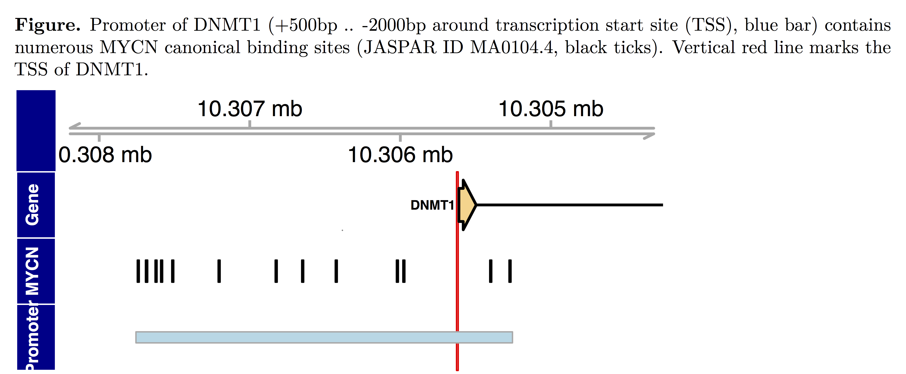
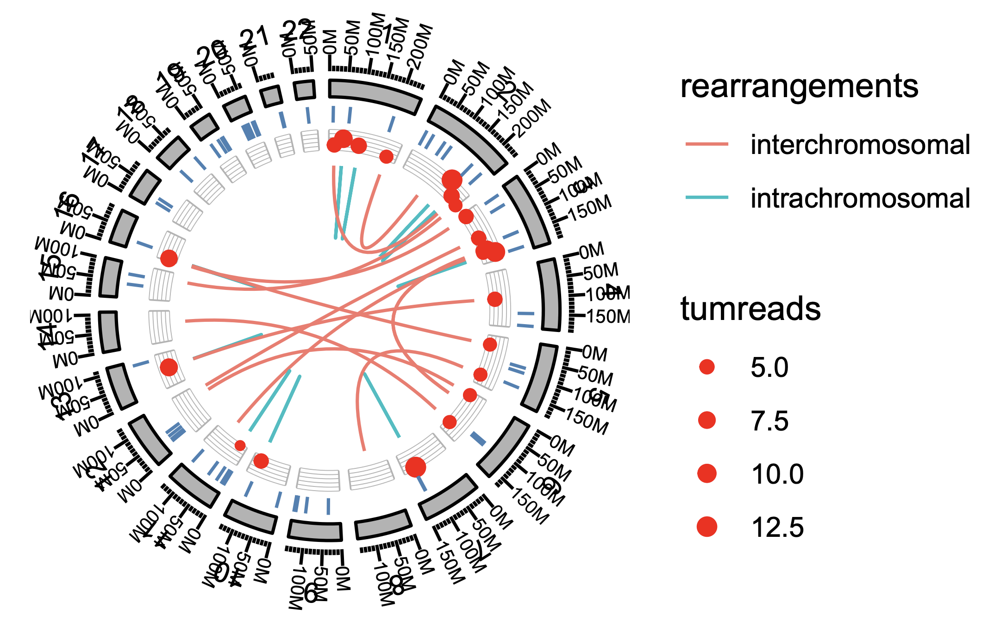
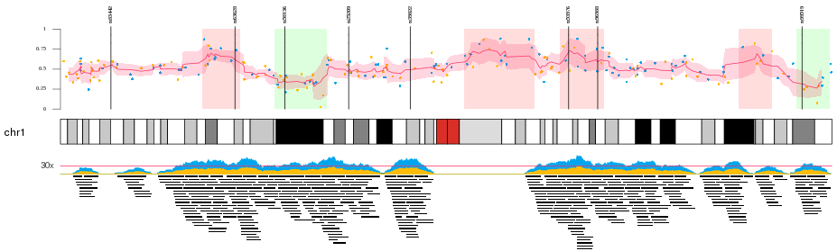

```{r xaringan-themer, include = FALSE}
library(xaringanthemer)
mono_light(
  base_color = "midnightblue",
  header_font_google = google_font("Josefin Sans"),
  text_font_google   = google_font("Montserrat", "500", "500i"),
  code_font_google   = google_font("Droid Mono"),
  link_color = "#8B1A1A", #firebrick4, "deepskyblue1"
  text_font_size = "28px"
)
library(dplyr)
library(ggplot2)
```

<!-- HTML style block -->
<style>
.large { font-size: 130%; }
.small { font-size: 70%; }
.tiny { font-size: 40%; }
</style>

## Bioconductor Project  

- Launched in 2001 to support open-source software for genomics and computational biology.  

- **Goal**: Enable reproducible and consistent analysis of high-throughput biological data.  

- Core team based at the Fred Hutchinson Cancer Center.  

- New versions released twice a year, aligned with R updates.  

- Thousands of community-contributed software packages, plus annotation and experiment data resources.  

.small[https://bioconductor.org/]

---
## Distinctive Features of the Bioconductor Project  

- Comprehensive **documentation** accompanies each package.  

- Packages include **vignettes** with reproducible examples and workflows.  

- Provides tools to access and integrate public databases and metadata (e.g.,  Ensembl, GEO).  

- Strong emphasis on **reproducibility**, interoperability, and community-driven development.  

---
## Vignettes  

- Bioconductor uses **vignettes** as a core documentation format.  

- A vignette is an executable document combining text, code, and results.  

- Provides dynamic, integrated, and reproducible analyses that update with data or code changes.  

- Typically created with **Sweave**, **knitr**, or **rmarkdown**, often alongside **roxygen2** for function documentation.  

.small[ https://bioconductor.org/packages/HiCcompare/ ]

---
## Bioconductor Packages for RNA-seq  

- Bioconductor provides R add-on packages for high-throughput genomics analysis.  

- An R package is a structured collection of code, documentation, and data for specific analyses.  

- Key RNA-seq packages:  
  - **DESeq2**, **edgeR** – differential expression analysis  
  - **tximport** – import and summarize transcript-level estimates  
  - **sva** – batch effect correction  
  - **biomaRt**, **AnnotationDbi** – functional annotation  

---
class: middle, center

# Visualization

---
## Gviz R package

- Visualize genomic data and annotations along genomic coordinates.
- Track-based plotting system for flexible genome graphics.
- Supports multiple data types: gene models, genomic signals, ideograms, and more.

```{r, out.width = "650px", fig.align='center', echo=FALSE}

```

.small[ https://bioconductor.org/packages/Gviz/ ]

<!--
## epivizR R package

- D3-based interactive visualization tool for functional genomics data.
- Multiple visualizations using scatterplots, heatmaps and other user-supplied visualizations. 
- Includes data from the Gene Expression Barcode project for transcriptome visualization. 

\tiny http://epiviz.cbcb.umd.edu/

https://epiviz.github.io/
-->

---
## ggbio R package

- Grammar of graphics framework for genomic data visualization.
- Integrates with Bioconductor data structures (e.g., GRanges, SummarizedExperiment).
- Supports track-based, ideogram, and circular genome plots.
- Enables flexible, publication-quality genome graphics.

```{r, out.width = "350px", fig.align='center', echo=FALSE}

```

.small[ https://bioconductor.org/packages/ggbio/

http://www.sthda.com/english/wiki/ggbio-visualize-genomic-data ]

---
## karyoploteR R package

- Create customizable, publication-quality karyotype plots.
- Plot genomic data and annotations directly on chromosomes.
- Supports multiple data types and flexible track layouts.
- Ideal for visualizing large-scale genomic patterns and structural variations.

```{r, out.width = "650px", fig.align='center', echo=FALSE}

```

.small[ Gel, Bernat, and Eduard Serra. “KaryoploteR: An R/Bioconductor Package to Plot Customizable Genomes Displaying Arbitrary Data.” Bioinformatics 33, no. 19 (October 1, 2017): 3088–90. https://doi.org/10.1093/bioinformatics/btx346.

https://bioconductor.org/packages/karyoploteR/

https://bernatgel.github.io/karyoploter_tutorial/ ]

---
## More visualization tools

- Review of omics data visualization tools, summary table: Schroeder, Michael P., Abel Gonzalez-Perez, and Nuria Lopez-Bigas. “Visualizing Multidimensional Cancer Genomics Data.” Genome Medicine 5, no. 1 (2013): 9. https://doi.org/10.1186/gm413.

