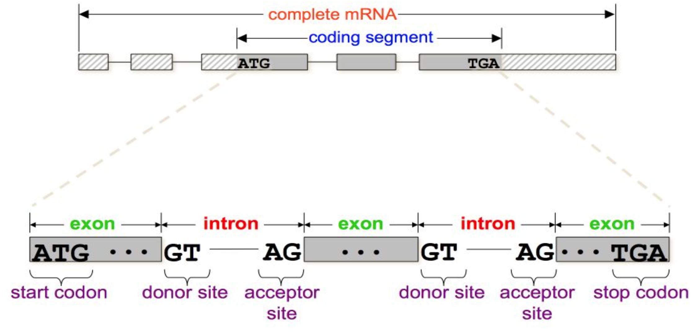
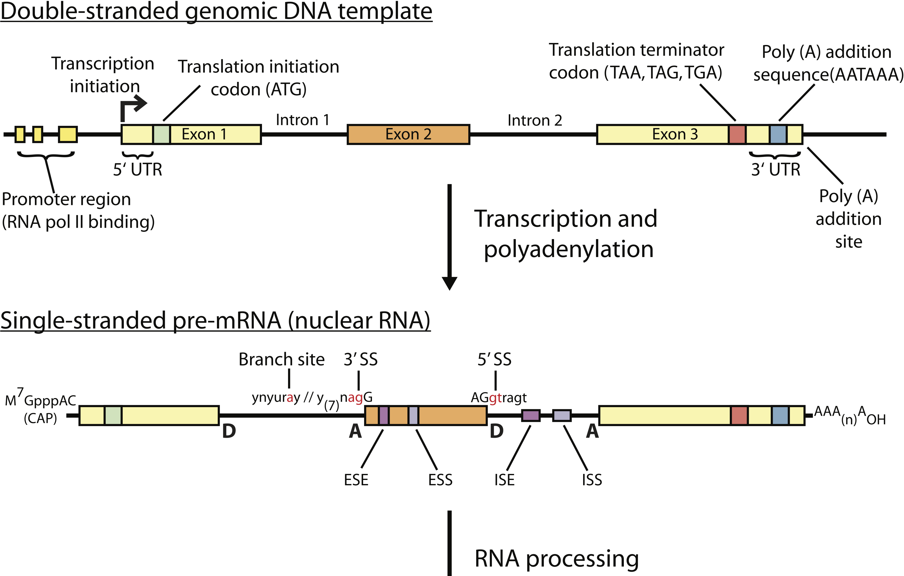
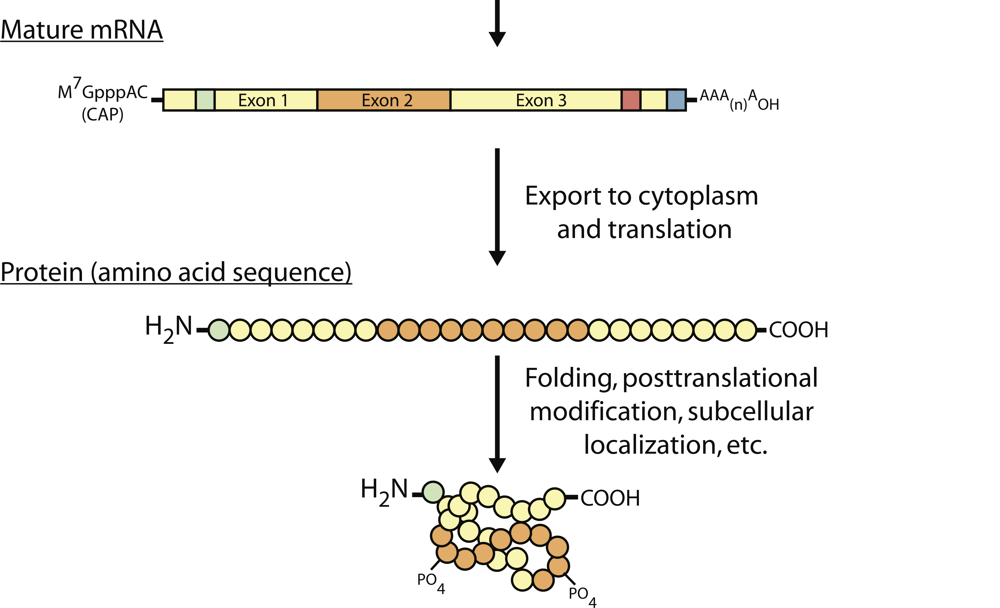
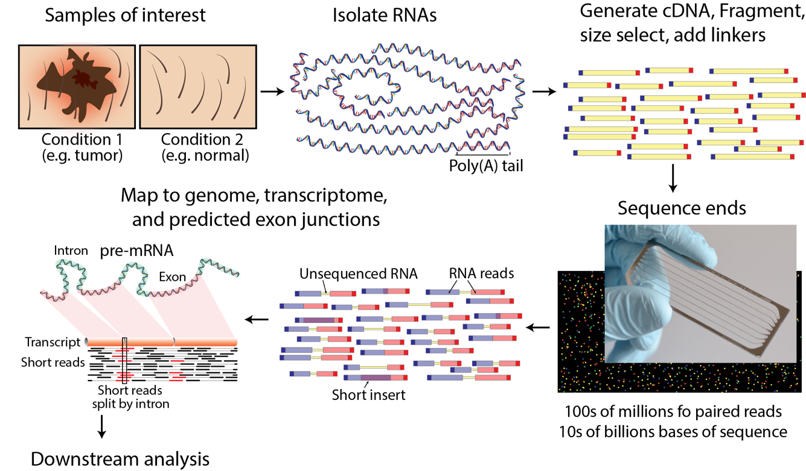

```{r xaringan-themer, include = FALSE}
library(xaringanthemer)
mono_light(
  base_color = "midnightblue",
  header_font_google = google_font("Josefin Sans"),
  text_font_google   = google_font("Montserrat", "500", "500i"),
  code_font_google   = google_font("Droid Mono"),
  link_color = "#8B1A1A", #firebrick4, "deepskyblue1"
  text_font_size = "28px"
)
library(dplyr)
library(ggplot2)
```

<!-- HTML style block -->
<style>
.large { font-size: 130%; }
.small { font-size: 70%; }
.tiny { font-size: 40%; }
</style>

## Eukaryotic gene structure

```{r, out.width = "850px", fig.align='center', echo=FALSE}

```

---
## Gene expression

```{r, out.width = "850px", fig.align='center', echo=FALSE}

```

---
## Gene expression

```{r, out.width = "850px", fig.align='center', echo=FALSE}

```

---
## What is RNA sequencing?

- Massive parallel sequencing to **characterize and quantify transcriptomes** (all actively transcribed genes)

- Detection of **differential gene expression**

- **Transcriptome reconstruction**, identification of **new transcripts**

- Detection of **alternative splicing events**

- Detection of **structural variants**, e.g., fusion transcripts

- **Allele-specific** gene expression measurements

- **Mutation analysis** – presence of genomic mutations and their effect on gene expression

.small[ RNA-seq analysis techniques: http://journals.plos.org/ploscompbiol/article/file?type=supplementary&id=info:doi/10.1371/journal.pcbi.1004393.s003 ]

---
## Sequencing technologies

Commercially available

- **Illumina/Solexa** - short reads, sequencing-by-synthesis

- **Life Technologies Ion Torrent/Proton** - short reads, Ion Semiconductor sequencing

- **Pacific Biosciences** - long reads, Single Molecule Real Time sequencing

Experimental

- **Nanopore sequencing** - continuous sequencing (very long reads), fluctuations of the ionic current from nucleotides passing through the nanopore

<!--
## Cap Analysis of Gene Expression (CAGE)

- The first 20 to 21 nucleotides at the 5' ends of capped mRNAs are extracted by a combination of cap trapping and cleavage by restriction enzyme _MmeI_.
- The "CAGE tags" then sequenced and mapped to the genome
- Produces a genome-wide picture of transcription start sites at a base-pair resolution
- "Promoterome" generated by FANTOM project

.small[ Balwierz, Piotr J., Piero Carninci, Carsten O. Daub, Jun Kawai, Yoshihide Hayashizaki, Werner Van Belle, Christian Beisel, and Erik van Nimwegen. “Methods for Analyzing Deep Sequencing Expression Data: Constructing the Human and Mouse Promoterome with DeepCAGE Data.” Genome Biology 10, no. 7 (2009): R79. doi:10.1186/gb-2009-10-7-r79. https://genomebiology.biomedcentral.com/articles/10.1186/gb-2009-10-7-r79
-->

---
## Overview of RNA sequencing technology

```{r, out.width = "800px", fig.align='center', echo=FALSE}

```

.small[ Source: https://doi.org/10.1371/journal.pcbi.1004393 ]

---
## Advantage of RNA-Seq

**Much richer information beyond quantitation**

- Boundary of gene transcripts: both 5' and 3' end, to nucleotide level 

- Alternative exon usage, novel splicing junction detection

- SNP/indel discovery in transcripts: both coding and UTRs

- Allele specific expression: critical in imprinting, cancer

- Novel gene and exon discovery enabled

---
## Advantage of RNA-Seq

**Flexibiliry at quantitation**

- Unlimited dynamic range: by increasing depth as needed

- Higher specificity and accuracy: digital counts of transcript copies, very low background noise

- Higher sensitivity: more transcripts and more differential genes detected

- Re-analysis easily done by computation, as gene annotation keeps evolving 

- _De novo_ assembly possible, not relying on reference genome sequence 

<!--
## SEQC RNA-seq quality control.

- The third phase of the MicroArray Quality Control (MAQC) project, also known as the Sequencing Quality Control (SEQC) project, aims to assess the technical performance of high-throughput sequencing platforms by generating benchmarking data sets
- The design includes four different sample types, namely samples A, B, C and D
    - Sample A is Stratagene’s universal human reference (UHR) RNA
    - Sample B is Ambion’s human brain reference RNA
    - Samples C and D are mixes of samples A and B, in a 3:1 and 1:3 ratio, respectively
- The four reference samples were sent to several sequencing centers around the world and sequenced using different platforms
- Found good reproducibility across sites and platforms

.small[ SEQC/MAQC-III Consortium. A comprehensive assessment of RNA-seq accuracy, reproducibility and information content by the Sequencing Quality Control Consortium. Nat. Biotechnol. doi:10.1038/nbt.2957 (24 August 2014).
-->

---
## RNA-Seq Limitations

Quantitation influenced by many confounding factors  

- "Sequenceability" - varying across genomic regions, local GC content and structure-related

- Varying length of gene transcripts and exons

- Bias in read ends due to reverse transcription, subtle but consistent 

- Varying extent of PCR amplification artifacts

- Effect of RNA degradation in the real world

- Computational bias in aligning reads to genome due to aligners
    
---
## RNA-Seq Limitations

SNP discovery in RNA-seq is more challenging than in DNA  

- Varying levels of coverage depth
- False discovery around splicing junctions due to incorrect mapping
    
_De novo_ assembly of transcripts without genome sequence: computationally intensive but possible, technical improvements will help  

- Longer read length
- Lower error rate
- More uniform nucleotide coverage of transcripts - more equalized transcript abundance

