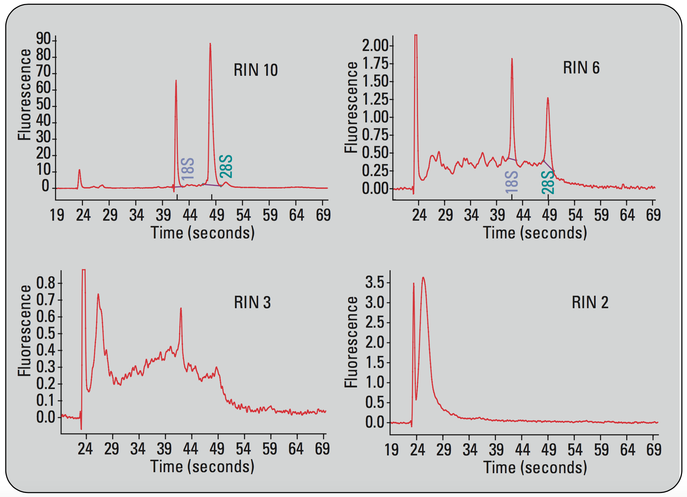
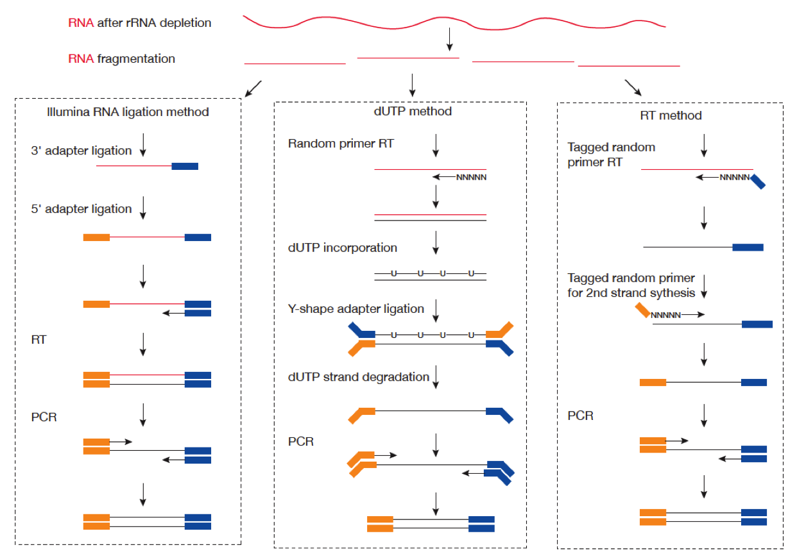

```{r xaringan-themer, include = FALSE}
library(xaringanthemer)
mono_light(
  base_color = "midnightblue",
  header_font_google = google_font("Josefin Sans"),
  text_font_google   = google_font("Montserrat", "500", "500i"),
  code_font_google   = google_font("Droid Mono"),
  link_color = "#8B1A1A", #firebrick4, "deepskyblue1"
  text_font_size = "28px"
)
library(dplyr)
library(ggplot2)
```

<!-- HTML style block -->
<style>
.large { font-size: 130%; }
.small { font-size: 70%; }
.tiny { font-size: 40%; }
</style>

## Library preparation steps

- **RNA isolation and QC**, to extract RNA relevant to the experimental question

- **Fragmentation**, to recover short reads across full length of long genes

- **Size selection**, suitable for RNA sequencing. 300-500bp - mRNA, 20-150bp - small/miRNA

- **Amplification**, typically by PCR. Up to $0.5-10ng$ of RNA

- **Library normalization/Exome capture**

- **Barcoding** and **multiplexing**

- Optionally, add **External RNA Control Consortium (ERCC) spike-in controls**

- **Single** or **paired end** sequencing. The latter is preferrable for the _de novo_ transcript discovery or isoform expression analysis

.small[  Sample preparation and library construction strategies: http://journals.plos.org/ploscompbiol/article/file?type=supplementary&id=info:doi/10.1371/journal.pcbi.1004393.s005 ]

---
## RNA isolation

**Ribosomal RNA (rRNA) depletion**

- $0.1-1\mu g$ original total RNA (One cell contains ~10 picogram of total RNA)

- rRNAs constitute over 90 % of total RNA in the cell, leaving the 1–2 % comprising messenger RNA (mRNA) that we are normally interested in (One cell contains ~0.1 picogram mRNA)

- Enriches for mRNA + long noncoding RNA. 

- Hybridization to bead-bound rRNA probes

---
## RNA isolation

- **Poly(A) selection (for eukaryotes only)**
    - Enrich for mRNA.
    - Hybridization to oligo-dT beads


- **Small RNA extraction**
    - Specific kits required to retain small RNAs
    - Optionally, size-selection by gel

&nbsp;

.small[  Description of RNA-seq library enrichment strategies: http://journals.plos.org/ploscompbiol/article/file?type=supplementary&id=info:doi/10.1371/journal.pcbi.1004393.s006 ]

---
## Poly-A selection or ribosome depletion protocol?

- Poly-A excels at gene quantification for classification/prediction purposes, better represents total RNA content

- Ribosomal depletion - more noncoding RNAs, better alignment of reads, more gene fusion events

- Overall, comparable performance

&nbsp;

.small[  Detailed comparison of RNA-seq library construction protocols: https://bmcgenomics.biomedcentral.com/articles/10.1186/s12864-017-4039-1 ]

---
## RNA quality

Agilent 2100 bioanalyzer. RIN - RNA integrity number (should be >7)

```{r, out.width = "650px", fig.align='center', echo=FALSE}

```

---
## Unstranded vs. Strand-Specific Libraries

* **Unstranded**
  * Random hexamer priming to reverse-transcribe mRNA.
  * Cannot distinguish which DNA strand the transcript originated from.

* **Strand-specific**
  * **dUTP method:** During second-strand cDNA synthesis, dTTP is replaced with **dUTP (deoxyuridine triphosphate)**.
  * The strand containing dUTP is selectively degraded by Uracil-DNA Glycosylase (UDG).
  
  * **RT-qPCR (Reverse Transcription quantitative PCR):** Uses tagged primers during reverse transcription to capture strand orientation.

.small[  Strand-related settings for RNA-seq tools: http://journals.plos.org/ploscompbiol/article/file?type=supplementary&id=info:doi/10.1371/journal.pcbi.1004393.s007 ]

---
## Unstranded vs. Strand-specific library

```{r, out.width = "800px", fig.align='center', echo=FALSE}

```

<!--
## External RNA Control Consortium (ERCC) spike-in controls

- A set of RNA standards for RNA-seq
    - 92 polyadenylated transcripts that mimic natural eukaryotic mRNAs
    - Designed to have a wide range of lengths (250–2,000 nucleotides) and GC-contents (5–51%) and can be spiked into RNA samples before library preparation at various concentrations (106-fold range)

- ERCC spike-in controls can be used for normalization in the context of a global expression shift
    - Count the number of cells in each sample
    - Add the ERCC spike-in sequences to each sample in proportion to the number of cells
    - Normalize read counts based on cyclic loess robust local regression on the spike-in counts

.small[  Baker, S.C. et al. The external RNA controls consortium: a progress report. Nat. Methods 2, 731–734 (2005).

Jiang, L. et al. Synthetic spike-in standards for RNA-seq experiments. Genome Res. 21, 1543–1551 (2011).

Loven, J. et al. Revisiting global gene expression analysis. Cell 151, 476–482
(2012).
-->

---
class: center,middle

# Experimental design

---
## Sources of variability in RNA-seq measures

In RNA-seq, we have multiple levels of randomness:

- Biological variability in samples

- Stochasticity of RNA content

- Randomness of fragments being sequenced

- Technical variability

&nbsp;

.small[   Auer, P.,RW Doerge. "Statistical Design and Analysis of RNA Sequencing Data." Genetics, 2010 https://doi.org/10.1534/genetics.110.114983 ]

---
## RNA-seq consideraations

- **Replication**. It allows the experimenter to obtain an estimate of the experimental error

- **Randomization**. It requires the experimenter to use a random choice of every factor that is not of interest but might influence the outcome of the experiment. Such factors are called nuisance factors

- **Blocking**. Creating homogeneous blocks of data in which a nuisance factor is kept constant while the factor of interest is allowed to vary. Used to increase the accuracy with which the influence of the various factors is assessed in a given experiment

- **Block what you can, randomize what you cannot**

---
## Experimental design: Multiplexing balances technical variability

```{r, out.width = "600px", fig.align='center', echo=FALSE}
knitr::include_graphics("img/rna-seq_design.jpg")
```

---
## Sequencing length/depth

- Longer reads improve mappability and transcript quantification

- More transcripts will be detected and their quantification will be more precise as the sample is sequenced to a deeper level

- Up to 100 million reads is needed to precisely quantify low expressed transcripts. 

- In reality, 20-30 million reads is OK for human genome.

<!--
## Power: effect size

Statistical power to detect differential expression increases with increased effect size, sequencing depth and number of replicates

| Replicates per group                 | 3    | 5    | 10    |
|--------------------------------------|------|------|-------|
| **Effect size (fold change)**            |      |      |       |
| 1.25                                 | 17 % | 25 % | 44 %  |
| 1.5                                  | 43 % | 64 % | 91 %  |
| 2                                    | 87 % | 98 % | 100 % |

&nbsp;

.small[  Source: http://genomebiology.biomedcentral.com/articles/10.1186/s13059-016-0881-8

## Power: Sequencing depth

Statistical power to detect differential expression increases with increased effect size, sequencing depth and number of replicates

| Replicates per group                 | 3    | 5    | 10    |
|--------------------------------------|------|------|-------|
| **Sequencing depth (millions of reads)** |      |      |       |
| 3                                    | 19 % | 29 % | 52 %  |
| 10                                   | 33 % | 51 % | 80 %  |
| 15                                   | 38 % | 57 % | 85 %  |

&nbsp;

.small[  Source: http://genomebiology.biomedcentral.com/articles/10.1186/s13059-016-0881-8</div>
-->

---
## RNASeqPower: Sample Size & Power Analysis for RNA-seq

- `RNASeqPower` is an R package designed to **calculate statistical power and sample size** for RNA-seq experiments.  

- Compute **power for a given sample size**, effect size, and sequencing depth.  

- Estimate **minimum sample size required** to achieve desired power.  

- Accounts for **overdispersion** and variance typical of RNA-seq count data.  

.small[ Bioconductor: https://bioconductor.org/packages/RNASeqPower/

Svensson, V. et.al. "Power Analysis of Single-Cell RNA-Sequencing Experiments." _Nature Methods_ 2017 https://doi.org/10.1038/nmeth.4220 ]
