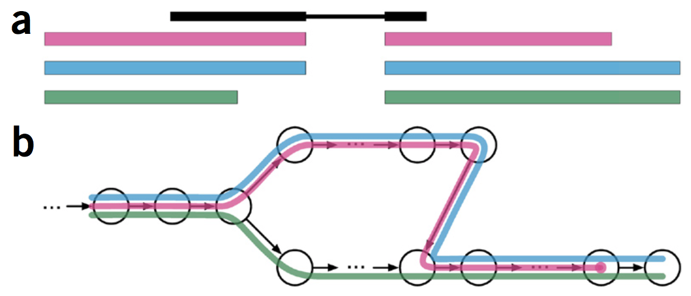

```{r xaringan-themer, include = FALSE}
library(xaringanthemer)
mono_light(
  base_color = "midnightblue",
  header_font_google = google_font("Josefin Sans"),
  text_font_google   = google_font("Montserrat", "500", "500i"),
  code_font_google   = google_font("Droid Mono"),
  link_color = "#8B1A1A", #firebrick4, "deepskyblue1"
  text_font_size = "28px"
)
library(dplyr)
library(ggplot2)
```

<!-- HTML style block -->
<style>
.large { font-size: 130%; }
.small { font-size: 70%; }
.tiny { font-size: 40%; }
</style>


## Computational ecosystem of sequencing

```{r, out.width = "700px", fig.align='center', echo=FALSE}
knitr::include_graphics("img/SequencingEcosystem.png")
```

.small[ Conesa, A., Madrigal, P., Tarazona, S. et al. A survey of best practices for RNA-seq data analysis. Genome Biol 17, 13 (2016). https://doi.org/10.1186/s13059-016-0881-8 ]

---
## RNA-seq analysis workflow

```{r, out.width = "500px", fig.align='center', echo=FALSE}

```

.small[ Brazas, M. D., & Ouellette, B. F. (2016). Continuing education workshops in bioinformatics positively impact research and careers. PLoS computational biology, https://doi.org/10.1371/journal.pcbi.1004916 ]

---
## FASTA/FASTQ format

**FASTA**: text-based representation of nucleotide sequence

```{r, out.width = "800px", fig.align='center', echo=FALSE}

```

**FASTQ**: sequence and quality info

```{r, out.width = "800px", fig.align='center', echo=FALSE}

```

.small[ http://zhanglab.ccmb.med.umich.edu/FASTA/ ]

---
## Quality of base calling

- **Phred quality score** is widely used to characterize the quality of base calling

- Phred quality score = $-10*log_{10}(P)$, where P is probability that base-calling is wrong

- Phred score of 30 means there is 1/1000 chance that the base-calling is wrong

- The quality of the bases tend to drop at the end of the read, a pattern observed in sequencing-by-synthesis techniques

---
## Quality control

- **FASTQC** - Quality of raw and aligned sequencing data
    - Base quality per position
    - Nucleotide per position
    - GC content
    - K-mer enrichment

```{r, out.width = "600px", fig.align='center', echo=FALSE}

```

.small[ http://www.bioinformatics.babraham.ac.uk/projects/fastqc/, Video tutorial how to interpret, https://www.youtube.com/watch?v=bz93ReOv87Y ]

---
## RNA-seq-specific quality control

- **RNASeQC** - quality of mapped (aligned) data

- **RSeQC** - Python-based table and graph QC reports

- **MultiQC** - Summarization and visualization QC results for multiple samples in one report. Recognizes multiple QC tools

.small[ https://github.com/getzlab/rnaseqc, Deluca DS, Levin JZ, Sivachenko A, Fennell T, Nazaire MD, Williams C, Reich M, Winckler W, Getz G. (2012) RNA- SeQC: RNA-seq metrics for quality control and process optimization. Bioinformatics https://doi.org/10.1093/bioinformatics/bts196

http://rseqc.sourceforge.net/, Wang L, Wang S, Li W* RSeQC: quality control of RNA- seq experiments Bioinformatics (2012)  https://doi.org/10.1093/bioinformatics/bts356

http://multiqc.info/ ]

---
## Adapter trimming

- **Cutadapt** - full control over adapter trimming

- **FASTX-Toolkit** - set of tools for low-level sequence trimming/cutting

- **Trimmomatic** - well-documented and easy-to-use adapter trimmer using multiple algorithms. Handles single- and paired-end reads, accountss for read quality

- **Flexbar**: similar to Trimmomatic by functionality

.small[ https://cutadapt.readthedocs.io/en/latest/guide.html

http://hannonlab.cshl.edu/fastx_toolkit/

http://www.usadellab.org/cms/?page=trimmomatic

https://github.com/seqan/flexbar/wiki/Manual ]

---
## Duplicates removal

- Duplicates may correspond to biased PCR amplification of particular fragments
- For highly expressed, short genes, duplicates are expected even if there is no amplification bias
- Removing them may reduce the dynamic range of expression estimates

Generally, do not remove duplicates from RNA-seq data

- If you ultimately want to remove duplicates, use Picard tools' `MarkDuplicates` command

.small[ https://broadinstitute.github.io/picard/command-line-overview.html#MarkDuplicates ]

---
## Alignment

- RNA-seq aligners face an additional problem, not encountered in DNA-only alignment: many RNA-seq reads will span introns

- The average human intron length is >6,000 bp (some are >1 Mbp in length)

- In a typical human RNA-seq experiment using 100-bp reads, >35% of the reads will span multiple exons - align over splice junctions

- Aligners must be splice-aware, especially when aligning longer (>50bp) reads

---
## Three types of reads: exonic-, junction- and poly(A) end-reads.

```{r, out.width = "650px", fig.align='center', echo=FALSE}

```

---
## Strategies for gapped alignments of RNA-seq reads

**Exon-first method**

- Map full, unspliced reads (reads originating from a single exon) to exons

- Divide the remaining reads into smaller pieces and map them to the genome

- An extension process extends mapped smaller pieces to find candidate splice sites to support a spliced alignment.

---
## Strategies for gapped alignments of RNA-seq reads

**Seed-and-extend methods**

- Divide each RNA-seq read in small words (k-mers) of similar size

- Store a map of all k-mers in the genome in an efficient lookup data structure

- Map k-mers to the genome via the lookup structure

- Mapped k-mers are extended into larger alignments, which may include gaps flanked by splice sites.

---
## Strategies for gapped alignments of RNA-seq reads

```{r, out.width = "700px", fig.align='center', echo=FALSE}

```

.small[ Garber, M., Grabherr, M., Guttman, M. et al. Computational methods for transcriptome annotation and quantification using RNA-seq. Nat Methods 8, 469–477 (2011). https://doi.org/10.1038/nmeth.1613 ]

---
## Alignment to the reference genome is the most frequently used for transcript quantification

```{r, out.width = "600px", fig.align='center', echo=FALSE}

```

---
## Alignment - Mapping RNA-seq reads to the genome

* **General-purpose aligners**
  * **BWA** – efficient, based on Burrows-Wheeler Transform
  * **Bowtie** – ultrafast for short reads; originally paired with TopHat for RNA-seq
  * **Bowtie2** – supports longer reads and gapped alignment; more flexible than Bowtie

* **RNA-seq optimized (spliced) aligners**
  * **STAR** – fast and accurate, detects splice junctions directly
  * **subread / subjunc** – spliced alignment; integrated with `featureCounts` for counting


.small[ http://bio-bwa.sourceforge.net/  https://github.com/alexdobin/STAR  https://bowtie-bio.sourceforge.net/bowtie2/index.shtml  http://subread.sourceforge.net/  
Timeline and extensive comparison of aligners: https://www.ebi.ac.uk/~nf/hts_mappers/  ]

---
## De Novo assembly using De Bruijn Graph

* **De Bruijn Graph** - A graph-based data structure used to assemble sequences from short reads.
  * Break reads into **k-mers** (subsequences of length *k*).
  * Nodes represent **(k-1)-mers**, edges connect nodes if the corresponding k-mers overlap by k-1 bases.
  **Visual idea:** Each k-mer is a colored edge connecting two overlapping nodes (k-1-mers), forming a network that traces the sequence.  

* Enables reconstruction of full-length sequences (contigs) from short fragments.

```{r, out.width = "350px", fig.align='center', echo=FALSE}

```

---
## De Novo RNA-Seq Assembly Tools

* **Trinity** - De Bruijn graph-based assembly.
  * **Components**: Inchworm, Chrysalis, Butterfly.

* **Trans-ABySS** - Parallelized de Bruijn graph assembler.

* **rnaSPAdes** - Extension of SPAdes genome assembler tailored for RNA-Seq data.


.small[ http://www.bcgsc.ca/platform/bioinfo/software/trans-abyss

https://github.com/trinityrnaseq/trinityrnaseq/wiki ]

<!--
## Trinity _de novo_ assembly 

- Trinity combines three independent software modules: **Inchworm**, **Chrysalis**, and **Butterfly**
- Trinity partitions the sequence data into many individual de Bruijn graphs, each representing the transcriptional complexity at a given gene or locus, and then processes each graph independently to extract full-length splicing isoforms and to tease apart transcripts derived from paralogous genes.

\begin{center}
\includegraphics[height=60px]{img/TrinityCompositeLogo.png}
\end{center}

.small[ Grabherr, Manfred G., Brian J. Haas, Moran Yassour, Joshua Z. Levin, Dawn A. Thompson, Ido Amit, Xian Adiconis, et al. “Full-Length Transcriptome Assembly from RNA-Seq Data without a Reference Genome.” Nature Biotechnology 29, no. 7 (May 15, 2011): 644–52. doi:10.1038/nbt.1883.
-->


