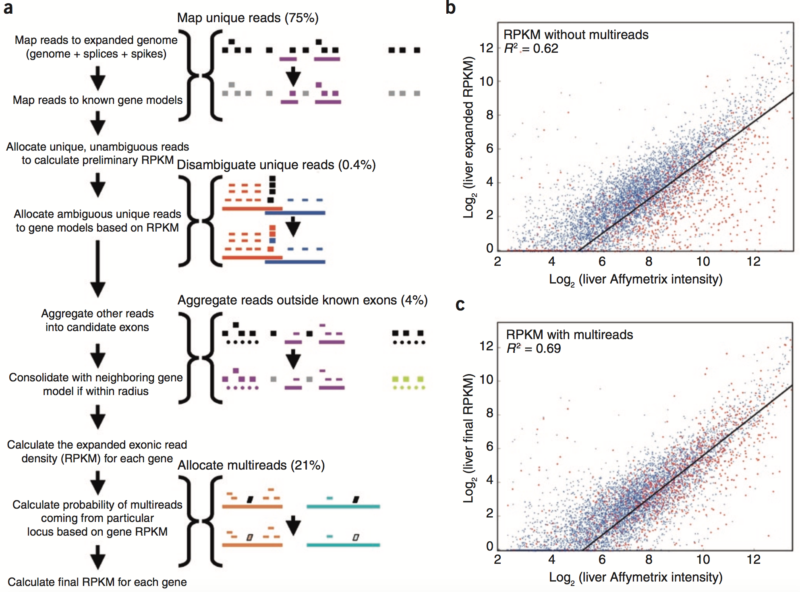
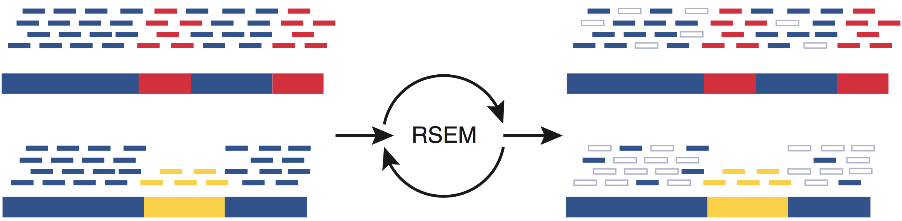
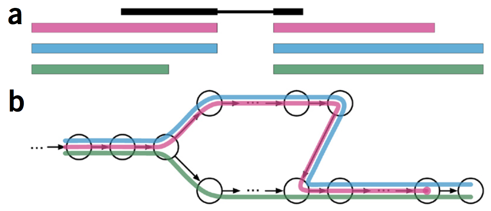
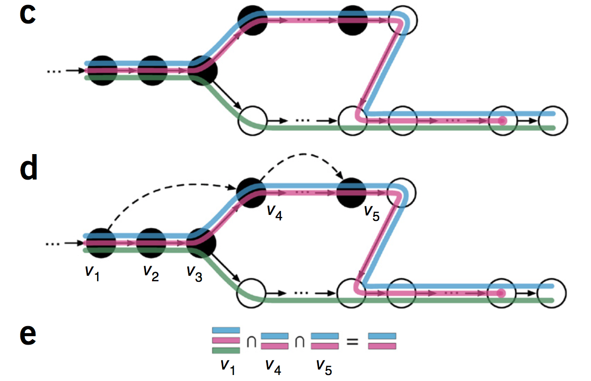
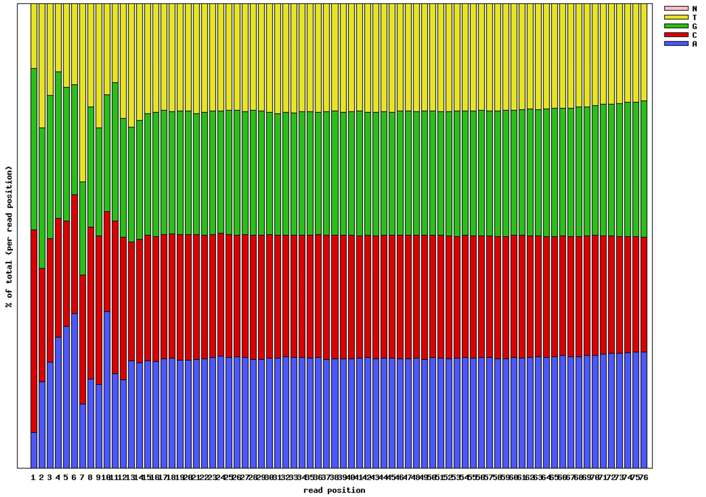
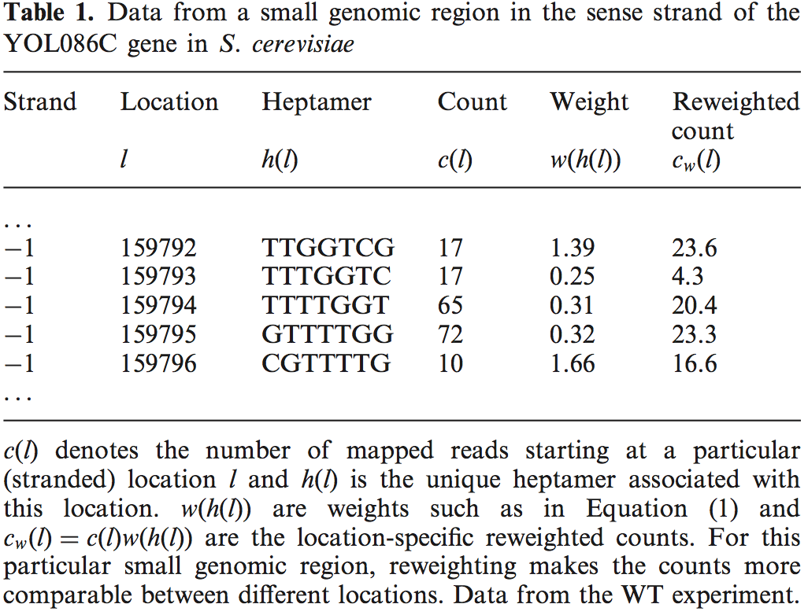
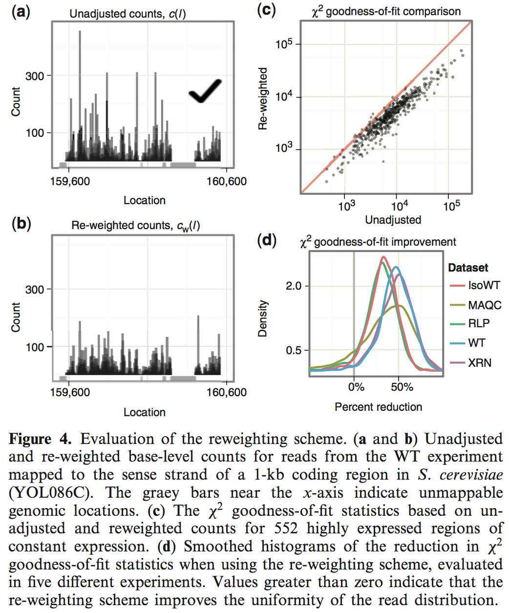

```{r xaringan-themer, include = FALSE}
library(xaringanthemer)
mono_light(
  base_color = "midnightblue",
  header_font_google = google_font("Josefin Sans"),
  text_font_google   = google_font("Montserrat", "500", "500i"),
  code_font_google   = google_font("Droid Mono"),
  link_color = "#8B1A1A", #firebrick4, "deepskyblue1"
  text_font_size = "28px"
)
library(dplyr)
library(ggplot2)
```

<!-- HTML style block -->
<style>
.large { font-size: 130%; }
.small { font-size: 70%; }
.tiny { font-size: 40%; }
</style>

## RNA-seq statistical problems

- Summarization

- Normalization

- Differential expression testing

- Isoform expression estimation

---
## Summarization of read counts

- From RNA-seq, the alignment result gives the chromosome/position of each aligned read (SAM/BAM files)

- For a gene (GTF annotation file), there are reads aligned to the gene body. How to summarized them into a number for the expression?

**Counts of reads**

- Easiest: The relative expression of a transcript is proportional to the number of cDNA fragments that originate from it ~ number of aligned reads. 
- Disadvantages: longer gene produce more reads, library depth (total counts) influence counts of individual transcripts

---
## Why is simple counting for transcript quantification not sufficient?

Each gene has multiple exon. Straightforward approaches  

- **Union** - treat a gene as the union of its exons

- **Intersection** - treat a gene as the intersection of its exons

Problems

- Cannot correct for positional biases / insert length distributions since they don’t model which transcript reads come from

- Intersection may throw away many reads
<!-- - Many more sophisticated approaches: Cufflinks (Trapnell, 2010), RSEM (Li, 2010), TIGAR (Nariai, 2014), eXpress (Roberts, 2013), Sailfish (Patro, 2014), Kallisto (Bray, 2015), more... -->

.small[ Trapnell, C., Hendrickson, D., Sauvageau, M. et al. Differential analysis of gene regulation at transcript resolution with RNA-seq. Nat Biotechnol 31, 46–53 (2013). https://doi.org/10.1038/nbt.2450 ]

---
## Expression estimation for known genes and transcripts

.pull-left[
- **HTSeq** - set of tools for analyzing high-throughput sequencing data with Python

- `htseq-count` command line tool for counting reads in features

```
htseq-count --mode intersection-strict --stranded no 
  --minaqual 1 --type exon --idattr transcript_id 
  accepted_hits.sam chr22.gff > transcript_counts.tsv
```

.small[ https://htseq.readthedocs.io/en/latest/htseqcount.html

Issues with `htseq-count`: http://seqanswers.com/forums/showthread.php?t=18068 ]
]
.pull-right[
```{r, out.width = "400px", fig.align='center', echo=FALSE}
knitr::include_graphics("https://htseq.readthedocs.io/en/latest/_images/count_modes.png")
```
]

---
## featureCounts: Efficient Read Summarization for RNA-seq

* Part of the **Subread / Rsubread** suite; very fast and accurate for counting reads overlapping genomic features (genes, exons, etc.) 

* Can count reads at the **feature** (e.g. exons) or **meta-feature** (genes) levels.
  - A read counts if it overlaps at least part of a feature; paired-end & fragment counting also supported.
  - By default, reads overlapping multiple features (or meta-features) are **not** counted more than once; optional flags exist to relax this. 

- Can handle strand specificity (forward / reverse), paired vs. single-end reads, filtering by fragment size, requiring both ends mapped, excluding ambiguous or chimeric fragments

 .small[ https://subread.sourceforge.net/featureCounts.html  
Liao Y, Smyth GK and Shi W (2014). featureCounts: an efficient general purpose program for assigning sequence reads to genomic features. Bioinformatics, https://doi.org/10.1093/bioinformatics/btt656]
```
featureCounts -t exon -g gene_id -a annotation.gtf 
  -o counts.txt library1.bam library2.bam library3.bam
```

---
## Multimapped reads

- A significant percentage of reads (up to 30% from the total mappable reads) are mapped to multiple locations (multireads) due to gene homology or low complexity.

- If the multireads are discarded, the expression levels of genes with homologous sequences will be artificially deflated

- If the multireads are split randomly amongst their possible loci, differences in estimates of expression levels for these genes between conditions will also be diminished leading to lower power to detect differential gene expression

---
## Multimapped reads

.pull-left[
- A heuristic solution - divide the multireads amongst their mapped regions according to the distribution of the uniquely mapped reads in those regions.
]
.pull-right[
```{r, out.width = "700px", fig.align='center', echo=FALSE}

```
]

.small[ Mortazavi, Ali, Brian A. Williams, Kenneth McCue, Lorian Schaeffer, and Barbara Wold. “Mapping and Quantifying Mammalian Transcriptomes by RNA-Seq.” Nature Methods 5, no. 7 (July 2008): 621–28. https://doi.org/10.1038/nmeth.1226. ]


<!--Enhanced Read Analysis of Gene Expression (ERANGE) and the allocation of multireads. (a) The main steps in the computational pipeline are outlined at left, with different aspects of read assignment and weighting diagrammed at right and the corresponding number of gene model reads treated in muscle shown in parentheses. In each step, the sequence read or reads being assigned by the algorithm are shown as a black rectangle, and their assignment to one or more gene models is indicated in color. Sequence reads falling outside known or predicted regions are shown in gray. RNAFAR regions (clusters of reads that do not belong to any gene model in our reference set) are shown as dotted lines. They can either be assigned to neighboring gene models, if they are within a specified threshold radius (purple), or assigned their own predicted transcript model (green). Multireads (shown as parallelograms) are assigned fractionally to their different possible locations based on the expression levels of their respective gene models as described in the text. (b) Comparison of mouse liver expanded RPKM values to publicly available Affymetrix microarray intensities from GEO (GSE6850) for genes called as present by Rosetta Resolver. Expanded RPKMs include unique reads, spliced reads and RNAFAR candidate exon aggregation, but not multireads. Genes with >30% contribution of multireads to their final RPKM (Supplementary Fig. 4) are marked in red. (c) Comparison of Affymetrix intensity values with final RPKMs, which includes multireads. Note that the multiread-affected genes that are below the regression line in b straddle the regression line in c.-->

---
## Multimapped reads

- More sophisticated approaches, e.g., considering genetic variation, have been developed

.small[ Hashimoto, Takehiro, Michiel J. L. de Hoon, Sean M. Grimmond, Carsten O. Daub, Yoshihide Hayashizaki, and Geoffrey J. Faulkner. “Probabilistic Resolution of Multi-Mapping Reads in Massively Parallel Sequencing Data Using MuMRescueLite.” Bioinformatics (Oxford, England) 25, no. 19 (October 1, 2009): 2613–14. https://doi.org/10.1093/bioinformatics/btp438.

Paşaniuc, Bogdan, Noah Zaitlen, and Eran Halperin. “Accurate Estimation of Expression Levels of Homologous Genes in RNA-Seq Experiments.” Journal of Computational Biology 18, no. 3 (March 2011): 459–68. https://doi.org/10.1089/cmb.2010.0259. ]

---
## RSEM - RNA-Seq by Expectation-Maximization

- Goal: Estimate gene and isoform expression from RNA-seq data

- Key idea: Reads may map to multiple isoforms; assignment is uncertain

- Algorithm:
  - Uses Expectation-Maximization (EM) to iteratively assign reads probabilistically to transcripts
  - Updates transcript abundance estimates until convergence

.small[ Haas, Brian J., Alexie Papanicolaou, Moran Yassour, Manfred Grabherr, Philip D. Blood, Joshua Bowden, Matthew Brian Couger, et al. “De Novo Transcript Sequence Reconstruction from RNA-Seq Using the Trinity Platform for Reference Generation and Analysis.” Nature Protocols 8, no. 8 (August 2013): 1494–1512. https://doi.org/10.1038/nprot.2013.084. ]

---
## RSEM - RNA-Seq by Expectation-Maximization

- Abundance estimation for two transcripts (long bars) with shared (blue) and unique (red, yellow) sequences
- RNA-seq reads (short bars) are first aligned to the transcript sequences (long bars, bottom)
- Unique regions of isoforms will capture uniquely mapping RNA-seq reads (red and yellow short bars), and shared sequences between isoforms will capture multimapped reads (blue short bars). 

```{r, out.width = "700px", fig.align='center', echo=FALSE}

```

.small[ Haas, Brian J., Alexie Papanicolaou, Moran Yassour, Manfred Grabherr, Philip D. Blood, Joshua Bowden, Matthew Brian Couger, et al. “De Novo Transcript Sequence Reconstruction from RNA-Seq Using the Trinity Platform for Reference Generation and Analysis.” Nature Protocols 8, no. 8 (August 2013): 1494–1512. https://doi.org/10.1038/nprot.2013.084. ]

<!--Abundance estimation via expectation maximization by RSEM. An illustrative example of abundance estimation for two transcripts with shared (blue) and unique (red, yellow) sequences. To estimate transcript abundances, RNA-seq reads (short bars) are first aligned to the transcript RSEM sequences (long bars, bottom). Unique regions of isoforms will capture uniquely mapping RNA-seq reads (red and yellow short bars), and shared sequences between isoforms will capture multiply-mapping reads (blue short bars). An expectation maximization algorithm, implemented in the RSEM software, estimates the most likely relative abundances of the transcripts and then fractionally assigns reads to the isoforms based on these abundances. The assignments of reads to isoforms resulting from iterations of expectation maximization are illustrated as filled short bars (right), and eliminated assignments are shown as hollow bars. Note that assignments of multiply-mapped reads are in fact performed fractionally according to a maximum likelihood estimate. Thus, in this example, a higher fraction of each read is assigned to the more highly expressed top isoform than to the bottom isoform.-->

---
## RSEM - RNA-Seq by Expectation-Maximization

- An expectation maximization algorithm **estimates the most likely relative abundances of the transcripts** 
- Then, it **fractionally assigns reads to the isoforms based on these abundances.** 
- The assignments of reads to isoforms resulting from iterations of expectation maximization are illustrated as filled short bars (right), and eliminated assignments are shown as hollow bars.

```{r, out.width = "700px", fig.align='center', echo=FALSE}

```

.small[ Haas, Brian J., Alexie Papanicolaou, Moran Yassour, Manfred Grabherr, Philip D. Blood, Joshua Bowden, Matthew Brian Couger, et al. “De Novo Transcript Sequence Reconstruction from RNA-Seq Using the Trinity Platform for Reference Generation and Analysis.” Nature Protocols 8, no. 8 (August 2013): 1494–1512. https://doi.org/10.1038/nprot.2013.084. ] 

---
## Data normalization

- Data from different samples need to be normalized so that they are comparable.

- Most important – sequencing depth: sample with more total reads will have more counts in each gene on average.

- Easiest method: divide by the total number of reads

---
## Expression estimation for known genes and transcripts

- **Counts per million**: counts scaled by the library depth in million units. $CPM=C * 10^6 / N$

- **RPKM**: Reads Per Kilobase of transcript per Million mapped reads. Introduced by Mortazavi, 2008

- **FPKM**: Fragments Per Kilobase of transcript per Million mapped reads. Introduced by Salzberg, Pachter, 2010

.small[ Mortazavi, A., Williams, B., McCue, K. et al. Mapping and quantifying mammalian transcriptomes by RNA-Seq. Nat Methods 5, 621–628 (2008). https://doi.org/10.1038/nmeth.1226 ]

---
## Expression estimation for known genes and transcripts

- **FPKM** (or **RPKM**) attempt to normalize for gene size and library depth

$$RPKM\ (or\ FPKM_i)=(10^9*C_i)/(N*L_i)$$

- $C_i$ - number of mappable reads/fragments for a $i$ gene/transcript/exon/etc.

- $N$ - total number of mappable reads/fragments in the library

- $L_i$ - number of base pairs in the $i$ gene/transcript/exon/etc.

.small[ https://haroldpimentel.wordpress.com/2014/05/08/what-the-fpkm-a-review-rna-seq-expression-units/ ]

---
## TPM: Transcript per Kilobase Million

- **TPM**: Transcripts per million. Introduced by Li, 2011. Normalized by total transcript count instead of read count in addition to average read length.

If you were to sequence one million full length transcripts, TPM is the number of transcripts you would have seen for transcript $i$.

$$TPM_i = 10^6 * Z * \frac{C_i}{N*L_i}$$

- $Z$ - sum of all length normalized transcript counts

.small[ Li, B., Ruotti, V., Stewart, R. M., Thomson, J. A., & Dewey, C. N. (2010). RNA-Seq gene expression estimation with read mapping uncertainty. Bioinformatics, https://doi.org/10.1093/bioinformatics/btp692 ]

---
## TPM: Transcript per Kilobase Million

**FPKM is calculated as**

1. Sum sample/library fragments per million
2. Divide gene/transcript fragment counts by #1 –  fragments per million, FPM
3. Divide FPM by length of gene in kilobases (FPKM)

**TPM reverses the order - length first, library size second**

1. Divide fragment count by length of transcript –  fragments per kilobase, FPK
2. Sum all FPK for sample/library per million
3. Divide #1 by #2 (TPM)

.small[ https://youtu.be/TTUrtCY2k-w?t=23  

Wagner, G.P., Kin, K. & Lynch, V.J. Measurement of mRNA abundance using RNA-seq data: RPKM measure is inconsistent among samples. Theory Biosci. 131, 281–285 (2012). https://doi.org/10.1007/s12064-012-0162-3 ]

<!--
## Problem: Transcript quantification

- **Goal** - estimate the abundance of each kind of transcript given short reads sampled from the expressed transcripts.
- **Challenges**  
    - hundreds of millions of short reads per experiment
    - finding locations of reads (mapping) is traditionally slow
    - alternative splicing creates ambiguity about where reads came from
    - sampling of reads is not uniform
-->

---
## Alignment-free methods: kallisto

- Use transcriptome to estimate probability of a read being generated by a transcript

- Hashing technique and pseudoalignment via the transcript-specific Target de Bruijn Graphs

- 500-1,000x faster than previous approaches. RNA-seq analysis of 30 million reads takes ~2.5 minutes

- Speed allows for bootstrapping to obtain uncertainty estimates, thus leading to new methods for differential analysis

.small[ Bray, Nicolas L., Harold Pimentel, Páll Melsted, and Lior Pachter. “Near-Optimal Probabilistic RNA-Seq Quantification.” Nature Biotechnology 34, no. 5 (May 2016): 525–27. https://doi.org/10.1038/nbt.3519.

https://pachterlab.github.io/kallisto/

https://liorpachter.wordpress.com/2015/05/10/near-optimal-rna-seq-quantification-with-kallisto/ ]

---
## kallisto: Targeted De Bruijn Graph (T-DBG)

* **Build graph from transcriptome**
  * Generate all **k-mers** (default k = 31) from transcripts.
  * Construct a **de Bruijn graph** where nodes = k-mers.
  * **Color nodes** to indicate which transcript(s) each k-mer belongs to.


* Prepares a **Targeted De Bruijn Graph (T-DBG)** for rapid mapping of reads.
* Creates a **compact and fast index**, enabling ultra-fast pseudoalignment.
* Efficient transcript abundance estimation without full alignment.

```{r, out.width = "600px", fig.align='center', echo=FALSE}

```

<!--
https://www.youtube.com/watch?v=b4tVokh6Law&index=2&list=PLfFNmoa-yUIb5cYG2R1zf5rtrQQKZvKwG

- A read (in black) and three overlapping transcripts with exonic regions
- An index is constructed by creating the transcriptome de Bruijn Graph (T-DBG) where nodes (v1, v2, v3, ... ) are k-mers, each transcript corresponds to a colored path as shown and the path cover of the transcriptome induces a k-compatibility class for each k-mer.
-->

---
## kallisto: Target de Bruijn Graph (T-DBG)

- Use k-mers in read to find which transcript it came from
- Want to find pseudoalignment - which transcripts the read (pair) is compatible with (**not** an alignment of the nucleotide sequences)
- Can jump over k-mers that provide the same information - ~8x speedup over checking all k-mers
- Each k-mer appears in a set of transcripts
- The intersection of all sets is our pseudoalignment

```{r, out.width = "600px", fig.align='center', echo=FALSE}

```


<!--
- Conceptually, the k-mers of a read are hashed (black nodes) to find the k-compatibility class of a read. 
- Skipping (black dashed lines) uses the information stored in the T-DBG to skip k-mers that are redundant because they have the same k-compatibility class. 
- The k-compatibility class of the read is determined by taking the intersection of the k-compatibility classes of its constituent k-mers.
-->

---
## sleuth: Differential analysis of RNA-seq incorporating quantification uncertainty

- Uses `kallisto` for transcripts quantification

- Separates the between-sample variability into two components:
    - **‘biological variance’** that arises from differences in expression between samples as well as from variability due to library preparation
    - **‘inferential variance’** which includes differences arising from computational inference procedures in addition to measurement ‘shot noise’ arising from random sequencing of fragments. 

- Differential expression using an extension of the general linear model where the total error has two additive components.

.small[ https://pachterlab.github.io/sleuth/, https://liorpachter.wordpress.com/2015/08/17/a-sleuth-for-rna-seq/

Pimentel, H., Bray, N., Puente, S. et al. Differential analysis of RNA-seq incorporating quantification uncertainty. Nat Methods 14, 687–690 (2017). https://doi.org/10.1038/nmeth.4324 ]


---
## Sailfish: Ultrafast Gene Expression Quantification

- Fast expectation maximization algorithm

- Uses small data atoms rather than long sequences

- More tolerant of genetic variation between individuals

- Extremely parallelized

.small[ Patro, R., Mount, S. & Kingsford, C. Sailfish enables alignment-free isoform quantification from RNA-seq reads using lightweight algorithms. Nat Biotechnol 32, 462–464 (2014). https://doi.org/10.1038/nbt.2862

https://www.cs.cmu.edu/~ckingsf/software/sailfish/ ]

---
## Salmon: fast & accurate method for RNA-seq-based quantification

- Pseudo-alignment, or using precomputed alignment to transcriptome

- Dual-phase statistical inference procedure 

- Uses sample-specific bias models that account for sequence-specific, fragment, GC content, and positional biases

- Includes its own aligner RapMap, or can take transcriptome-mapped BAM files

.small[ Patro, Rob, Geet Duggal, Michael I Love, Rafael A Irizarry, and Carl Kingsford. “Salmon Provides Fast and Bias-Aware Quantification of Transcript Expression.” Nature Methods 14, no. 4 (March 6, 2017): 417–19. https://doi.org/10.1038/nmeth.4197.

https://github.com/COMBINE-lab/Salmon ]

---
## How to get the estimated values into R?

- tximport - Import and summarize transcript-level estimates for transcript- and gene-level analysis

- Imports transcript-level abundance, estimated counts and transcript lengths, and summarizes into matrices for use with downstream gene-level analysis packages. 

- Average transcript length, weighted by sample-specific transcript abundance estimates, is provided as a matrix which can be used as an offset for different expression of gene-level counts.

.small[ https://bioconductor.org/packages/tximport/ ]

---
##  Artifacts in the reads distribution

- The reads are NOT uniformly distributed within gene bodies. 
  - Need to account for read position to quantify gene expression.


- Longer genes produce more reads, have more chance to be sequenced
  - The ability to call differentially expressed genes is strongly associated with the length of the transcript

.small[ Li, J., Jiang, H. & Wong, W.H. Modeling non-uniformity in short-read rates in RNA-Seq data. Genome Biol 11, R50 (2010). https://doi.org/10.1186/gb-2010-11-5-r50 

Oshlack, A., Wakefield, M.J. Transcript length bias in RNA-seq data confounds systems biology. Biol Direct 4, 14 (2009). https://doi.org/10.1186/1745-6150-4-14

Need to weight counts by gene length in differential analysis settings. Bullard, J.H., Purdom, E., Hansen, K.D. et al. Evaluation of statistical methods for normalization and differential expression in mRNA-Seq experiments. BMC Bioinformatics 11, 94 (2010). https://doi.org/10.1186/1471-2105-11-94 ]

---
## Random hexamer priming

- Single-stranded RNA needs to be converted to cDNA for sequencing
- Need a small double-stranded segment for reverse transcriptase to achieve the conversion
- Random hexamers - small single-stranded DNA stretches six nucleotides long - which bind RNA at random places
- Random priming is not so random

```{r, out.width = "500px", fig.align='center', echo=FALSE}

```

---
## Downweighting hexamer effect

- Discovered that reads from Illumina have a 7bp motif at beginning: there are more reads started with certain 7-bp due to technical artifacts (the random priming bias).
- The effect stretches up to position 12-13.
- Downweight the reads started with the motif

$$w(h)=\frac{\frac{1}{6}\sum_{i=24}^{29}\hat{p}_{hep:i}(h)}{\frac{1}{2}(\hat{p}_{hep:1}(h) + \hat{p}_{hep:2}(h))}$$

- Read length is at least 35bp
- $w(h)$ - weights for reads starting with heptamer $h$
- $\hat{p_{hep:i}}$ - observed proportion of heptamers (7 bases) starting at position $i$.

.small[ Hansen, K. D., Brenner, S. E., & Dudoit, S. (2010). Biases in Illumina transcriptome sequencing caused by random hexamer priming. Nucleic acids research https://doi.org/10.1093/nar/gkq224 ]

---
## Example: Downweighting hexamer effect

```{r, out.width = "650px", fig.align='center', echo=FALSE}

```

---
## Downweighting hexamer effect

```{r, out.width = "650px", fig.align='center', echo=FALSE}

```

