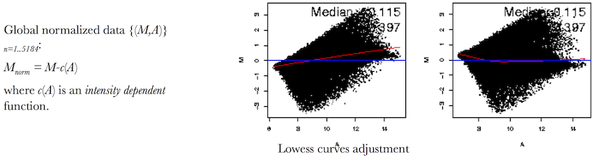
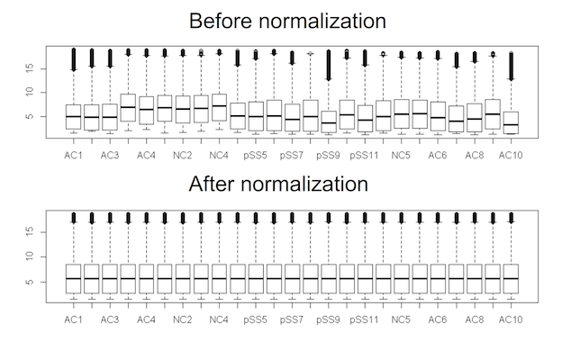
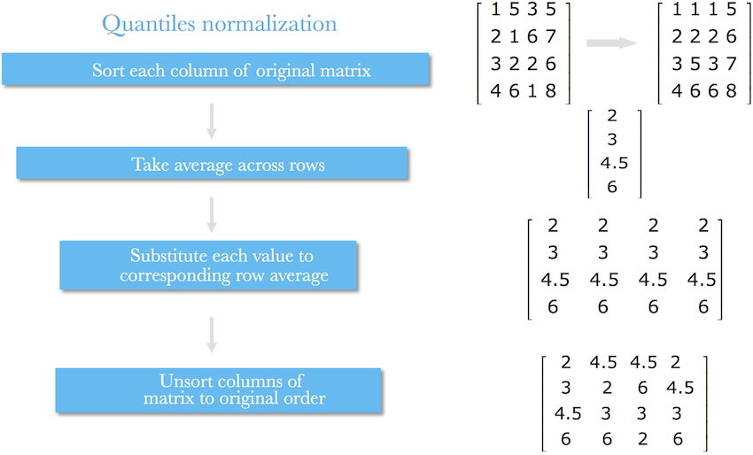
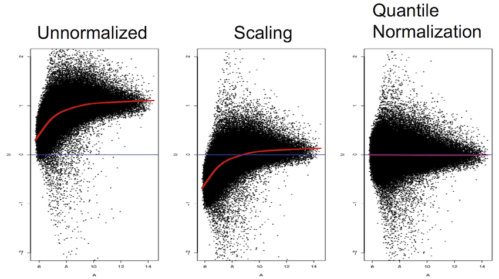
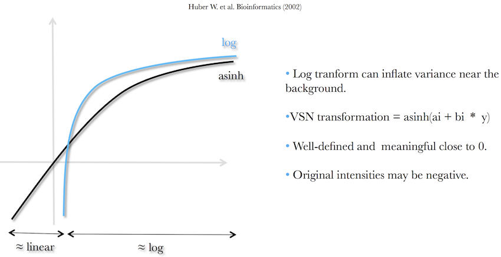

```{r xaringan-themer, include = FALSE}
library(xaringanthemer)
mono_light(
  base_color = "midnightblue",
  header_font_google = google_font("Josefin Sans"),
  text_font_google   = google_font("Montserrat", "500", "500i"),
  code_font_google   = google_font("Droid Mono"),
  link_color = "#8B1A1A", #firebrick4, "deepskyblue1"
  text_font_size = "28px"
)
library(dplyr)
library(ggplot2)
```

<!-- HTML style block -->
<style>
.large { font-size: 130%; }
.small { font-size: 70%; }
.tiny { font-size: 40%; }
</style>

## Proper normalization is important

- Transcripts with different lengths within a sample are NOT comparable

- Transcripts with the same length between samples are NOT comparable

- A combination of the two is even worse

---
## Data generative process for one sample

The read counts from RNA-seq follow a sampling process. For gene $i$, $i=1,...,G$, let  
  - $\mu$ - the true expression (number of cDNA fragments)
  - $L_i$ - gene length


- The probability of a read starting from gene $i$ is: $p_i=\mu_i*L_i/\sum_{i=1}^G\mu_i*L_i$

- If the total number of reads is $N$, the count for gene $i$, denoted by $Y_i$, can be modeled as a Poisson random variable. Let $\lambda_i=N*p_i$, $Y_i|\lambda_i \sim Poisson(\lambda_i)$

- Downstream DE test between sample 1 and 2 is: $H_0:\mu_{1i}=\mu_{2i}$ which is NOT equivalent to $H_0:\lambda_{1i}=\lambda_{2i}$ without proper normalization
  
---
## Concerns in RNA-seq data normalization

- When comparing two samples, if the distributions of $p_i$ are approximately the same, normalizing by $N$ will be sufficient – this is what RPKM does.

- However if that’s not true we will be in trouble.  
    - A toy example: if there are only two genes in the genome, their read counts are 10 and 20 in one sample, and 10 and 100 in another one. We don’t know how to compare!  
    - A real example: RNA-seq is often used to compare one tissue type to another, e.g., brain vs. liver. Many genes may be liver-specific and not transcribed in brain, causing difference in **library composition**.

- The normalization procedure is to choose a proper “baseline” for different samples, then normalize data to the baseline so that the counts are comparable.

---
## Single factor normalization methods – One normalization factor per sample

- Total or median counts, aka scaling to the library size

- Intuition - it is expected that sequencing a sample to half the depth will give, on average, half the number of reads mapping to each gene

- Problems - does not take into account the composition of RNA population being sequenced

.small[ Anders, Simon, and Wolfgang Huber. “Differential Expression Analysis for Sequence Count Data.” Genome Biology 11, no. 10 (2010): R106. https://doi.org/10.1186/gb-2010-11-10-r106. ]

---
## Two-Sample Normalization

* **Goal:** Remove expression-dependent bias between samples

* **Approach:** Adjust values based on global gene expression trends

* **Assumption:** Most genes are not differentially expressed, differences between conditions should be mostly zero

* **MA (Bland–Altman) plots**: visualize bias (M = log fold-change, A = log average)

* **Non-linear curve fitting**: correct systematic trends

* **LOWESS/LOESS regression**: smooth, data-driven normalization

---
## LOWESS Normalization

* **LOWESS** = *LOcally WEighted Scatterplot Smoothing* (Cleveland, 1979)
* Adapted for microarrays (Yang et al., 2002) using a 40% local window

**Key Assumptions**

* Most genes are **not differentially expressed**
* Up- and down-regulation are **balanced**
* Bias can be modeled as an **gene expression-dependent trend**

**Purpose**

* Removes systematic gene expression bias
* Ensures fair comparison across samples

---
## LOESS Normalization

- Loess normalization is based on MA plots.

- Skewing reflects experimental artifacts such as the contamination of one RNA source with genomic DNA or rRNA, the use of unequal sample concentrations.

```{r, out.width = "1000px", fig.align='center', echo=FALSE}

```

---
## LOESS Normalization

- Skewing can be corrected with local smoother: fitting a local regression curve to the data and subtracting the predicted value from the
observed values

- Goal: minimize the standard deviation and place the mean log ratio at 0

```{r, out.width = "1000px", fig.align='center', echo=FALSE}

```

---
## LOWESS Normalization

```{r, out.width = "500px", fig.align='center', echo=FALSE}
knitr::include_graphics("img/loess_gif.gif")
```

---
## Two-Sample LOWESS Normalization

* **Compute log-ratio (M) and average (A):**

$$M_i = \log_2(Y_{i1}) - \log_2(Y_{i2}), 
\quad
A_i = \tfrac{1}{2}\big(\log_2(Y_{i1}) + \log_2(Y_{i2})\big)$$

* **Fit a smooth curve** of $M_i$ vs. $A_i$ using LOWESS: $M_i \approx f(A_i)$

* **Adjust log-ratios** by removing systematic bias: $M_i^{adj} = M_i - f(A_i)$

* **Reconstruct normalized log-intensities:**

$$\log_2(Y_{i1}^{norm}) = A_i + \tfrac{1}{2}M_i^{adj}$$

$$\log_2(Y_{i2}^{norm}) = A_i - \tfrac{1}{2}M_i^{adj}$$

* Result: Intensities corrected for **intensity-dependent bias**.


---
## Multi-Sample Normalization: Cyclic LOESS

* **Extension of LOWESS** to >2 samples
* Normalizes **pairs** of samples at any one time
* Repeated in a **cyclic fashion** until convergence

**Steps**

1. Choose a reference sample (initially arbitrary)
2. Apply LOWESS normalization **sample vs. reference**
3. Update reference to the **average of normalized samples**
4. Repeat pairwise normalizations until stable

**Purpose**

* Removes intensity-dependent biases across multiple samples
* Ensures distributions are comparable across all samples

---
## Full-quantile normalization

- The quantiles of the distributions of the gene-level read counts are matched across samples
    - Use counts from cousekeeping genes
    - Use a certain quantile (75th) for all counts

```{r, out.width = "500px", fig.align='center', echo=FALSE}

```

<!-- - Implemented in `limma::normalizeBetweenArrays(method="quantile")` -->

.small[ Bullard, James H, Elizabeth Purdom, Kasper D Hansen, and Sandrine Dudoit. “Evaluation of Statistical Methods for Normalization and Differential Expression in MRNA-Seq Experiments.” BMC Bioinformatics 11, no. 1 (2010): 94. https://doi.org/10.1186/1471-2105-11-94. ]

---
## Quantile normalization 

1. Given $n$ samples with gene expression number $p$, form matrix $X$ of dimension $p × n$ where each array is a column.

2. Sort each column of $X$ to get $X_{sort}$. Remember to original order

3. Take the means across rows of $X_{sort}$ and replace the values of $X$ by those means. The resulting matrix is $X_{sort}'$.

4. Get $X_{normalized}$ by rearranging each column of $X_{sort}'$ to have the same ordering as original $X$.

Quantile normalization changes expression over many slides i.e. changes the correlation structure of the data, may affect subsequent analysis.

---
## Quantile normalization 

```{r, out.width = "900px", fig.align='center', echo=FALSE}

```

---
## Comparison of normalization techniques

```{r, out.width = "900px", fig.align='center', echo=FALSE}

```

---
## TMM: Trimmed mean of M values

- Compute $M(log\ fold\ changes)$ and $A(log\ total\ counts)$ for all genes

- Discard genes with extreme $M$ and $A$ values (30% and 5%), and compute a weighted mean of M’s for the rest of genes. The weights as the inverse of the approximate asymptotic variances

- Underlying assumption is that most genes are not DE

- Implemented in `edgeR::calcNormFactors()`

.small[ Robinson, Mark D., and Alicia Oshlack. “A Scaling Normalization Method for Differential Expression Analysis of RNA-Seq Data.” Genome Biology 11, no. 3 (2010): R25. https://doi.org/10.1186/gb-2010-11-3-r25. ]

---
## Gene-specific normalization – each gene has a different normalization factor

- The gene-specific biases (from GC content, gene length, etc.) need to be considered. Model the observed counts $Y_{g,i}$ for gene $g$ in sample $i$

$$Y_{g,i}|\mu_{g,i} \sim Poisson(\mu_{g,i})$$
$$\mu_{g,i}=exp{h_i(\theta_{g,i}) + \sum_{j=1}^pf_{i,j}(X_{g,j}) + log(m_i)}$$

- $h_i(\theta_{g,i})$ - function that captures non-linearity of counts distribution across samples (technical variability)
- $f_{i,j}(X_{g,j})$ - sample-dependent biases, e.g., GC content
- $m_i$ - sequencing depth
- Estimate $h$ and $f$ and $\theta$ using conditional quantile normalization  

.small[ Hansen, K. D., Irizarry, R. A., & Wu, Z. (2012). Removing technical variability in RNA-seq data using conditional quantile normalization. Biostatistics, https://doi.org/10.1093/biostatistics/kxr054 ] 

---
## voom - making RNA-seq counts look like microarray measures

- log-counts per million - capture relative changes in expression

- Model the coefficient of variation (CV) of RNA-seq counts as a decreasing function of count size.
$$CV^2=1/\lambda + \phi$$
- $\lambda$ - the expected size of the count
- $\phi$ - biological variation
- Captures mean-variance trend for lower counts
- Used as weights in `limma` model  

.small[ Law, C.W., Chen, Y., Shi, W. et al. voom: precision weights unlock linear model analysis tools for RNA-seq read counts. Genome Biol 15, R29 (2014). https://doi.org/10.1186/gb-2014-15-2-r29 ]

---
## Variance stabilizing normalization (VSN) 

```{r, out.width = "600px", fig.align='center', echo=FALSE}

```

Inverse hyperbolic sine function $ashin\ x\ = ln(x + \sqrt{1 + x^2})$. Has the compressing effect on large values like regular $ln\ x$, but has much less of a compressing effect for small values. Defined on the entire real number line, no need to add an offset like for regular log-transformation.


---
## Summary

- RNA-seq normalization is difficult!

- Still an open statistical problem.

- The goal is to find a proper “baseline” to normalize data to.

- Single factor methods provide comparable results.

- Gene-specific normalization is promising, but be careful of over-fitting.
