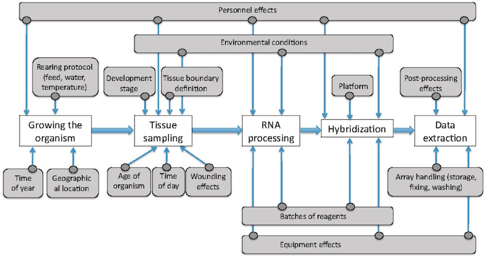

```{r xaringan-themer, include = FALSE}
library(xaringanthemer)
mono_light(
  base_color = "midnightblue",
  header_font_google = google_font("Josefin Sans"),
  text_font_google   = google_font("Montserrat", "500", "500i"),
  code_font_google   = google_font("Droid Mono"),
  link_color = "#8B1A1A", #firebrick4, "deepskyblue1"
  text_font_size = "28px"
)
library(dplyr)
library(ggplot2)
```

<!-- HTML style block -->
<style>
.large { font-size: 130%; }
.small { font-size: 70%; }
.tiny { font-size: 40%; }
</style>

## Batch effects

- Batch effects are widespread in high-throughput biology. They are artifacts not related to the biological variation of scientific interests. 

- For instance, two experiments on the same technical replicates processed on two different days might present different results due to factors such as room temperature or the two technicians who did the two experiments. 

- Batch effects can substantially confound the downstream analysis, especially meta-analysis across studies. 

---
## Batch sources

```{r, out.width = "900px", fig.align='center', echo=FALSE}

```

---
## Design matrices

- **Design matrices** are fundamental to the use of linear models. 

- A design matrix encodes the experimental design into a numerical format that statistical models can interpret. 

- It defines the relationship between samples and experimental conditions (e.g., treatment, control, batch effects, interactions). 

- The design matrix is the bridge between biological hypotheses and statistical inference.

---
## Design matrices

- **Rows** correspond to samples.

- **Columns** correspond to predictors (experimental conditions, covariates, intercepts).

- The values in the matrix indicate how each sample contributes to each predictor.

Design matrices are central to packages like **ComBat**, **sva**, **limma**, **edgeR**, and **DESeq2**, which rely on linear modeling frameworks.

---
## Constructing Design Matrices

The general form of a design matrix is:

$$ Y = X\beta + \epsilon $$

where:
- $Y$ is the expression matrix (genes × samples),
- $X$ is the design matrix (samples × predictors),
- $\beta$ are the coefficients (effects of predictors),
- $\epsilon$ is the residual error.

R provides the function `model.matrix()` to automatically construct design matrices.

---
## Example: One Factor (Treatment)

Suppose we have samples from two conditions: **control** and **treatment**.

.pull-left[
```{r}
# Example phenotype data
samples <- data.frame(
  sample_id = paste0("S", 1:6),
  condition = c("control", "control", "control", "treatment", "treatment", "treatment")
)
samples
```
]
.pull-right[
```{r}
# Build design matrix
X <- model.matrix(~ condition, data = samples)
X
```
]

- The first column (`(Intercept)`) represents the baseline (control).
- The second column encodes the treatment effect relative to control.

---
## Example: Adding Batch Effects

In real-world data, samples often come from different **batches**, which may introduce systematic variation. We include batch as an additional factor.

.pull-left[
```{r}
samples$batch <- c("batch1", "batch1", "batch2", "batch2", "batch3", "batch3")
samples
```

- Now, the design matrix adjusts for differences between batches in addition to treatment effects.
]
.pull-right[
```{r}
X_batch <- model.matrix(~ condition + batch, data = samples)
X_batch
```
]

---
## Custom Coding of Factors

By default, R uses **treatment coding** (baseline vs. effect). Alternative codings (e.g., sum contrasts) may be useful.

```{r}
# Change contrast settings
options(contrasts = c("contr.sum", "contr.poly"))
X_sum <- model.matrix(~ condition + batch, data = samples)
X_sum %>% as.data.frame()
```

This changes the interpretation of coefficients: now they represent deviations from the grand mean instead of the baseline.


---
## ComBat: Removing known batch effects

**ComBat - Location-scale method**

The core idea of ComBat was that the observed measurement $Y_{ijg}$ for the expression value of gene $g$ for sample $j$ from batch $i$ can be expressed as 

$$Y_{ijg}=\alpha_g+X\beta_g+\gamma_{ig}+\delta_{ig}\epsilon_{ijg}$$

where the design matrix $X$ consists of covariates of scientific interests, while $\gamma_{ig}$ and $\delta_{ig}$ characterize the additive and multiplicative batch effects of batch $i$ for gene $g$. 

.small[ https://www.bu.edu/jlab/wp-assets/ComBat/Abstract.html

https://github.com/brentp/combat.py ]

---
## ComBat: Removing known batch effects

After obtaining the estimators from the above linear regression, the raw data $Y_{ijg}$ can be adjusted to $Y_{ijg}^*$:

$$Y_{ijg}^*=\frac{Y_{ijg}-\hat{\alpha_g}-X\hat{\beta_g}-\hat{\gamma_{ig}}}{\hat{\delta_{ig}}}+\hat{\alpha_g}+X\hat{\beta_g}$$

Where $\hat{\alpha_g}$, $\hat{\beta_g}$, $\hat{\gamma_{ig}}$ are estimated parameters using an empirical Bayes method.

.small[ Johnson, W. Evan, Cheng Li, and Ariel Rabinovic. “Adjusting Batch Effects in Microarray Expression Data Using Empirical Bayes Methods.” Biostatistics (Oxford, England) 8, no. 1 (2007): 118–27. https://doi.org/10.1093/biostatistics/kxj037. ]

---
## SVA: Removing unknown batch effects

- When batches were unknown, the surrogate variable analysis (SVA) was developed. 
- The main idea was to separate the effects caused by covariates of our primary interests from the artifacts not modeled.
- Now the raw expression value $Y_{jg}$ of gene $g$ in sample $j$ can be formulated as:

$$Y_{jg}=\alpha_g+X\beta_g+\sum_{k=1}^K{\lambda_{kg}\eta_{kj}}+\epsilon_{jg}$$

where $\eta_{kj}$ represent the unmodeled factors and are called as “surrogate variables”. 

---
## SVA

- Once again, the basic idea was to estimate $\eta_{kj}$ and adjust them accordingly. 

- An iterative algorithm based on singular value decomposition (SVD) was derived to iterate between estimating the main effects $\hat{\alpha_g}+X\hat{\beta_g}$ given the estimation of surrogate variables and estimating surrogate variables from the residuals $r_{jg}=Y_{jg}-\hat{\alpha_g}-X\hat{\beta_g}$

.small[ Leek, Jeffrey T., Robert B. Scharpf, Héctor Corrada Bravo, et al. “Tackling the Widespread and Critical Impact of Batch Effects in High-Throughput Data.” Nature Reviews. Genetics 11, no. 10 (2010): 733–39. https://doi.org/10.1038/nrg2825. ]

---
## `sva` package in Bioconductor

- Contains `ComBat` function for removing effects of known batches. 

- Assume we have:
    * `edata`: a matrix for raw expression values 
    * `batch`: a vector named for batch numbers. 

```{r eval=FALSE}
# Design matrix containing all covariates but not batch
modcombat = model.matrix(~1, data=as.factor(batch)) 

combat_edata = ComBat(dat=edata, batch=batch, mod=modcombat, 
                      par.prior=TRUE, prior.plot=FALSE)
```

.small[ https://bioconductor.org/packages/sva/ ]

---
## SVASEQ

- `svaseq`, the version of SVA algorithm adapted to sequencing data

- Goal: Capture hidden batch effects / latent variables in RNA-seq data

- Suggests applying a moderated log transformation to the count data or fragments per kilobase of exon per million fragments mapped (FPKM) to account for the nature of discrete distributions 

.small[ Leek, J. T. (2014). Svaseq: removing batch effects and other unwanted noise from sequencing data. Nucleic acids research, 42(21), e161-e161. https://doi.org/10.1093/nar/gku864  

https://bioconductor.org/packages/sva/ ]

---
## SVASEQ

```{r eval=FALSE}
# Get normalized counts from DESeq2 object
dat <- counts(dds, normalized = TRUE)

# Filter out lowly expressed genes (mean count ≤ 1)
idx <- rowMeans(dat) > 1
dat <- dat[idx, ]

# Full design matrix (biological variable of interest: dex)
mod <- model.matrix(~ dex, colData(dds))

# Null design matrix (no biological effect)
mod0 <- model.matrix(~ 1, colData(dds))

# Estimate surrogate variables (n.sv = 2 here)
svseq <- svaseq(dat, mod, mod0, n.sv = 2)
# Output: Number of significant surrogate variables is: 2

# Add surrogate variables to DESeq2 object
ddssva <- dds
ddssva$SV1 <- svseq$sv[, 1]
ddssva$SV2 <- svseq$sv[, 2]

# Updated design formula
design(ddssva) <- ~ SV1 + SV2 + dex

```

---
## RUVSeq: Remove Unwanted Variation from RNA-Seq Data

- Instead of a direct transformation on the raw counts or FPKM, remove unwanted variation (RUV) adopted a generalized linear model. For $n$ samples and $J$ genes,

$$log\ E[Y|W,X,O] = W\alpha + X\beta + O$$

- $Y$ is an $n \times J$ matrix of the observed gene-level read counts,
- $X$ is an $n \times p$ matrix of the $p$ covariates of interest (wanted variation),
- $\beta$ is a $p \times J$ matrix of parameters of interest
- $W$ is an $n \times k$ matrix corresponding to hidden factors (unwanted variation),
- $\alpha$ is a $k \times J$ matrix of nuisance parameters,
- $O$ is an $n \times J$ matrix of offsets
- Goal - estimate the unwanted factors $W$

.small[ https://www.bioconductor.org/packages/devel/bioc/html/RUVSeq.html

Risso, Davide, John Ngai, Terence P Speed, and Sandrine Dudoit. “Normalization of RNA-Seq Data Using Factor Analysis of Control Genes or Samples.” Nature Biotechnology 32, no. 9 (August 24, 2014): 896–902. https://doi.org/10.1038/nbt.2931. https://www.nature.com/articles/nbt.2931  
https://bioconductor.org/packages/release/bioc/html/RUVSeq.html

---
## RUVSeq: Remove Unwanted Variation from RNA-Seq Data

Three approaches: 

- **RUVg** uses negative control genes, assumed not to be differentially expressed with respect to the covariates of interest, estimates $\hat{W}$ from this subset,
- **RUVs** uses negative control samples for which the covariates of interest are constant 
- **RUVr** uses residuals from a first-pass GLM regression of the unnormalized counts on the covariates of interest.

.small[ https://github.com/drisso/RUVSeq https://github.com/drisso/peixoto2015_tutorial

Risso, D., Ngai, J., Speed, T. et al. Normalization of RNA-seq data using factor analysis of control genes or samples. Nat Biotechnol 32, 896–902 (2014). https://doi.org/10.1038/nbt.2931

Peixoto, L., Risso, D., Poplawski, S. G., Wimmer, M. E., Speed, T. P., Wood, M. A., & Abel, T. (2015). How data analysis affects power, reproducibility and biological insight of RNA-seq studies in complex datasets. Nucleic acids research, 43(16), 7664-7674. https://doi.org/10.1093/nar/gkv736. ]


<!--
## BatchQC - Batch Effects Quality Control

- A Bioconductor package with a GUI (shiny app)
- Allows for interactive visualization of batch effects via clustering, dimensionality reduction
- Applies ComBat or SVA to remove batches and observe the effect

.small[ https://github.com/mani2012/BatchQC
-->