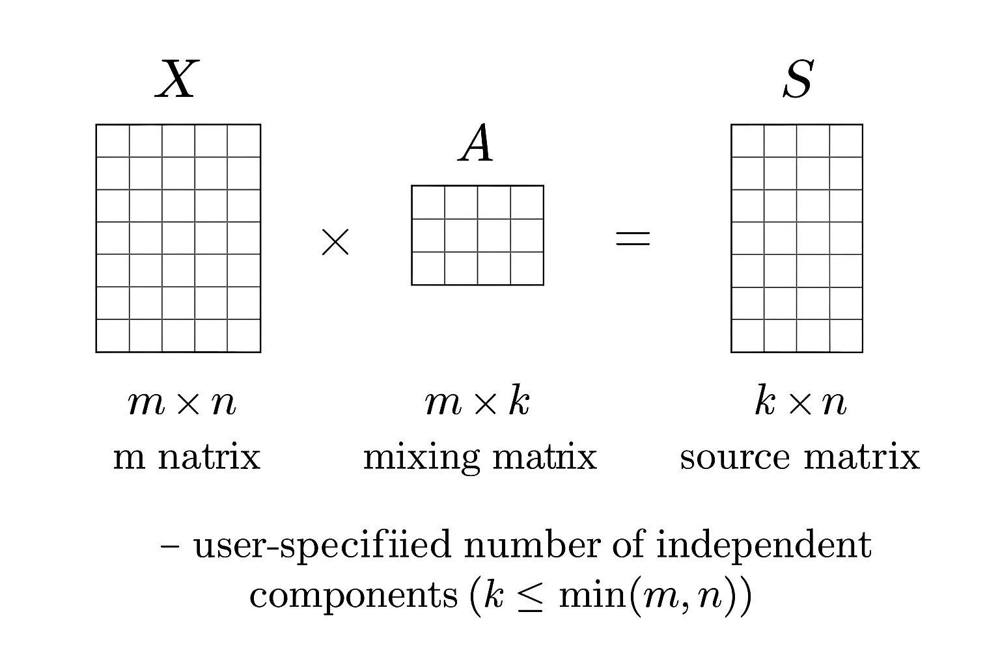

```{r xaringan-themer, include = FALSE}
library(xaringanthemer)
mono_light(
  base_color = "midnightblue",
  header_font_google = google_font("Josefin Sans"),
  text_font_google   = google_font("Montserrat", "500", "500i"),
  code_font_google   = google_font("Droid Mono"),
  link_color = "#8B1A1A", #firebrick4, "deepskyblue1"
  text_font_size = "28px"
)
library(dplyr)
library(ggplot2)
```

<!-- HTML style block -->
<style>
.large { font-size: 130%; }
.small { font-size: 70%; }
.tiny { font-size: 40%; }
</style>

## ICA - Independent Component Analysis

- PCA assumes multivariate normally distributed data — gene expression data are usually **super-Gaussian** (heavier tails, not Normal)

- ICA models observations as a **linear combination of latent variables (components)** that are **as statistically independent as possible**

- Analogy: multiple sound sources mixed together — ICA tries to “unmix” them

---
## ICA - Independent Component Analysis

- ICA performs a **linear rotation** of data like PCA, but recovers **independent**, not maximally variable, components

- In RNA-seq, ICA components often correspond to **transcriptional modules** representing biological processes

.small[ Hyvärinen, Aapo, and Erkki Oja. "Independent component analysis: algorithms and applications." Neural networks 13, no. 4-5 (2000): 411-430. https://doi.org/10.1016/S0893-6080(00)00026-5 ]

---

## ICA vs PCA – Conceptual Difference

| Aspect | PCA | ICA |
|--------|-----|-----|
| Goal | Maximize variance | Maximize statistical independence |
| Components | Orthogonal | Independent (not necessarily orthogonal) |
| Suitable for | Gaussian data | Non-Gaussian (super-Gaussian) data |
| Interpretation | Global variation patterns | Underlying sources/processes |

- ICA can reveal **hidden biological signals** not captured by PCA

.small[ Engreitz, Jesse M., Bernie J. Daigle Jr, Jonathan J. Marshall, and Russ B. Altman. "Independent component analysis: mining microarray data for fundamental human gene expression modules." Journal of biomedical informatics 43, no. 6 (2010): 932-944. https://doi.org/10.1016/j.jbi.2010.07.001]

---
## ICA - Model Formulation

- $X$ — an $m \times n$ matrix of $n$ genes and $m$ experiments  

- ICA decomposes $X$ as:
  $$X = AS$$

- $A$ — an $m \times k$ **mixing matrix**  

- $S$ — a $k \times n$ **source matrix**  

- $k$ — user-specified number of independent components ($k \leq \min(m, n)$)

- Preprocessing: filter, center, scale (as for PCA)

<!--
## ICA - Model Formulation

```{r, out.width = "800px", fig.align='center', echo=FALSE}

```
-->

---
## ICA Components and Interpretation

- Rows of $S$ (source matrix) are **independent components**

- Gene weights in each component reflect **independent random variables**

- Genes with strong weights in the same component likely participate in the same biological process

- Columns of $A$ show the **expression strength of each component** across samples

.small[ fastICA R package: https://CRAN.R-project.org/package=fastICA  ]

---
## ICA in Practice

- The **source matrix $S$**: interpreted biologically by studying the genes contributing to each component

- The **mixing matrix $A$**: associate components with sample features (e.g., clinical or molecular characteristics)

- Identify correlations between **independent components and phenotypes**

.small[ MineICA package: https://bioconductor.org/packages/MineICA/ ]

.small[ Engreitz, Jesse M., Bernie J. Daigle Jr, Jonathan J. Marshall, and Russ B. Altman. "Independent component analysis: mining microarray data for fundamental human gene expression modules." Journal of biomedical informatics 43, no. 6 (2010): 932-944. https://doi.org/10.1016/j.jbi.2010.07.001]

---

## Example Workflow in R

```r
library(fastICA)

# Example data: expression matrix (genes x samples)
set.seed(123)
expr <- matrix(rnorm(1000), nrow = 100, ncol = 10)

# Run ICA with 3 components
ica_res <- fastICA(expr, n.comp = 3)

# Matrices
S <- ica_res$S  # Source matrix (independent components)
A <- ica_res$A  # Mixing matrix
```

- Inspect top genes contributing to each component  

- Plot sample scores (A) colored by phenotype

---
## ICA Demo Using *iris* Dataset

We illustrate Independent Component Analysis (ICA) using the well-known *iris* dataset.

We use only the **numeric columns** (4 flower measurements) and treat each **row as a sample**.

```{r}
library(fastICA)

# Use only numeric variables from iris
data(iris)
X <- as.matrix(iris[, 1:4])   # 150 samples × 4 features

dim(X)
```

---
## Running ICA

We extract **3 independent components**.

```{r}
set.seed(123)
ica_res <- fastICA(X, n.comp = 3)
S <- ica_res$S   # Independent components (sources)
A <- ica_res$A   # Mixing matrix

dim(S)
dim(A)
```

In ICA, rows of **S** describe how each independent signal varies across samples.  
Rows of **A** tell us how each feature loads onto the independent components.

---
## Plotting ICA Components

Color the samples by species to visualize whether ICA captures class structure.

```{r}
library(ggplot2)

df_ica <- data.frame(
  IC1 = S[,1],
  IC2 = S[,2],
  Species = iris$Species
)
head(df_ica)
```

---
## Plotting ICA Components

Color the samples by species - ICA captures class structure.

```{r fig.height=5}
ggplot(df_ica, aes(IC1, IC2, color = Species)) +
  geom_point(size = 3, alpha = 0.8) +
  theme_minimal() +
  labs(title = "ICA on iris: First Two Independent Components")
```


---
## Inspecting Feature Loadings

The columns of **A** correspond to the independent components.  

We inspect how the original measurements contribute to each component.

```{r}
colnames(X)
A
```

* High absolute values indicate a strong contribution of that feature to the component.
* Since ICA seeks **statistical independence**, these do not correspond to variance directions (as in PCA).

---
## Summary

- ICA separates signals into **independent sources**  

- Useful for **unsupervised discovery** of biological modules  

- Complements PCA by uncovering **non-Gaussian, hidden structure**  

- Applications: transcriptomics, epigenomics, imaging, and multi-omics data integration

