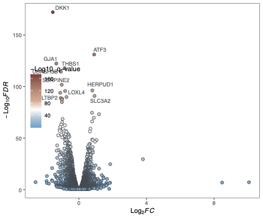

```{r xaringan-themer, include = FALSE}
library(xaringanthemer)
mono_light(
  base_color = "midnightblue",
  header_font_google = google_font("Josefin Sans"),
  text_font_google   = google_font("Montserrat", "500", "500i"),
  code_font_google   = google_font("Droid Mono"),
  link_color = "#8B1A1A", #firebrick4, "deepskyblue1"
  text_font_size = "24px"
)
library(dplyr)
library(ggplot2)
```

<!-- HTML style block -->
<style>
.large { font-size: 130%; }
.small { font-size: 70%; }
.tiny { font-size: 40%; }
</style>

## What is a Volcano Plot?

```{r, out.width = "650px", fig.align='center', echo=FALSE}

```

---
## What is a Volcano Plot?

**Volcano plot:** A scatter plot used to visualize differential expression results

**Axes:**
- **X-axis:** Log fold change (log₂FC) - magnitude of change
- **Y-axis:** -log₁₀(p-value) - statistical significance

**Why "volcano"?**
- Shape resembles a volcanic eruption
- Significant genes with large changes appear at the top sides
- Non-significant genes cluster at the bottom

**Key Features:**
- Combines **statistical significance** and **biological relevance**
- Quickly identify genes that are both significantly and substantially changed
- Standard visualization in genomics papers

---

## Interpreting a Volcano Plot

**Quadrants:**

.pull-left[
**Upper right:** 
- Upregulated genes
- High significance
- Large positive fold change

**Upper left:**
- Downregulated genes
- High significance  
- Large negative fold change

**Bottom:**
- Non-significant genes
- Regardless of fold change
]

.pull-right[
**Thresholds commonly used:**
- Vertical lines: |log₂FC| ≥ 1 (2-fold change)
- Horizontal line: p-value ≤ 0.05 or adjusted p-value ≤ 0.05

**Points above/outside thresholds:**
- Differentially expressed genes (DEGs)
]

---

## Generate Sample Data

Using the `airway` dataset from Bioconductor

```{r eval=FALSE}
# Install if needed
# BiocManager::install("airway")
# BiocManager::install("DESeq2")

library(DESeq2)
library(airway)

# Load airway dataset
data("airway")

# Create DESeq2 object
dds <- DESeqDataSet(airway, design = ~ cell + dex)

# Run differential expression analysis
dds <- DESeq(dds)

# Get results (comparing dex treated vs untreated)
res <- results(dds, contrast = c("dex", "trt", "untrt"))

# Convert to data frame
res_df <- as.data.frame(res)
res_df$gene <- rownames(res_df)
```

---

## Prepare Data for Plotting

```{r eval=FALSE}
library(dplyr)

# Remove rows with NA values
res_df <- res_df %>%
  filter(!is.na(padj), !is.na(log2FoldChange))

# Add significance categories
res_df <- res_df %>%
  mutate(
    significance = case_when(
      padj < 0.05 & log2FoldChange > 1 ~ "Upregulated",
      padj < 0.05 & log2FoldChange < -1 ~ "Downregulated",
      TRUE ~ "Not Significant"
    )
  )

# View summary
table(res_df$significance)

# Preview data
head(res_df[, c("gene", "log2FoldChange", "pvalue", "padj", "significance")])
```

---

## Basic Volcano Plot with ggplot2

```{r eval=FALSE}
library(ggplot2)

ggplot(res_df, aes(x = log2FoldChange, y = -log10(pvalue))) +
  geom_point(alpha = 0.4, size = 1.5) +
  labs(title = "Volcano Plot: DESeq2 Results",
       x = "Log2 Fold Change",
       y = "-Log10 P-value") +
  theme_minimal()
```

**Result:** Basic scatter plot showing all genes

---

## Add Color by Significance

```{r eval=FALSE}
ggplot(res_df, aes(x = log2FoldChange, y = -log10(pvalue), 
                   color = significance)) +
  geom_point(alpha = 0.6, size = 1.5) +
  scale_color_manual(values = c("Upregulated" = "red",
                                "Downregulated" = "blue",
                                "Not Significant" = "grey")) +
  labs(title = "Volcano Plot with Significance Colors",
       x = "Log2 Fold Change",
       y = "-Log10 P-value",
       color = "Differential Expression") +
  theme_minimal() +
  theme(legend.position = "right")
```

**Enhancement:** Color-coded by expression direction and significance

---

## Add Threshold Lines

```{r eval=FALSE}
# Define thresholds
fc_threshold <- 1  # log2FC threshold
pval_threshold <- 0.05

ggplot(res_df, aes(x = log2FoldChange, y = -log10(pvalue), 
                   color = significance)) +
  geom_point(alpha = 0.6, size = 1.5) +
  scale_color_manual(values = c("Upregulated" = "red",
                                "Downregulated" = "blue",
                                "Not Significant" = "grey50")) +
  # Add threshold lines
  geom_vline(xintercept = c(-fc_threshold, fc_threshold), 
             linetype = "dashed", color = "black", linewidth = 0.5) +
  geom_hline(yintercept = -log10(pval_threshold), 
             linetype = "dashed", color = "black", linewidth = 0.5) +
  labs(title = "Volcano Plot with Thresholds",
       subtitle = "|log2FC| ≥ 1, p-value ≤ 0.05",
       x = "Log2 Fold Change",
       y = "-Log10 P-value",
       color = "Status") +
  theme_minimal()
```

---

## Label Top Genes

```{r eval=FALSE}
library(ggrepel)

# Select top 10 genes by adjusted p-value
top_genes <- res_df %>%
  filter(significance != "Not Significant") %>%
  arrange(padj) %>%
  head(10)

ggplot(res_df, aes(x = log2FoldChange, y = -log10(pvalue), 
                   color = significance)) +
  geom_point(alpha = 0.6, size = 1.5) +
  scale_color_manual(values = c("Upregulated" = "red",
                                "Downregulated" = "blue",
                                "Not Significant" = "grey50")) +
  geom_vline(xintercept = c(-1, 1), linetype = "dashed") +
  geom_hline(yintercept = -log10(0.05), linetype = "dashed") +
  # Add gene labels
  geom_text_repel(data = top_genes, 
                  aes(label = gene),
                  size = 3, max.overlaps = 15) +
  labs(title = "Volcano Plot with Top Gene Labels",
       x = "Log2 Fold Change",
       y = "-Log10 P-value") +
  theme_minimal()
```

---

## Using Adjusted P-values

**Important:** Use adjusted p-values (padj) to control for multiple testing

```{r eval=FALSE}
# Recalculate significance with adjusted p-values
res_df <- res_df %>%
  mutate(
    significance_adj = case_when(
      padj < 0.05 & log2FoldChange > 1 ~ "Upregulated",
      padj < 0.05 & log2FoldChange < -1 ~ "Downregulated",
      TRUE ~ "Not Significant"
    )
  )

ggplot(res_df, aes(x = log2FoldChange, y = -log10(padj), 
                   color = significance_adj)) +
  geom_point(alpha = 0.6, size = 1.5) +
  scale_color_manual(values = c("Upregulated" = "red",
                                "Downregulated" = "blue",
                                "Not Significant" = "grey50")) +
  geom_vline(xintercept = c(-1, 1), linetype = "dashed") +
  geom_hline(yintercept = -log10(0.05), linetype = "dashed") +
  labs(title = "Volcano Plot with Adjusted P-values",
       x = "Log2 Fold Change",
       y = "-Log10 Adjusted P-value") +
  theme_minimal()
```

---

## Enhanced Volcano Plot

```{r eval=FALSE}
# Count DEGs
n_up <- sum(res_df$significance_adj == "Upregulated")
n_down <- sum(res_df$significance_adj == "Downregulated")

ggplot(res_df, aes(x = log2FoldChange, y = -log10(padj), 
                   color = significance_adj)) +
  geom_point(alpha = 0.6, size = 2) +
  scale_color_manual(
    values = c("Upregulated" = "#E41A1C",
               "Downregulated" = "#377EB8",
               "Not Significant" = "grey70"),
    labels = c(paste0("Upregulated (", n_up, ")"),
               paste0("Downregulated (", n_down, ")"),
               "Not Significant")
  ) +
  geom_vline(xintercept = c(-1, 1), linetype = "dashed", alpha = 0.5) +
  geom_hline(yintercept = -log10(0.05), linetype = "dashed", alpha = 0.5) +
  labs(title = "Dexamethasone Treatment Effect on Gene Expression",
       subtitle = "Airway smooth muscle cells",
       x = "Log2 Fold Change",
       y = "-Log10 Adjusted P-value",
       color = "Expression Status") +
  theme_bw() +
  theme(legend.position = "top",
        plot.title = element_text(hjust = 0.5, face = "bold"),
        plot.subtitle = element_text(hjust = 0.5))
```

---

## Using EnhancedVolcano Package

**EnhancedVolcano** provides publication-ready volcano plots with minimal code

```{r eval=FALSE}
# Install if needed
# BiocManager::install("EnhancedVolcano")

library(EnhancedVolcano)

EnhancedVolcano(res_df,
                lab = res_df$gene,
                x = 'log2FoldChange',
                y = 'pvalue',
                title = 'Dexamethasone vs Control',
                pCutoff = 0.05,
                FCcutoff = 1,
                pointSize = 2.0,
                labSize = 4.0,
                colAlpha = 0.5,
                legendPosition = 'right',
                legendLabSize = 12,
                legendIconSize = 4.0)
```

---

## EnhancedVolcano: Customization

```{r eval=FALSE}
EnhancedVolcano(res_df,
                lab = res_df$gene,
                x = 'log2FoldChange',
                y = 'padj',
                title = 'Differential Expression Analysis',
                subtitle = 'Airway: Treated vs Untreated',
                pCutoff = 0.05,
                FCcutoff = 1.5,
                pointSize = 2.0,
                labSize = 3.0,
                # Custom colors
                col = c('grey30', 'forestgreen', 'royalblue', 'red2'),
                colAlpha = 0.7,
                # Select top genes to label
                selectLab = top_genes$gene,
                drawConnectors = TRUE,
                widthConnectors = 0.5,
                colConnectors = 'grey30',
                # Legend
                legendPosition = 'bottom',
                legendLabels = c('NS', 'Log2FC', 'p-value', 'p-value & Log2FC'),
                legendLabSize = 10)
```

---

## Using ggVolcano Package

**ggVolcano** is another specialized package for volcano plots

```{r eval=FALSE}
# BiocManager::install("BioSenior/ggVolcano", update = FALSE)
library(ggVolcano)
# use the function -- add_regulate to add a regulate column 
# to the DEG result data. 
res_df$FDR <- as.numeric(res_df$padj)
data <- add_regulate(data = res_df, log2FC_name = "log2FoldChange",
                     fdr_name = "FDR", log2FC = 1, fdr = 0.3)


# plot
gradual_volcano(data[, c("gene", "log2FoldChange", "padj")], x = "log2FoldChange", y = "padj",
          label = "gene", label_number = 10,
          fills = c("#53a4cf", "#aec5d1", "white", "#e2ae96", "#cc917c", "#a96d5d", "#91403e"),
          colors = "#404950",
          log2FC_cut = 0, FDR_cut = 1, add_line = FALSE, pointSizeRange = c(2, 2),
          output = TRUE)
```

**Features:**
- Automatic labeling of top genes
- Built-in color schemes
- Simple syntax

---

## Highlighting Specific Genes

```{r eval=FALSE}
# Define genes of interest
genes_of_interest <- c("ENSG00000179094", "ENSG00000116584", 
                       "ENSG00000168309")

res_df <- res_df %>%
  mutate(highlight = ifelse(gene %in% genes_of_interest, 
                            "Gene of Interest", 
                            significance_adj))

ggplot(res_df, aes(x = log2FoldChange, y = -log10(padj))) +
  geom_point(aes(color = highlight), alpha = 0.6, size = 2) +
  scale_color_manual(
    values = c("Upregulated" = "red",
               "Downregulated" = "blue",
               "Not Significant" = "grey70",
               "Gene of Interest" = "gold"),
    breaks = c("Upregulated", "Downregulated", 
               "Not Significant", "Gene of Interest")
  ) +
  geom_text_repel(data = filter(res_df, gene %in% genes_of_interest),
                  aes(label = gene), size = 3.5, fontface = "bold") +
  geom_vline(xintercept = c(-1, 1), linetype = "dashed") +
  geom_hline(yintercept = -log10(0.05), linetype = "dashed") +
  labs(title = "Volcano Plot with Highlighted Genes",
       x = "Log2 Fold Change",
       y = "-Log10 Adjusted P-value") +
  theme_minimal()
```

---

## Interactive Volcano Plot with plotly

```{r eval=FALSE}
library(plotly)

# Create ggplot object
p <- ggplot(res_df, aes(x = log2FoldChange, y = -log10(padj), 
                        color = significance_adj,
                        text = paste("Gene:", gene,
                                   "<br>Log2FC:", round(log2FoldChange, 2),
                                   "<br>P-adj:", format(padj, digits = 3)))) +
  geom_point(alpha = 0.6, size = 2) +
  scale_color_manual(values = c("Upregulated" = "red",
                                "Downregulated" = "blue",
                                "Not Significant" = "grey70")) +
  geom_vline(xintercept = c(-1, 1), linetype = "dashed") +
  geom_hline(yintercept = -log10(0.05), linetype = "dashed") +
  labs(title = "Interactive Volcano Plot",
       x = "Log2 Fold Change",
       y = "-Log10 Adjusted P-value") +
  theme_minimal()

# Convert to interactive plot
ggplotly(p, tooltip = "text")
```

**Benefits:** Hover to see gene information, zoom, pan

---

## Faceted Volcano Plots

For comparing multiple contrasts

```{r eval=FALSE}
# Simulate multiple contrasts (for demonstration)
res_df_multi <- bind_rows(
  res_df %>% mutate(contrast = "Treatment vs Control"),
  res_df %>% 
    mutate(log2FoldChange = log2FoldChange * 0.7,
           padj = padj * 1.5,
           contrast = "Time Point 2 vs 1")
)

ggplot(res_df_multi, aes(x = log2FoldChange, y = -log10(padj), 
                         color = significance_adj)) +
  geom_point(alpha = 0.5, size = 1) +
  scale_color_manual(values = c("Upregulated" = "red",
                                "Downregulated" = "blue",
                                "Not Significant" = "grey70")) +
  geom_vline(xintercept = c(-1, 1), linetype = "dashed") +
  geom_hline(yintercept = -log10(0.05), linetype = "dashed") +
  facet_wrap(~ contrast) +
  labs(title = "Multiple Comparisons",
       x = "Log2 Fold Change",
       y = "-Log10 Adjusted P-value") +
  theme_bw() +
  theme(legend.position = "bottom")
```

---

## MA Plot vs Volcano Plot

**MA Plot:** Alternative visualization for differential expression

```{r eval=FALSE, fig.width=10, fig.height=4}
library(patchwork)

# Volcano plot
p1 <- ggplot(res_df, aes(x = log2FoldChange, y = -log10(padj), 
                         color = significance_adj)) +
  geom_point(alpha = 0.6, size = 1.5) +
  scale_color_manual(values = c("red", "blue", "grey70")) +
  labs(title = "Volcano Plot", x = "Log2 Fold Change", 
       y = "-Log10 Adj P-value") +
  theme_minimal()

# MA plot
p2 <- ggplot(res_df, aes(x = log10(baseMean), y = log2FoldChange,
                         color = significance_adj)) +
  geom_point(alpha = 0.6, size = 1.5) +
  scale_color_manual(values = c("red", "blue", "grey70")) +
  geom_hline(yintercept = c(-1, 1), linetype = "dashed") +
  labs(title = "MA Plot", x = "Log10 Mean Expression", 
       y = "Log2 Fold Change") +
  theme_minimal()

p1 + p2 + plot_layout(guides = "collect")
```

---

## Best Practices

**Data preparation:**
- Remove genes with NA values
- Use adjusted p-values (FDR) for thresholds
- Consider filtering low-count genes before analysis

**Thresholds:**
- Common: |log₂FC| ≥ 1 (2-fold change) and padj ≤ 0.05
- Adjust based on biological context and sample size
- Be consistent across analyses

**Visualization:**
- Use color strategically (red/blue for up/down is conventional)
- Label only top genes to avoid clutter
- Include threshold lines for clarity
- Add counts in legend (e.g., "Upregulated (234)")

---

## Summary

**Volcano plots visualize differential expression results:**
- X-axis: Log₂ fold change (magnitude)
- Y-axis: -log₁₀ p-value (significance)

**Key elements:**
- Color by significance status
- Threshold lines for FC and p-value
- Labels for top or interesting genes

**R packages:**
- **ggplot2:** Full customization, complete control
- **EnhancedVolcano:** Publication-ready, many options
- **ggVolcano:** Simple syntax, quick plots

---

## Resources

**Packages:**
- `DESeq2`: Differential expression analysis
- `EnhancedVolcano`: Advanced volcano plots
- `ggvolcano`: Simple volcano plots
- `ggrepel`: Non-overlapping text labels
- `plotly`: Interactive plots

**Documentation:**
- EnhancedVolcano: https://bioconductor.org/packages/EnhancedVolcano/
- ggVolcano: https://github.com/BioSenior/ggVolcano
- ggvolcano: https://cran.r-project.org/package=ggvolcano

